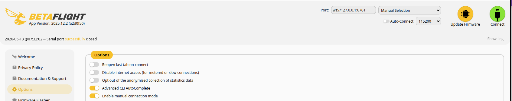

# BETAFLIGHT SITL with gazebo

- run gazebo 
- run websockify
- run sitl

## VSCode tasks
- Start SITL: start websockify and sitl
- gazebo: Run gazebo


## betaflight configure (SITL)



```
ws://127.0.0.1:6761
```

---

[Resource](https://betaflight.com/docs/development/autopilot/SITL_Autopilot_Testing_Gazebo)


