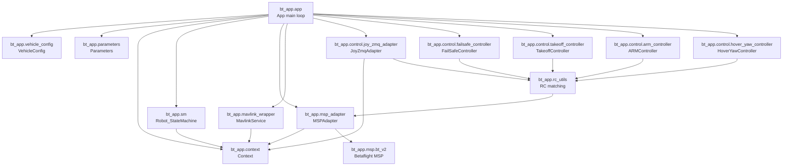

# Application Block Diagram

```mermaid
flowchart TD
    App["bt_app.app<br/>App main loop"]
    Config["bt_app.vehicle_config<br/>VehicleConfig"]
    Params["bt_app.parameters<br/>Parameters"]
    Context["bt_app.context<br/>Context"]
    StateMachine["bt_app.sm<br/>Robot_StateMachine"]
    RcUtils["bt_app.rc_utils<br/>RC matching"]

    MspAdapter["bt_app.msp_adapter<br/>MSPAdapter"]
    BtV2["bt_app.msp.bt_v2<br/>Betaflight MSP"]
    Mavlink["bt_app.mavlink_wrapper<br/>MavlinkService"]

    Joy["bt_app.control.joy_zmq_adapter<br/>JoyZmqAdapter"]
    FailSafe["bt_app.control.failsafe_controller<br/>FailSafeController"]
    Takeoff["bt_app.control.takeoff_controller<br/>TakeoffController"]
    Arm["bt_app.control.arm_controller<br/>ARMController"]
    Search["bt_app.control.hover_yaw_controller<br/>HoverYawController"]

    App --> Config
    App --> Params
    App --> Context
    App --> StateMachine
    App --> MspAdapter
    App --> Mavlink
    App --> Joy
    App --> FailSafe
    App --> Takeoff
    App --> Arm
    App --> Search

    StateMachine --> Context
    Mavlink --> Context
    MspAdapter --> Context
    MspAdapter --> BtV2
    Joy --> Context

    Joy --> RcUtils
    FailSafe --> RcUtils
    Takeoff --> RcUtils
    Arm --> RcUtils
    Search --> RcUtils
    RcUtils --> MspAdapter

    click App "../bt_app/app.py" "Open bt_app.app"
    click Config "../bt_app/vehicle_config.py" "Open bt_app.vehicle_config"
    click Params "../bt_app/parameters/__init__.py" "Open bt_app.parameters"
    click Context "../bt_app/context.py" "Open bt_app.context"
    click StateMachine "../bt_app/sm.py" "Open bt_app.sm"
    click RcUtils "../bt_app/rc_utils.py" "Open bt_app.rc_utils"

    click MspAdapter "../bt_app/msp_adapter.py" "Open bt_app.msp_adapter"
    click BtV2 "../bt_app/msp/bt_v2.py" "Open bt_app.msp.bt_v2"
    click Mavlink "../bt_app/mavlink_wrapper.py" "Open bt_app.mavlink_wrapper"

    click Joy "../bt_app/control/joy_zmq_adapter.py" "Open JoyZmqAdapter"
    click FailSafe "../bt_app/control/failsafe_controller.py" "Open FailSafeController"
    click Takeoff "../bt_app/control/takeoff_controller.py" "Open TakeoffController"
    click Arm "../bt_app/control/arm_controller.py" "Open ARMController"
    click Search "../bt_app/control/hover_yaw_controller.py" "Open HoverYawController"
```
