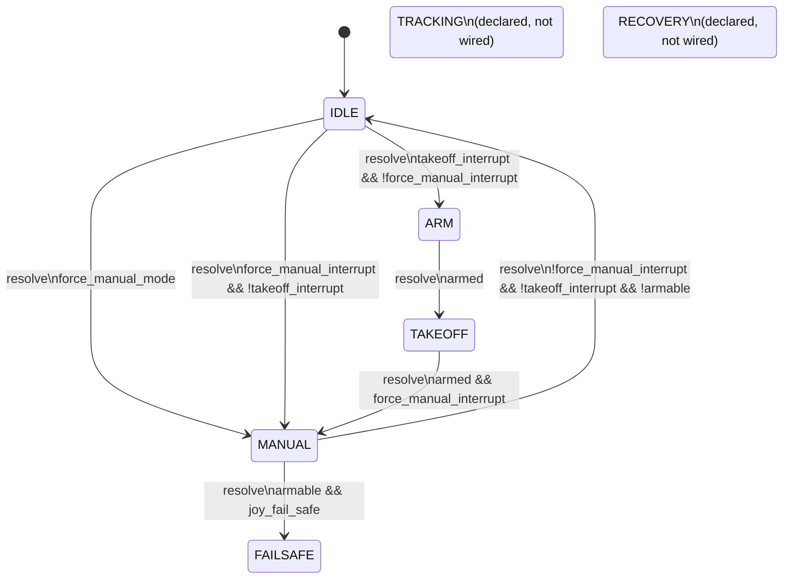

# BT App State Machine

This document describes the explicit application state machine implemented in
`bt_app/bt_app/sm.py` and driven by `bt_app/bt_app/app.py`.

The application runs a continuous control loop:

1. Read vehicle status, altitude, and RC input through the MSP adapter.
2. Update the shared `Context`.
3. Call `robot_sm.resolve()` to evaluate state transitions.
4. Select the controller for the active state and generate RC channels.
5. Apply RC matching rules and send the final channels to Betaflight.

## State Data

The transition guards are evaluated against `Context` fields:

| Field | Source | Meaning |
| --- | --- | --- |
| `state` | State machine | Current application state. |
| `armed` | MSP vehicle state | `True` when Betaflight reports the expected armed mode flags. |
| `armable` | MSP vehicle state | `True` when Betaflight reports no arming disable flags. |
| `arming_disable_flags` | MSP vehicle state | Raw Betaflight arming-disable reasons. |
| `joy_fail_safe` | Joystick ZMQ failsafe event | `True` while joystick failsafe is active. |
| `takeoff_interrupt` | Joystick AUX4 interrupt | `True` when AUX4 equals `RC_MAX`. |
| `force_manual_interrupt` | Joystick AUX5 interrupt | `True` when AUX5 equals `RC_MAX`. |
| `force_manual_mode` | Context flag | Forces manual mode from `IDLE`. |
| `take_control` | RC matching logic | Tracks whether the internal controller has taken throttle control in `MANUAL`. |
| `auto_arm` | State side effect | In `MANUAL`, forces the arm channel high when enabled. |
| `drone_alt` | MSP altitude | Current altitude used by takeoff and failsafe controllers. |
| `drone_rc` | MSP RC readback | Current RC values used by manual matching. |

## States

| State | Purpose | RC output |
| --- | --- | --- |
| `IDLE` | Default safe state. No active flight control command. | Sends eight low channels: `[1000] * 8`. |
| `MANUAL` | Passes joystick channels through the ZMQ adapter, with manual matching rules. | Joystick channels, optionally with arm forced high by `auto_arm`. |
| `ARM` | Performs the arming sequence before takeoff. | Holds throttle low and arm low for `DISABLED_HOLD_TIME`, then sets arm high. |
| `TAKEOFF` | Runs altitude PID toward the takeoff setpoint. | Armed angle-mode channels with PID-controlled throttle. |
| `FAILSAFE` | Runs failsafe controller while joystick failsafe is active. | Armed channels with altitude-hold style throttle. |
| `TRACKING` | Declared in `RobotState`, but no active transition is currently configured. | Not implemented in RC selector. |
| `RECOVERY` | Declared in `RobotState`, but no active transition is currently configured. | Not implemented in RC selector. |

## Transition Conditions

All active transitions use the `resolve` trigger. Invalid triggers are ignored,
and transitions are evaluated in the order they are registered in
`Robot_StateMachine.__init__`.

| From | To | Guard method | Condition |
| --- | --- | --- | --- |
| `IDLE` | `MANUAL` | `enter_manual_mode` | `force_manual_mode == True` |
| `MANUAL` | `FAILSAFE` | `enter_failsafe` | `armable == True` and `joy_fail_safe == True` |
| `IDLE` | `ARM` | `enter_arm` | `takeoff_interrupt == True` and `force_manual_interrupt == False` |
| `ARM` | `TAKEOFF` | `enter_takeoff_from_arm` | `armed == True` |
| `IDLE` | `MANUAL` | `enter_manual_from_idle` | `force_manual_interrupt == True` and `takeoff_interrupt == False` |
| `MANUAL` | `IDLE` | `enter_idle_from_manual` | `force_manual_interrupt == False` and `takeoff_interrupt == False` and `armable == False` |
| `TAKEOFF` | `MANUAL` | `enter_manual_from_takeoff` | `armed == True` and `force_manual_interrupt == True` |

### Transition Side Effects

| Transition | Side effect |
| --- | --- |
| Any successful transition | `ctx.state` is updated to the destination state and the transition is logged. |
| Any transition into `IDLE` | `ctx.auto_arm` is set to `True`. |
| `IDLE -> ARM` | `on_before_state_changed` resets the `ARMController` timer. |
| `TAKEOFF -> MANUAL` | `ctx.take_control` is set to `False` and `ctx.auto_arm` is set to `True`. |

## Mermaid Diagram

## Event Sources

### Joystick Interrupts

`JoyZmqAdapter` listens to joystick ZMQ messages and emits an interrupt when a
registered channel changes:

| Channel | Interrupt name | Context update |
| --- | --- | --- |
| `AUX4` | `takeoff` | `ctx.takeoff_interrupt = value == RC_MAX` |
| `AUX5` | `force_manual` | `ctx.force_manual_interrupt = value == RC_MAX` |

### Joystick Failsafe

Joystick failsafe messages set `ctx.joy_fail_safe`:

| Message state | Context update |
| --- | --- |
| Failsafe active | `ctx.joy_fail_safe = True` |
| Failsafe cleared | `ctx.joy_fail_safe = False` |

### Vehicle State

Each loop, the app reads the MSP vehicle state:

| Vehicle value | Context update |
| --- | --- |
| `box_mode_flags == 3` | `ctx.armed = True` |
| `armable` | `ctx.armable` |
| `arming_disable_flags` | `ctx.arming_disable_flags` |

## Implementation Notes

- The state machine uses one trigger, `resolve`, so transitions are polling-based
  rather than event-specific.
- `TRACKING` and `RECOVERY` are future states. Their transition blocks are present
  as commented code in `sm.py`.
- `enter_takeoff` exists but is not registered by an active transition.
- The state machine writes `ctx.state` on transition. The RC selector in
  `app.py` uses `ctx.state` to choose the controller for the current loop.
