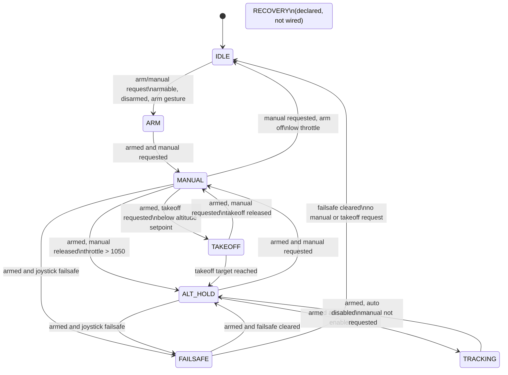

# BT App State Machine

The application state machine is implemented by `Robot_StateMachine` in
`bt_app/bt_app/sm.py`. It uses the `transitions` library and starts in `IDLE`.
The application periodically calls `resolve()`; the machine evaluates eligible
transitions for the current state in registration order. Invalid triggers are
ignored.

After a successful transition, the machine:

1. emits `on_before_state_changed` with the source and destination;
2. changes its state;
3. updates `ctx.state`;
4. logs the transition and emits `on_state_changed`.

## States

| State | Purpose |
| --- | --- |
| `IDLE` | Disarmed, inactive state and initial state. |
| `ARM` | Runs the arming sequence. |
| `MANUAL` | Uses the operator's RC commands. |
| `TAKEOFF` | Climbs to the configured altitude setpoint. |
| `ALT_HOLD` | Holds altitude while accepting hover/yaw commands. |
| `FAILSAFE` | Holds altitude while joystick failsafe is active. |
| `TRACKING` | Runs cursor or target-tracking automatic control. |
| `RECOVERY` | Declared in `RobotState`, but has no registered transitions or RC handler. |

## Active Transitions

Every transition uses the `resolve` trigger. Conditions in a row are combined
with logical AND unless stated otherwise.

| From | To | Guard | Conditions |
| --- | --- | --- | --- |
| `IDLE` | `ARM` | `enter_arm` | (`joy_takeoff_request` OR `joy_manual_request`) and `armable` and not `armed` and `joy_arm_requested` |
| `ARM` | `MANUAL` | `enter_manual_mode_from_arm` | `armed` and `joy_manual_request` |
| `MANUAL` | `TAKEOFF` | `enter_takeoff_from_manual` | `armed` and `joy_takeoff_request` and `drone_alt < alt_setpoint` |
| `MANUAL` | `FAILSAFE` | `enter_failsafe` | `armed` and `joy_fail_safe` |
| `MANUAL` | `IDLE` | `enter_idle_from_manual` | `joy_manual_request` and not `arm_switch` and low throttle |
| `MANUAL` | `ALT_HOLD` | `enter_hover_from_manual` | requested throttle > 1050 and not `joy_manual_request` and `armed` |
| `TAKEOFF` | `ALT_HOLD` | `enter_hover_from_takeoff` | `takeoff_reach` |
| `TAKEOFF` | `MANUAL` | `enter_manual_from_takeoff` | `armed` and `joy_manual_request` and not `joy_takeoff_request` |
| `ALT_HOLD` | `FAILSAFE` | `enter_failsafe` | `armed` and `joy_fail_safe` |
| `ALT_HOLD` | `MANUAL` | `enter_manual_mode_from_hover` | `joy_manual_request` and `armed` |
| `ALT_HOLD` | `TRACKING` | `enter_tracking_mode_from_alt_hold` | `auto_mode_type` is `TRACKING` or `CURSOR`, and `armed` |
| `TRACKING` | `ALT_HOLD` | `enter_alt_hold_mode_from_auto` | `auto_mode_type` is `DISABLED`, `armed`, and not `joy_manual_request` |
| `FAILSAFE` | `ALT_HOLD` | `exit_failsafe` | `armed` and not `joy_fail_safe` |
| `FAILSAFE` | `IDLE` | `exit_failsafe_to_idle` | not `joy_fail_safe`, not `joy_manual_request`, and not `joy_takeoff_request` |

For states with multiple outgoing transitions, registration order determines
priority when more than one guard is true:

- `MANUAL`: `TAKEOFF`, `FAILSAFE`, `IDLE`, then `ALT_HOLD`.
- `ALT_HOLD`: `FAILSAFE`, `MANUAL`, then `TRACKING`.
- `TAKEOFF`: `ALT_HOLD`, then `MANUAL`.
- `FAILSAFE`: `ALT_HOLD`, then `IDLE`.

## Transition Diagram

```mermaid
stateDiagram-v2
    [*] --> IDLE

    IDLE --> ARM: arm/manual request\narmable, disarmed, arm gesture
    ARM --> MANUAL: armed and manual requested

    MANUAL --> TAKEOFF: armed, takeoff requested\nbelow altitude setpoint
    MANUAL --> FAILSAFE: armed and joystick failsafe
    MANUAL --> IDLE: manual requested, arm off\nlow throttle
    MANUAL --> ALT_HOLD: armed, manual released\nthrottle > 1050

    TAKEOFF --> ALT_HOLD: takeoff target reached
    TAKEOFF --> MANUAL: armed, manual requested\ntakeoff released

    ALT_HOLD --> FAILSAFE: armed and joystick failsafe
    ALT_HOLD --> MANUAL: armed and manual requested
    ALT_HOLD --> TRACKING: armed and auto mode enabled

    TRACKING --> ALT_HOLD: armed, auto disabled\nmanual not requested

    FAILSAFE --> ALT_HOLD: armed and failsafe cleared
    FAILSAFE --> IDLE: failsafe cleared\nno manual or takeoff request

    state "RECOVERY\n(declared, not wired)" as RECOVERY
```

## Guard Context

The guards read these `Context` values:

| Field or method | Meaning in the state machine |
| --- | --- |
| `armed` | The vehicle/controller is considered armed. |
| `armable` | The vehicle currently permits arming. |
| `arm_switch` | The arm switch used when deciding whether manual mode may return to `IDLE`. |
| `joy_arm_requested` | The operator completed the arm request/gesture. |
| `joy_manual_request` | Manual mode is requested. |
| `joy_takeoff_request` | Automatic takeoff is requested. |
| `joy_fail_safe` | Joystick failsafe is active. |
| `request_rc[THROTTLE]` | Requested throttle; values above 1050 allow `MANUAL -> ALT_HOLD`. |
| `is_low_throttle()` | Returns whether requested joystick throttle is below 1050. |
| `drone_alt` / `alt_setpoint` | Current and requested altitude used to admit takeoff. |
| `takeoff_reach` | The takeoff controller has remained at its target long enough to enter `ALT_HOLD`. |
| `auto_mode_type` | `DISABLED`, `CURSOR`, or `TRACKING`; controls entry to and exit from `TRACKING`. |

## Application Callbacks

`bt_app/bt_app/app.py` subscribes to both state-change events:

- Before entering `ARM`, it resets the arm controller.
- Before entering `TAKEOFF`, it resets the takeoff controller.
- Before entering `MANUAL`, it resets the manual landing detector.
- Before entering `IDLE`, it resets the arm and takeoff controllers and clears
  arming/takeoff state.
- Before entering `ALT_HOLD`, it initializes the altitude setpoint from the
  current altitude and applies the hover throttle baseline.
- Before entering `FAILSAFE`, it initializes the failsafe controller from the
  current altitude and applies the hover throttle baseline.
- After `MANUAL -> FAILSAFE`, it clears `joy_manual_request`, requiring the
  operator to request manual mode again.

## Current Limitations

- There is no direct `ARM -> IDLE` or `ARM -> TAKEOFF` transition. `ARM` can
  currently advance only to `MANUAL`.
- Failsafe transitions are registered only from `MANUAL` and `ALT_HOLD`, not
  from `ARM`, `TAKEOFF`, or `TRACKING`.
- `RECOVERY` is declared but not connected.
- Landing confirmation is not part of `MANUAL -> IDLE`; the guard relies on
  manual request, arm switch, and low throttle.
- The failsafe exit guards do not yet include an airborne/landed check.
