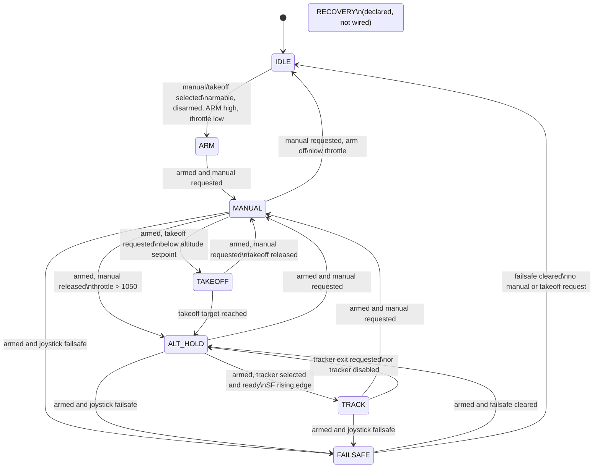

# BT App State Machine

The application state machine is implemented by `Robot_StateMachine` in
`bt_app/bt_app/sm.py`. It uses the `transitions` library and starts in `IDLE`.
The application periodically calls `resolve()`; the machine evaluates eligible
transitions for the current state in registration order. Invalid triggers are
ignored.

After a successful transition, the machine:

1. emits `on_before_state_changed` with the source and destination;
2. changes its state;
3. updates `ctx.state`;
4. logs the transition and emits `on_state_changed`.

## States

| State | Purpose |
| --- | --- |
| `IDLE` | Disarmed, inactive state and initial state. |
| `ARM` | Runs the arming sequence. |
| `MANUAL` | Uses the operator's RC commands. |
| `TAKEOFF` | Climbs to the configured altitude setpoint. |
| `ALT_HOLD` | Holds altitude while accepting hover/yaw commands. |
| `TRACK` | Centers on and approaches a fresh visual target. |
| `FAILSAFE` | Holds altitude while joystick failsafe is active. |
| `RECOVERY` | Declared in `RobotState`, but has no registered transitions or RC handler. |

## Active Transitions

Every transition uses the `resolve` trigger. Conditions in a row are combined
with logical AND unless stated otherwise.

| From | To | Guard | Conditions |
| --- | --- | --- | --- |
| `IDLE` | `ARM` | `enter_arm` | manual or auto-takeoff selected, ARM high, throttle below 1050, `armable`, and not `armed` |
| `ARM` | `MANUAL` | `enter_manual_mode_from_arm` | `armed` and manual selected |
| `MANUAL` | `TAKEOFF` | `enter_takeoff_from_manual` | `armed`, auto-takeoff selected, and `drone_alt < alt_setpoint` |
| `MANUAL` | `FAILSAFE` | `enter_failsafe` | `armed` and `joy_fail_safe` |
| `MANUAL` | `IDLE` | `enter_idle_from_manual` | manual selected, ARM off, and throttle below 1050 |
| `MANUAL` | `ALT_HOLD` | `enter_hover_from_manual` | throttle above 1050, manual not selected, and `armed` |
| `TAKEOFF` | `ALT_HOLD` | `enter_hover_from_takeoff` | `takeoff_reach` |
| `TAKEOFF` | `MANUAL` | `enter_manual_from_takeoff` | `armed`, manual selected, and auto-takeoff not selected |
| `ALT_HOLD` | `FAILSAFE` | `enter_failsafe` | `armed` and `joy_fail_safe` |
| `ALT_HOLD` | `MANUAL` | `enter_manual_mode_from_hover` | manual selected and `armed` |
| `ALT_HOLD` | `TRACK` | `enter_tracking` | armed, tracker1/2 selected, manual released, tracker ready, and an SF rising-edge request |
| `TRACK` | `FAILSAFE` | `enter_failsafe` | armed and joystick failsafe |
| `TRACK` | `MANUAL` | `enter_manual_mode_from_hover` | manual selected and `armed` |
| `TRACK` | `ALT_HOLD` | `exit_tracking` | tracker exit requested or SB moved to disabled |
| `FAILSAFE` | `ALT_HOLD` | `exit_failsafe` | `armed` and not `joy_fail_safe` |
| `FAILSAFE` | `IDLE` | `exit_failsafe_to_idle` | failsafe cleared, manual not selected, and auto-takeoff not selected |

For states with multiple outgoing transitions, registration order determines
priority when more than one guard is true:

- `MANUAL`: `TAKEOFF`, `FAILSAFE`, `IDLE`, then `ALT_HOLD`.
- `ALT_HOLD`: `FAILSAFE`, `MANUAL`, then `TRACK`.
- `TRACK`: `FAILSAFE`, `MANUAL`, then `ALT_HOLD`.
- `TAKEOFF`: `ALT_HOLD`, then `MANUAL`.
- `FAILSAFE`: `ALT_HOLD`, then `IDLE`.

## Transition Diagram

```mermaid
stateDiagram-v2
    [*] --> IDLE

    IDLE --> ARM: manual/takeoff selected\narmable, disarmed, ARM high, throttle low
    ARM --> MANUAL: armed and manual requested

    MANUAL --> TAKEOFF: armed, takeoff requested\nbelow altitude setpoint
    MANUAL --> FAILSAFE: armed and joystick failsafe
    MANUAL --> IDLE: manual requested, arm off\nlow throttle
    MANUAL --> ALT_HOLD: armed, manual released\nthrottle > 1050

    TAKEOFF --> ALT_HOLD: takeoff target reached
    TAKEOFF --> MANUAL: armed, manual requested\ntakeoff released

    ALT_HOLD --> FAILSAFE: armed and joystick failsafe
    ALT_HOLD --> MANUAL: armed and manual requested
    ALT_HOLD --> TRACK: armed, tracker selected and ready\nSF rising edge
    TRACK --> FAILSAFE: armed and joystick failsafe
    TRACK --> MANUAL: armed and manual requested
    TRACK --> ALT_HOLD: tracker exit requested\nor tracker disabled
    FAILSAFE --> ALT_HOLD: armed and failsafe cleared
    FAILSAFE --> IDLE: failsafe cleared\nno manual or takeoff request

    state "RECOVERY\n(declared, not wired)" as RECOVERY
```

## Guard Context

The guards read these `Context` values. Joystick positions come from the single
immutable `request_rc: InternalJoystick` snapshot:

| Field or method | Meaning in the state machine |
| --- | --- |
| `armed` | The vehicle/controller is considered armed. |
| `armable` | The vehicle currently permits arming. |
| `joy_fail_safe` | Joystick failsafe is active. |
| `request_rc.is_armed()` | The joystick ARM switch is high. |
| `request_rc.is_manual()` | Manual mode is selected. |
| `request_rc.is_auto_takeoff()` | Automatic takeoff is selected. |
| `request_rc.is_throttle_low()` | Requested throttle is below 1050. |
| `drone_alt` / `alt_setpoint` | Current and requested altitude used to admit takeoff. |
| `takeoff_reach` | The takeoff controller has remained at its target long enough to enter `ALT_HOLD`. |
| `tracker_ready` | Three distinct fresh estimates are available and the completion latch is clear. |
| `tracker_exit_requested` | Tracking is invalid/stale, auto was released, or COMMIT expired. |

## Application Callbacks

`bt_app/bt_app/app.py` subscribes to both state-change events:

- Before entering `ARM`, it resets the arm controller.
- Before entering `TAKEOFF`, it resets the takeoff controller.
- Before entering `MANUAL`, it resets the manual landing detector.
- Before entering `IDLE`, it resets the arm and takeoff controllers and clears
  vehicle arming state.
- Before entering `ALT_HOLD`, it initializes the altitude setpoint from the
  current altitude and applies the hover throttle baseline.
- Before entering `FAILSAFE`, it initializes the failsafe controller from the
  current altitude and applies the hover throttle baseline.
- Before entering `TRACK`, it activates the tracker controller.
- Leaving `TRACK` stops active tracking; TRACK-to-ALT_HOLD seeds altitude hold
  from current altitude and vertical-speed telemetry.

## Current Limitations

- There is no direct `ARM -> IDLE` or `ARM -> TAKEOFF` transition. `ARM` can
  currently advance only to `MANUAL`.
- Failsafe transitions are registered from `MANUAL`, `ALT_HOLD`, and `TRACK`,
  but not from `ARM` or `TAKEOFF`.
- `RECOVERY` is declared but not connected.
- Landing confirmation is not part of `MANUAL -> IDLE`; the guard relies on
  the manual selection, ARM switch, and low throttle from `request_rc`.
- The failsafe exit guards do not yet include an airborne/landed check.
