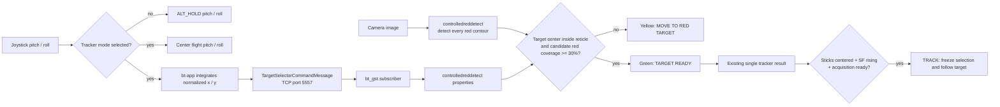

# Joystick target selector

In `ALT_HOLD`, selecting `TRACKER1` or `TRACKER2` changes the meaning of the
pitch and roll sticks. They move an image-space selection reticle and are sent
to the hover controller as centered commands, so the aircraft continues to
hold attitude. Throttle and yaw keep their normal `ALT_HOLD` behavior.



All detected red boxes are drawn blue. The selected box and reticle are green;
an invalid reticle is yellow. If several detections qualify, the tracker uses
the greatest red coverage and then the nearest center. During `TRACK`, nearest-
center association follows the chosen detection and does not automatically
return to reticle selection until the application returns to `ALT_HOLD`. The
selector reticle is hidden during `TRACK`; only the selected target bbox remains
green.

bt-app publishes absolute normalized coordinates, making dropped commands
idempotent. The socket worker in bt_gst only receives and validates messages;
the pipeline thread applies the latest command to the C++ element. Commands
become disabled after 0.5 seconds without an update.

The relevant defaults are `80 x 80 px` and `30%` red coverage in
`controlledreddetect`, with `360 px/s` at the 640-pixel reference width and a
35-PWM joystick deadband in bt-app. The result sent on TCP port 5556 contains
the selected red contour's measured bbox, not the selector rectangle.

## Simulation

Use `bt_gazebo/worlds/betaloop_three_red_boxes_harmonic.sdf`. Start the normal
bt_gst pipeline with `controlledreddetect` and bt-app, then run:

```bash
python bt_app/example/send_rc_takeoff_target_selector.py --target right
```

Choose `--target left`, `--target center`, or `--target right`. Each profile
moves downward toward the ground boxes and applies the corresponding horizontal
direction. Fine-tune a profile with `--selector-roll-rc`,
`--selector-pitch-rc`, and `--selector-move-duration`; explicit RC options
override the named profile.

bt-app binds `selector_zmq_endpoint: tcp://127.0.0.1:5557`. bt_gst connects by
default; it can be overridden with a `selector_zmq` YAML section containing
`enabled`, `endpoint`, `bind`, and `command_timeout_s`.
