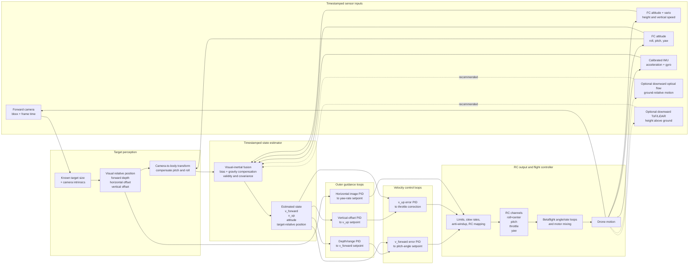

# Cascaded visual tracker redesign

## Objective

Replace fixed-pitch and direct image-error control with a cascaded controller:

- target geometry produces desired forward and vertical velocity;
- estimated drone velocity closes the inner pitch and throttle loops;
- horizontal image error commands yaw rate;
- Betaflight retains its attitude, rate, and motor-mixing loops.

This is a GPS-free design for approaching a stationary target whose physical
size is known. It is a conceptual architecture; PID equations, estimator type,
loop rates, and gains are intentionally deferred to the detailed-design stage.

## Concept block diagram

The diagram uses `v_forward` and `v_up` rather than `vx` and `vy` so camera,
body, and world axes are not confused.

## Signals and control allocation

Every signal belongs to one of three categories:

- **Measured:** bounding box, timestamps, altitude, vario, attitude, IMU, and
  optional optical-flow/range measurements.
- **Estimated:** target-relative position, forward velocity, vertical velocity,
  sensor biases, and estimate quality.
- **Commanded:** forward and vertical velocity setpoints, pitch angle, throttle
  correction, yaw rate, and RC channels.

The first implementation should allocate control as follows:

| Guidance input | Outer-loop output | Inner-loop output |
| --- | --- | --- |
| Target depth/range error | `v_forward` setpoint | Pitch-angle command |
| Vertical target offset | `v_up` setpoint | Throttle correction |
| Horizontal image error | Yaw-rate setpoint | Yaw RC |
| Roll | No tracking command | Centered RC |

Pitch primarily controls forward velocity. Throttle controls vertical velocity
and therefore vertical target alignment. Raw camera `dy` must not independently
command both pitch and throttle: pitch itself moves the target vertically in the
image, so measured attitude and camera mounting geometry must first remove that
coupling.

## Perception and state estimation

Known target dimensions and camera intrinsics provide camera-relative depth and
offsets. Camera extrinsics and measured attitude transform that vector into the
chosen body or local frame. Differences between timestamped visual positions
provide relative closing velocity.

Visual velocity equals drone velocity only under the stationary-target
assumption. It becomes unreliable when:

- the bounding box touches an image edge;
- width- and height-derived depth disagree;
- the tracker changes target or loses lock;
- bounding-box scale is noisy;
- camera timestamps or attitude samples are stale.

The state estimator must publish validity and uncertainty with each state. The
controllers should reject or degrade safely when an input is stale or its
uncertainty exceeds a configured limit.

FC altitude and vario improve the vertical estimate, but they may originate
from the same barometer pipeline and must be treated as correlated rather than
independent observations.

IMU acceleration supplies fast short-term motion information. It cannot be
integrated directly into velocity until the implementation provides:

- calibrated units and sensor timestamps;
- accelerometer and gyro bias estimates;
- gravity removal using current attitude;
- IMU-to-body and camera-to-body transformations;
- periodic correction from visual, vario, optical-flow, or range data.

The repository's current `TargetEstimate.vx_m_s` and `vy_m_s` are desired
camera-relative velocities. They are not measured vehicle velocities and must
not be connected as inner-loop feedback in the redesign.

## Is this a good direction?

Yes. A cascade separates trajectory guidance from vehicle response, supports
smooth velocity profiles, exposes measurable tracking errors, and provides a
clear location for limits, slew rates, anti-windup, and loss handling.

The current camera and FC vario are sufficient for a stationary-target proof of
concept, but not yet for a robust aggressive final approach. Differentiating
monocular bounding-box depth amplifies noise, while IMU-only velocity drifts.
Reliable operation therefore depends on timestamped fusion and at least one
additional drift-bounding motion source.

## Recommended GPS-free sensors

| Priority | Sensor | Contribution |
| ---: | --- | --- |
| 1 | Downward optical flow plus downward ToF/LiDAR | Ground-relative horizontal velocity with metric scale and stable height |
| 2 | Faster timestamped FC attitude and calibrated IMU | Gravity removal, frame transformation, and high-rate prediction |
| 3 | Forward ToF/LiDAR or depth camera | Target range independent of bounding-box scale |
| 4 | Stereo camera or visual-inertial odometry | Local metric motion and position without GPS |
| 5 | UWB anchors | Local position when external infrastructure is acceptable |

The best first hardware addition is downward optical flow paired with a
downward rangefinder. Optical flow alone needs height to convert image motion
into metric velocity. The rangefinder also stabilizes altitude close to the
ground where barometric height is weak.

## Current software gaps

- Raw IMU reads exist but are not scheduled or delivered to the application
  context.
- Attitude is currently scheduled at 2 Hz, too slowly for useful visual/body
  transformation during aggressive motion.
- Altitude and vario are scheduled at 10 Hz.
- No measured forward velocity or local horizontal position is available.
- Camera, attitude, altitude, and IMU measurements do not yet share a unified
  timestamped estimator interface.

The next design step should define coordinate frames, timestamp semantics,
estimator states and measurements, PID equations, loop rates, saturation and
anti-windup behavior, and a staged simulation-validation plan.
