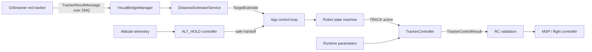
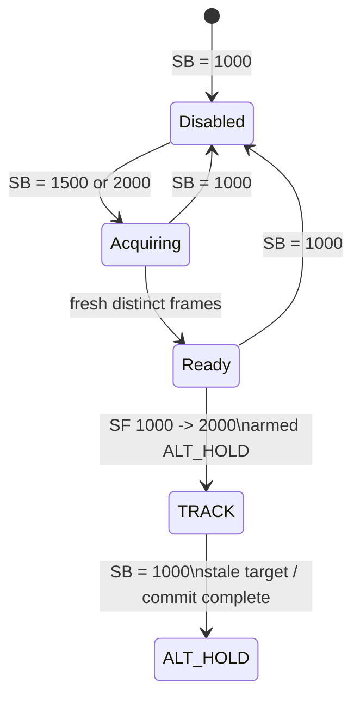
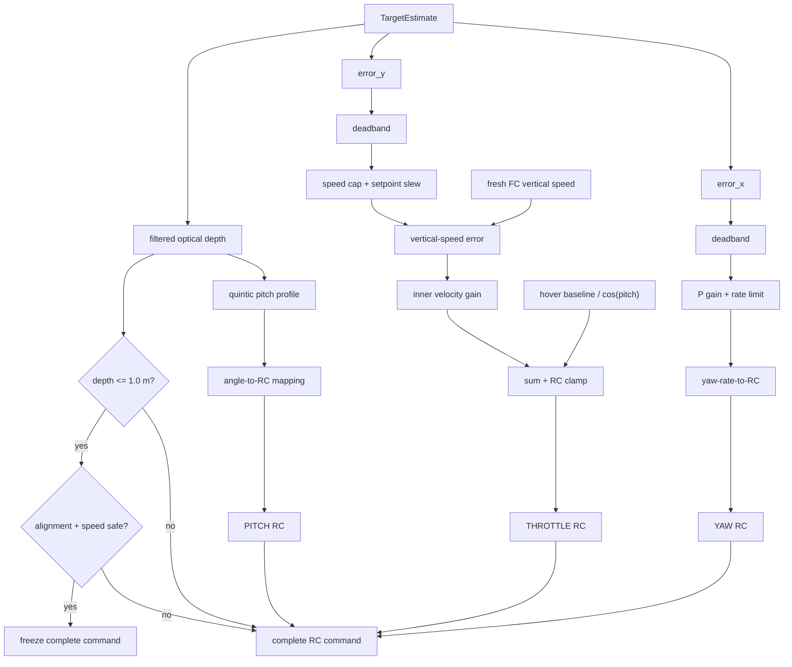
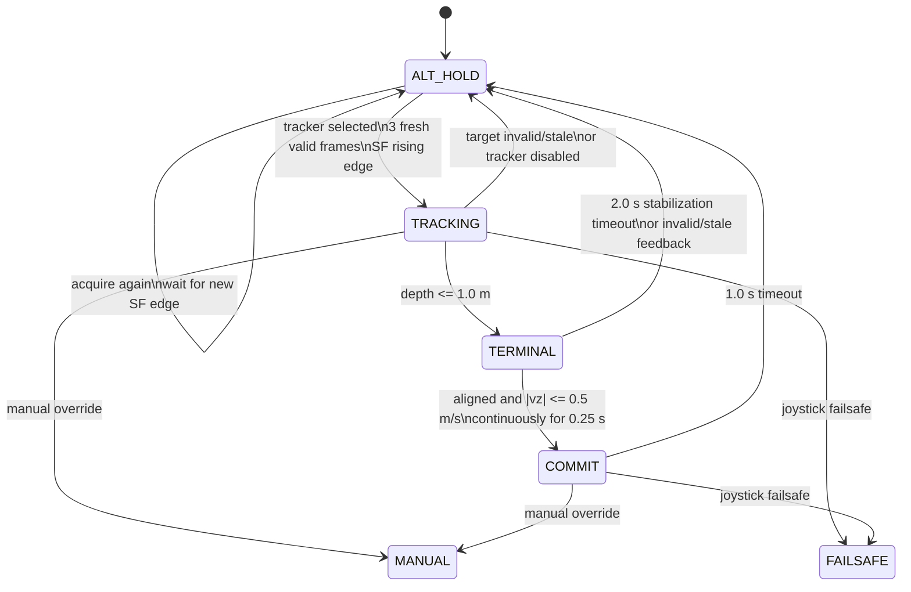

# Red-target tracker controller

For the proposed GPS-free cascaded velocity architecture, see
[Cascaded visual tracker redesign](tracker_cascade_redesign.md).

## Objective

The tracker controller guides the drone toward a red target while keeping the
target near the center of a forward-facing camera. The first version commands:

- fixed forward pitch;
- yaw from horizontal image error;
- throttle from vertical image error;
- centered roll.

Measured-velocity feedback is deliberately deferred. When the drone reaches a
configured forward depth, the controller freezes its complete last valid RC
command for a short commit interval so loss of useful vision near the target
does not change the trajectory.

This document describes the implemented POC and its deferred production work.

## System boundary and data flow

For the application TRACK state, acquisition flags, and internal phase
transitions, see [Tracker states and phases](tracker_states_and_phases.md).

The GStreamer process publishes `TrackerResultMessage`. The existing visual
bridge and distance-estimator service convert it into a controller-facing
observation. The application state machine decides whether the tracker
controller owns RC output.



The tracker controller runs synchronously in the existing 50 Hz application
loop. ZMQ reception continues on its existing receiver thread; it only replaces
the immutable latest estimate. No additional controller thread is needed.

## Buffered controller trace

Each TRACK session buffers one analysis row for every controller update. The
trace separates the newest observed target result from the last valid estimate
that drives a held command during visual-loss grace. It includes monotonic
timing, target geometry, desired `vx_m_s`/`vy_m_s`, controller internals, active
parameters, phase and exit flags, measured FC vertical speed and freshness,
the raw/capped/slew-limited vertical-speed requests, velocity error,
visual/damping throttle terms, and all eight proposed RC channels.

No file I/O occurs while TRACK is actively producing commands. When TRACK
exits, `stop_tracking()` synchronously overwrites
`logs/tracker_controller.csv` through an atomic temporary-file replacement.
The App supplies an end reason such as target loss, commit completion, tracker
disable, manual override, or failsafe. Export failures are logged without
preventing the requested state transition.

The trace intentionally records proposed controller output rather than final
sanitized/dispatched RC. Vertical speed is measured FC telemetry, but horizontal
velocity and position remain unavailable, so the trace still cannot establish
the drone's actual trajectory.

## Proposed interfaces

`TargetEstimate` needs the normalized target-center errors in addition to its
existing distance fields:

```python
@dataclass(frozen=True, slots=True)
class TargetEstimate:
    frame_id: int
    timestamp_ns: int | None
    received_at_s: float
    depth_m: float | None
    slant_range_m: float | None
    error_x: float | None
    error_y: float | None
    vx_m_s: float
    vy_m_s: float
    valid: bool
    reason: str | None = None
```

The errors are computed from the bounding-box center and configured camera
geometry:

```text
u = bbox_x + bbox_width / 2
v = bbox_y + bbox_height / 2

error_x = (u - cx) / (image_width / 2)
error_y = (cy - v) / (image_height / 2)
```

Positive `error_x` means the target is to the camera's right. Positive
`error_y` means the target is above the camera center. Both are clamped to
`[-1, 1]`.

The implemented controller API separates acquisition from active command output:

```text
TrackerController.observe(estimate, now_s, mode_selected) -> bool
TrackerController.update(now_s) -> TrackerControlResult
```

`TrackerControlResult` contains the complete eight-channel RC command, current
phase (`TRACKING`, `TERMINAL`, or `COMMIT`), image errors, requested pitch, yaw
rate, vertical-speed limit and corrections, terminal readiness diagnostics,
validity, and an optional reason. `reset()` clears acquisition, terminal and
commit timing, the frozen command, and completion state.

Only distinct frame IDs advance acquisition or update the tracking command.
Repeated application-loop reads hold the previous output.

## Joystick activation

Tracking selection is independent of auto takeoff. The immutable joystick
snapshot exposes two dedicated inputs:

| Channel | Boxer switch | Values |
| ------- | ------------ | ------ |
| 8 | SB | `1000` disabled, `1500` tracker1, `2000` tracker2 |
| 9 | SF | `1000` released, `2000` pressed |

Tracker1 and tracker2 intentionally use the same controller in this POC. While
either is selected, observations build the required fresh-frame lock. A single
SF `1000` to `2000` edge requests entry only when the application is already
armed in `ALT_HOLD` and the tracker is ready. Startup-high, held-high, and early
presses do not request a later entry. SB disabled immediately cancels acquisition
or exits `TRACK` to `ALT_HOLD`.



## Controller logic

### Deadband

A continuous deadband removes small detector noise without creating an output
jump:

```text
deadband(e, d) = 0                         when abs(e) <= d
                 sign(e) * (abs(e) - d)   otherwise
```

The initial deadband is `0.03` normalized image units.

### Pitch

Before measured-velocity control is introduced, pitch slews from level flight
toward a fixed physical angle:

```text
pitch_command = -10 degrees
```

Negative pitch means nose-down/forward. `BetaflightRcMapper.angle_to_rc()` uses
the configured Betaflight angle limit. The tracker applies its vehicle-specific
inverted pitch mapping, so forward pitch maps above RC midpoint (`-10 degrees`
at a `60 degree` limit maps to approximately `1583`). Other angle-mapper users
retain the default direction. The command is always bounded to `[1000, 2000]`.
TRACK starts at `0 degrees` and advances toward the target at
`TRK_PITCH_RATE`. With the initial `5 degrees/s` rate, the transition to
`-10 degrees` takes two seconds. Runtime target changes use the same slew rate.
Tilt-compensated throttle is calculated from the current ramped pitch.

### Yaw

Horizontal image error commands a proportional target yaw rate:

```text
yaw_rate = clamp(
    TRK_YAW_KP * deadband(error_x, TRK_DEADBAND),
    -TRK_YAW_MAX,
    +TRK_YAW_MAX,
)
```

The sent yaw rate slews toward this target by at most
`TRK_YAW_SLEW * dt` each loop. This limits initial acceleration and prevents an
instantaneous sign reversal when the target crosses the camera center.

A target to the right produces a right-turn request. The existing
`BetaflightRcMapper.yaw_rate_to_rc()` converts the rate to RC.

### Throttle

Vertical image error creates a bounded, acceleration-limited vertical-speed
setpoint. Measured upward-positive FC vertical speed closes the inner loop.
First, compensate for pitch so the vertical thrust component remains near
hover:

```text
hover_fraction = (HOV_BASELINE - 1000) / 1000
throttle_ff = 1000 + 1000 * hover_fraction / cos(pitch_command)

raw_vz = (TRK_THR_KP / TRK_VZ_KD) * deadband(error_y, TRK_DEADBAND)
effective_limit = smooth_range_limit(closest_depth, TRK_VZ_MAX, TRK_VZ_NEAR)
target_vz = clamp(raw_vz, -effective_limit, +effective_limit)
setpoint_vz = asymmetric_slew(
    setpoint_vz, target_vz, TRK_VZ_ACCEL, TRK_VZ_BRAKE
)

visual_correction = TRK_VZ_KD * setpoint_vz
damping_correction = -TRK_VZ_KD * measured_vertical_speed

throttle_correction = clamp(
    visual_correction + damping_correction,
    -TRK_THR_MAX,
    +TRK_THR_MAX,
)

throttle = clamp(throttle_ff + throttle_correction, 1000, 2000)
```

A target above center requests upward speed; a target below center requests
downward speed. TRACK requires finite vertical-speed telemetry aged from 0 to
0.30 s both at entry and while active. Missing or stale telemetry blocks entry
or requests an ALT_HOLD exit. Roll stays at `1500`. ARM and ANGLE remain high
while TRACK owns the command.



## Acquisition, tracking, terminal braking, and commit

Add a dedicated `RobotState.TRACK`. `TRACKING`, `TERMINAL`, and `COMMIT` are
internal controller phases rather than additional application states.

### Entry

`ALT_HOLD` enters `TRACK` only when all of these are true:

- the vehicle is armed;
- SB selects tracker1 or tracker2;
- SF has produced a new low-to-high edge;
- three consecutive distinct estimates are valid and no older than `0.25 s`.

The state-machine guard reads observation status prepared by the App loop. It
does not read the ZMQ receiver thread directly.

### TRACKING

Each new valid frame updates the visual yaw and throttle corrections. The
time-based pitch slew advances on application updates while the latest target
remains valid; once it reaches its target, duplicate frames return the previous
complete command. Velocity fields in `TargetEstimate` are ignored in this
milestone.

An invalid estimate freezes the last valid command, including the pitch ramp,
until the last valid estimate becomes older than `0.25 s`. A valid estimate
within that grace period resumes tracking from the frozen pitch. At timeout,
`observe()` requests an exit before state resolution. The state machine enters
`ALT_HOLD` in the same loop; its altitude setpoint is initialized from the
current altitude for a bumpless handoff. A timeout still returns neutral
pitch/yaw and hover throttle rather than raising.

### TERMINAL

At valid filtered `depth_m <= 1.0`, latch `TERMINAL`, retain the terminal pitch
profile and yaw alignment, and force the vertical-speed target to zero. Enter
COMMIT only after `abs(dx) <= 0.10`, `abs(dy) <= 0.10`, and
`abs(measured_vz) <= 0.50 m/s` remain true for 0.25 s. Invalid observations or
a failed condition reset the readiness timer. Failure to stabilize within two
seconds returns the safe handoff command and requests ALT_HOLD.

### COMMIT

After the terminal gate passes, copy the complete current RC command and enter
`COMMIT`. During COMMIT:

- return the exact frozen command on every application tick;
- ignore new visual estimates and controller parameter changes;
- allow manual and failsafe overrides;
- stop at a deadline frozen on COMMIT entry using the monotonic clock.

At timeout, emit the safe altitude-hold handoff command and exit to `ALT_HOLD`.
Set a completion flag for diagnostics. The one-shot joystick request prevents
the still-visible target from immediately starting a second approach; a new SF
low-to-high edge is required after acquisition becomes ready again.



Failsafe has the highest transition priority, followed by manual override,
tracking exits, and normal tracking updates.

## Parameters

The first simulator values are intentionally conservative. Controller
parameters subscribe to the existing parameter-change event and update through
one validated immutable configuration snapshot, so an App-loop update never
observes a partially changed configuration. Invalid cross-field updates retain
the last valid snapshot. COMMIT retains both its frozen RC tuple and its
original deadline despite parameter updates.

| Parameter | Default | Meaning |
| --- | ---: | --- |
| `TRK_PITCH_DEG` | `-10.0` | Fixed forward pitch angle |
| `TRK_PITCH_RATE` | `5.0` | Pitch slew rate in degrees per second |
| `TRK_YAW_KP` | `10.0` | Yaw-rate gain in deg/s per normalized error |
| `TRK_YAW_MAX` | `20.0` | Absolute yaw-rate limit in deg/s |
| `TRK_YAW_SLEW` | `20.0` | Yaw-rate slew limit in deg/s² |
| `TRK_THR_KP` | `100.0` | Outer visual gain used with `TRK_VZ_KD` to derive requested speed |
| `TRK_VZ_KD` | `30.0` | Inner vertical-speed error gain in RC units per m/s |
| `TRK_VZ_MAX` | `1.75` | Far-range absolute vertical-speed target limit in m/s |
| `TRK_VZ_ACCEL` | `0.75` | Vertical-speed setpoint slew limit in m/s squared |
| `TRK_VZ_NEAR` | `0.5` | Absolute vertical-speed limit at and below the taper end |
| `TRK_VZ_TAPER_S` | `4.0` | Depth where the speed-limit taper begins |
| `TRK_VZ_TAPER_E` | `2.0` | Depth where the near speed limit is reached |
| `TRK_VZ_BRAKE` | `1.5` | Setpoint braking rate toward zero in m/s squared |
| `TRK_THR_MAX` | `100.0` | Absolute throttle correction limit in RC units |
| `TRK_DEADBAND` | `0.03` | Image-error deadband |
| `TRK_TIMEOUT_S` | `0.25` | Maximum time since the last valid estimate |
| `TRK_LOCK_FRAMES` | `3` | Consecutive frames required for entry |
| `TRK_COMMIT_M` | `1.0` | Forward depth that enters COMMIT |
| `TRK_COMMIT_S` | `1.0` | Maximum frozen-command duration |
| `TRK_COMMIT_XY` | `0.1` | Maximum absolute camera error allowed for COMMIT |
| `TRK_COMMIT_VZ` | `0.5` | Maximum absolute vertical speed allowed for COMMIT |
| `TRK_COMMIT_HOLD` | `0.25` | Continuous safe-condition time required for COMMIT |
| `TRK_TERM_TIMEOUT` | `2.0` | Maximum TERMINAL stabilization time before safe exit |
| `BF_ANGLE_LIMIT` | `60.0` | Betaflight angle represented by full RC stick |

`HOV_BASELINE` and `BF_YAW_RATE` remain the shared hover and yaw-mapping
parameters. All generated MAVLink parameter names remain within 16 characters.

## Implementation milestones

1. Extend `TargetEstimate` with normalized image errors while retaining the
   existing velocity fields.
2. Add the isolated `TrackerController`, immutable output, parameter bindings,
   RC mapping, and deterministic tests.
3. Add `RobotState.TRACK`, guards, App routing, altitude-hold handoff,
   completion latching, and integration tests.
4. Add measured vertical-speed damping and log its individual throttle term.

## Test and acceptance matrix

Future implementation tests must cover:

- centered target: fixed forward pitch, neutral yaw, tilt-compensated throttle;
- target right/left: correctly signed and bounded yaw;
- target above/below: correctly signed and bounded throttle correction;
- upward/downward motion: correctly signed vertical-speed damping;
- stale or invalid vertical speed: visual control continues without damping;
- deadband behavior and RC bounds;
- duplicate frames holding the previous command;
- entry only after three fresh distinct frames;
- brief invalid target holding the last command and resuming without a pitch jump;
- invalid or stale target exceeding the grace period exiting TRACK safely;
- terminal braking and monotonic range-based speed limiting;
- commit only after continuously safe alignment and vertical speed;
- terminal timeout returning the safe handoff command;
- exact preservation of every RC channel during COMMIT;
- visual and parameter updates being ignored during COMMIT;
- one-second commit timeout and SF edge re-entry gate;
- failsafe and manual overrides taking priority in both phases;
- live parameter updates outside COMMIT;
- state entry/exit resetting acquisition, timers, and frozen commands.

The first flight acceptance test succeeds when the simulator enters TRACK,
keeps the red target near camera center during a low-speed approach, brakes at
one metre, freezes only a safely gated command, returns to ALT_HOLD after one
second, and cannot
re-enter TRACK until SF is released and pressed again after target lock.

## Deferred work

- measured forward/vertical velocity feedback;
- collision or impact confirmation;
- roll/lateral control;
- adaptive pitch;
- wind, camera distortion, target motion, and production recovery behavior.
