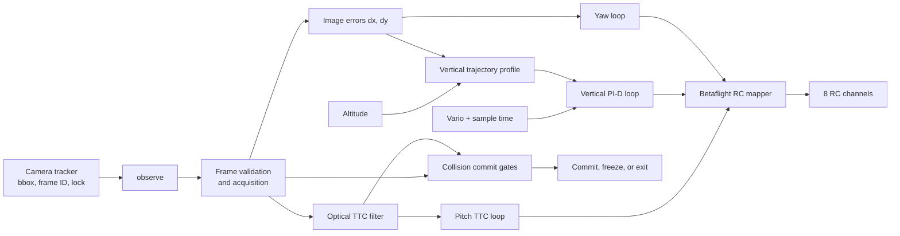
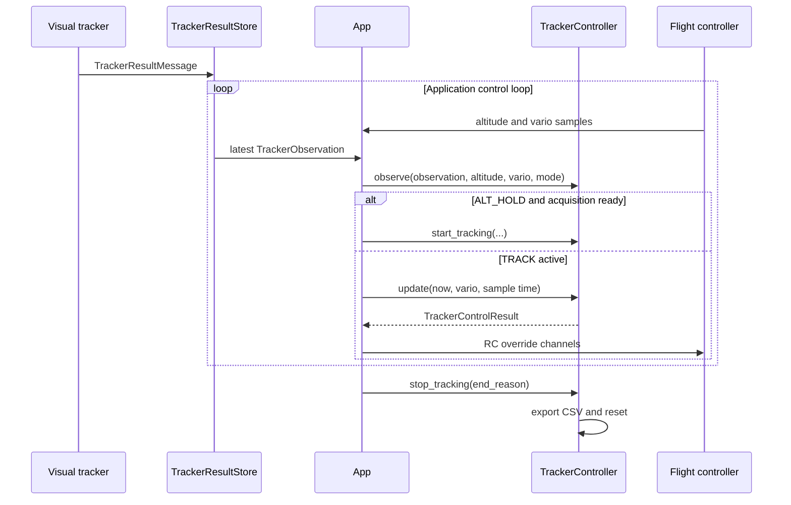
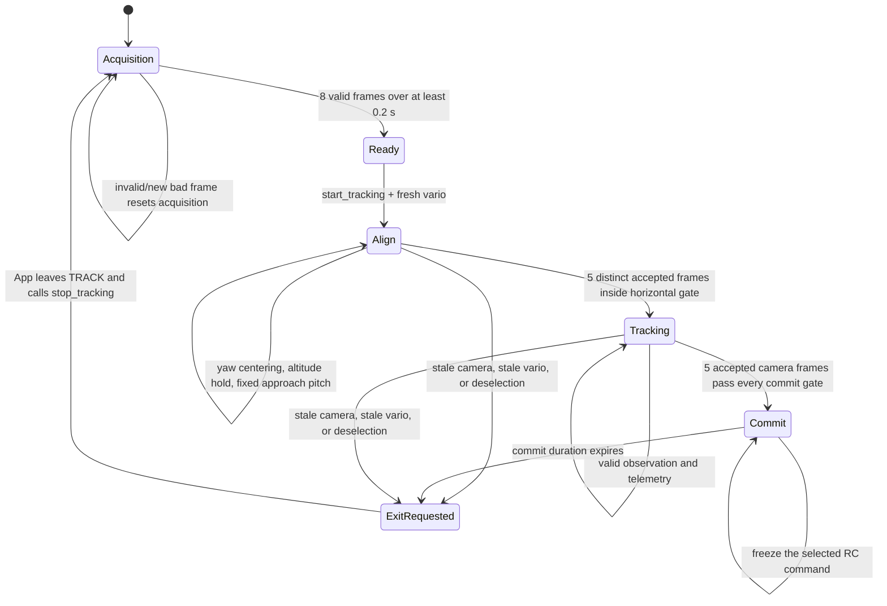
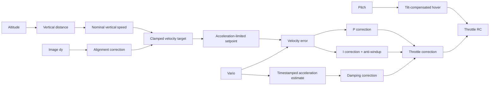

# Tracker controller flow

## Brief overview

`TrackerController` controls the drone during the application's `TRACK` state. It combines three inputs:

- a camera tracker bounding box;
- flight-controller altitude;
- flight-controller vertical speed (vario).

It produces eight RC channels. Roll remains centered, yaw centers the target horizontally, pitch controls visual time-to-contact (TTC), and throttle follows a vertical trajectory toward the configured target height.

The controller intentionally does **not** estimate metric forward distance or horizontal velocity. Forward closing is inferred from how quickly the target bounding box expands.



## External calling flow

The application owns the lifecycle. On each application control iteration it calls `observe(...)`, even if the raw tracker store still contains the same camera frame. While the application is in `TRACK`, it then calls `update(...)` and sends the returned channels.



`TrackerObservation.received_at_s` is a local monotonic receive time. It is used instead of the camera timestamp for freshness and optical-filter time differences.

## Lifecycle

The public lifecycle is acquisition, alignment, tracking, commit, and stop. `TrackerPhase.TERMINAL` remains in the enum for API compatibility but is not entered by this implementation.



### Acquisition

`observe(...)` feeds each distinct camera frame to `OpticalTtcFilter`. Readiness requires:

1. the tracker mode is selected;
2. the current observation is no older than `TTC_TIMEOUT`;
3. at least `TTC_LOCK_FR` accepted frames have accumulated;
4. their receive-time history spans at least `TTC_LOCK_S`.

With the current defaults, this means 8 accepted frames spanning at least 0.20 seconds. Re-reading the same frame at the faster application-loop rate does not increase the count and does not clear an already reached ready state.

Before TRACK starts, any distinct invalid frame clears acquisition. During active TRACK, an invalid frame does not immediately discard the last valid observation; the controller may use that last observation until the freshness timeout expires.

### Start and stop

`start_tracking(...)` rejects entry unless acquisition is ready and vario is fresh. It enters `ALIGN` and initializes:

- pitch to `TTC_ALN_PIT`;
- the vertical setpoint to current measured vario;
- the vertical integral to zero;
- acceleration history from the current vario sample;
- phase and commit state;
- in-memory CSV rows.

During `ALIGN`, yaw remains active, pitch stays at `TTC_ALN_PIT`, and the existing vario PI-D loop targets zero vertical speed. Optical TTC cannot increase the closing pitch and vertical image error cannot command descent. The target must remain within the horizontal threshold `TTC_ALN_XY` for `TTC_ALN_FR` distinct accepted frames. A distinct rejected or horizontally misaligned frame resets this counter; reading the same frame again does not advance it. On transition to `TRACKING`, the optical expansion-rate estimate is reset so staging motion is not interpreted as target closing.

`stop_tracking(...)` exports the CSV atomically through a temporary file, resets all dynamic controller state, and returns to acquisition behavior.

## Camera-frame validation and optical TTC

### Frame rejection

`OpticalTtcFilter.update(...)` handles frame ordering and visual validity. A tracker-ID change resets the filter. A frame is rejected when it is:

- duplicate or out of order;
- unlocked;
- non-positive in width or height;
- touching or crossing any image edge;
- non-monotonic in local receive time;
- a scale innovation larger than `log(1 + TTC_SCALE_JMP)`.

The strict edge rule prevents a clipped box from corrupting TTC, because its visible area no longer represents the target's true projected area.

### Scale and TTC equations

The scalar visual size is the geometric mean of bounding-box dimensions:

```text
scale = sqrt(bbox_width * bbox_height)
measurement = log(scale)
```

The alpha-beta filter predicts log scale and corrects it with the new measurement:

```text
predicted_log_scale = previous_log_scale + rate * dt
innovation = measured_log_scale - predicted_log_scale

filtered_log_scale = predicted_log_scale + alpha * innovation
rate = previous_rate + beta * innovation / dt
```

For a stationary target, positive log-scale rate approximates inverse TTC:

```text
inverse_ttc_measured = clamp(max(0, rate), 0, TTC_INV_MAX)
measured_ttc = 1 / inverse_ttc_measured
```

Very small or negative expansion is reported as `TTC_LOG_MAX` rather than infinity.

## Normalized image errors

The controller derives errors from the bbox center and configured camera center:

```text
bbox_center_x = bbox_x + bbox_width / 2
bbox_center_y = bbox_y + bbox_height / 2

dx = (bbox_center_x - camera_cx) / (camera_width / 2)
dy = (camera_cy - bbox_center_y) / (camera_height / 2)
```

Both values are clamped to `[-1, +1]`.

- Positive `dx`: target is right of center.
- Negative `dx`: target is left of center.
- Positive `dy`: target is above center.
- Negative `dy`: target is below center.

## Pitch: optical TTC loop

The desired arrival time is derived from remaining vertical distance, not forward range:

```text
vertical_distance = target_height - altitude
target_ttc = max(abs(vertical_distance) / TTC_VY_NOM, TTC_MIN_S)
inverse_ttc_target = 1 / target_ttc
```

The pitch law compares desired and measured inverse TTC:

```text
pitch_raw = TTC_PIT_INIT
            - TTC_INV_KP * (inverse_ttc_target - inverse_ttc_measured)

pitch_raw = clamp(pitch_raw, TTC_PIT_MIN, 0)
```

If visual closing is slower than desired, pitch becomes more negative. If closing is faster than desired, pitch relaxes toward zero. The command can change by at most `TTC_PIT_SLEW * control_dt`, preventing pitch steps.

The mapper uses `sign=-1`, matching the configured Betaflight/simulator pitch-channel direction.

Important current limitation: desired forward closing is not yet reduced when the bbox is badly misaligned in the near field. Pitch and vertical alignment therefore share camera geometry but are not explicitly trajectory-coupled.

## Throttle: vertical trajectory and PI-D loop

The vertical loop is layered:



### Vertical target

Because `target_ttc` is derived from vertical distance, the nominal speed is normally `-TTC_VY_NOM` while the drone is above the target:

```text
vertical_nominal = vertical_distance / target_ttc
vertical_alignment = TTC_DY_KP * deadband(dy)

vertical_target = clamp(
    vertical_nominal + vertical_alignment,
    TTC_VY_MIN,
    TTC_VY_MAX,
)
```

A target below the camera center produces negative `dy`, making the requested vertical velocity more negative.

### Setpoint slew limiter

The raw vertical target is not applied immediately:

```text
maximum_step = TRK_VZ_ACCEL * control_dt
vertical_setpoint += clamp(
    vertical_target - vertical_setpoint,
    -maximum_step,
    +maximum_step,
)
```

The current acceleration limit is 0.5 m/s². This prevents the large initial velocity step that previously excited the vertical dynamics.

### P and I terms

```text
vertical_error = vertical_setpoint - vario
P = TTC_VY_KP * vertical_error
I_candidate = clamp(
    I + TTC_VY_KI * vertical_error * control_dt,
    -TTC_VY_I_MAX,
    +TTC_VY_I_MAX,
)
```

The integral candidate is accepted when the total correction is within its limit or when integration would drive an already saturated output back toward the valid range. The integral resets at TRACK start and stop.

### Acceleration damping

Acceleration updates only when the vario sample timestamp advances. Repeated 50 Hz control-loop reads of the same telemetry sample do not recalculate it.

```text
raw_acceleration = clamp(
    (new_vario - previous_vario) / telemetry_dt,
    -5,
    +5,
)

filtered_acceleration += TTC_AZ_ALPHA
                         * (raw_acceleration - filtered_acceleration)

D = -TTC_VY_KD * filtered_acceleration
```

The negative sign provides damping: developing downward acceleration generates positive throttle correction, while upward acceleration reduces throttle.

### Final throttle command

The P, I, and D terms are limited together:

```text
correction = clamp(P + I + D, -TTC_THR_MAX, +TTC_THR_MAX)
```

Hover throttle is compensated for commanded pitch:

```text
tilt_hover = RC_MIN
    + (HOV_BASELINE - RC_MIN) / max(cos(pitch), 0.35)

throttle_rc = clamp(round(tilt_hover + correction), RC_MIN, RC_MAX)
```

## Yaw and fixed channels

Yaw is a bounded proportional loop after image deadband:

```text
yaw_rate = clamp(
    TRK_YAW_KP * deadband(dx),
    -TRK_YAW_MAX,
    +TRK_YAW_MAX,
)
```

`BetaflightRcMapper` converts yaw rate using `BF_YAW_RATE` as the full-stick rate.

The output channel policy is:

| Channel | Command |
|---|---|
| Roll | Centered |
| Pitch | Mapped pitch angle |
| Throttle | Tilt-compensated PI-D output |
| Yaw | Mapped yaw rate |
| Arm | Maximum/on |
| Angle mode | Maximum/on |
| AUX3 | Minimum |
| AUX4 | Minimum |

All channels are clamped to the RC minimum/maximum range.

## Collision commit

Every accepted, distinct camera frame is checked against four gates in this order:

1. bbox fill is at least `TTC_FILL`;
2. measured TTC is no greater than `TTC_MIN_S`;
3. `abs(dx)` is no greater than `TTC_ALIGN`;
4. `abs(dy)` is no greater than `TTC_ALIGN`.

Fill is the larger of the bbox width fraction and height fraction:

```text
fill = max(bbox_width / image_width, bbox_height / image_height)
```

The current defaults require fill ≥ 0.60, TTC ≤ 0.50 seconds, and both alignment errors ≤ 0.15 for five consecutive accepted camera frames. Duplicate control-loop reads neither increment nor reset the counter. A distinct rejected frame resets it.

When the count reaches `TTC_COMMIT_FR`, the controller:

1. changes phase to `COMMIT`;
2. freezes the current `TrackerControlResult` and RC channels;
3. holds those channels for `TRK_COMMIT_S`;
4. latches completion and requests exit with `commit complete`.

## Loss and safe-output behavior

The controller requests exit when:

- tracker mode is deselected during active TRACK;
- altitude or vario is missing, stale, non-finite, or timestamped in the future;
- the last accepted tracker observation exceeds `TTC_TIMEOUT`.

The camera timeout acts as a short prediction/hold window: control continues from the last accepted observation, but an invalid or duplicate frame cannot advance commit. Once stale, `_safe_result(...)` centers roll, pitch, and yaw and uses `HOV_BASELINE` throttle while the application transitions out of TRACK.

The controller does not perform the state transition itself. It raises `exit_requested`; the application/state machine decides the next state and then calls `stop_tracking(...)`.

## Runtime parameters

The most important active defaults are:

| Function | Parameters and defaults |
|---|---|
| Optical filter | `TTC_SCALE_A=0.35`, `TTC_SCALE_B=0.08`, `TTC_SCALE_JMP=0.35` |
| Acquisition/loss | `TTC_LOCK_FR=8`, `TTC_LOCK_S=0.20`, `TTC_TIMEOUT=0.25` |
| Initial alignment | `TTC_ALN_PIT=-5`, horizontal `TTC_ALN_XY=0.25`, `TTC_ALN_FR=5`; vertical-speed target is zero |
| Pitch/TTC | `TTC_PIT_INIT=-8`, `TTC_PIT_MIN=-15`, `TTC_PIT_SLEW=5`, `TTC_INV_KP=10` |
| Vertical profile | `TGT_HEIGHT_M=0.5`, `TTC_VY_NOM=1.25`, `TTC_DY_KP=1.5`, `TRK_VZ_ACCEL=0.5` |
| Vertical PI-D | `TTC_VY_KP=20`, `TTC_VY_KI=3`, `TTC_VY_KD=10`, `TTC_AZ_ALPHA=0.2` |
| Vertical limits | `TTC_VY_MIN=-5`, `TTC_VY_MAX=2`, `TTC_VY_I_MAX=40`, `TTC_THR_MAX=100` |
| Yaw | `TRK_YAW_KP=15`, `TRK_YAW_MAX=20`, `TRK_DEADBAND=0.03` |
| Commit | `TTC_FILL=0.60`, `TTC_ALIGN=0.15`, `TTC_COMMIT_FR=5`, `TTC_MIN_S=0.50` |

Parameter-change callbacks rebuild and validate an immutable `TrackerConfig`. Each observe or update operation takes a lock-protected configuration snapshot, so one iteration uses a consistent set of values.

## Diagnostics and CSV flow

When a CSV path is configured, each active `update(...)` appends a row in memory. The row contains:

- raw tracker identity, timing, bbox, and validity;
- normalized alignment and bbox fill;
- optical filter state, innovation, inverse TTC, and TTC;
- altitude, vario, velocity target/setpoint/error;
- raw and filtered vertical acceleration;
- P, I, and D throttle terms;
- actual roll, pitch, heading and attitude-sample age;
- commanded pitch, yaw, throttle, alignment/commit state, exit state;
- all eight final RC channels.

Rows are exported only by `stop_tracking(...)`. Every row receives the same final `end_reason`, and the temporary file is atomically renamed to `logs/tracker_controller.csv`.

One diagnostic detail matters during analysis: the final stale-data row contains a safe result, so its centered pitch and hover throttle are not the last active flight command. Use the last row with `result_valid=True` when interpreting terminal controller behavior.

## Current design boundary

The implementation now has a stable vertical PI-D loop, but these capabilities remain outside it:

- no metric forward distance or forward velocity;
- no GPS or horizontal-position feedback;
- Euler attitude is logged at 20 Hz but is not feedback for bbox rotation compensation;
- no near-field coupling that slows optical closing when `dx` or `dy` is poor;
- no target-motion compensation—the TTC model assumes a stationary target.

The next architectural addition should be near-field alignment-to-TTC coupling. It should reduce desired inverse TTC when the bbox is large and misaligned, without changing the now-stable vertical PI-D gains.
