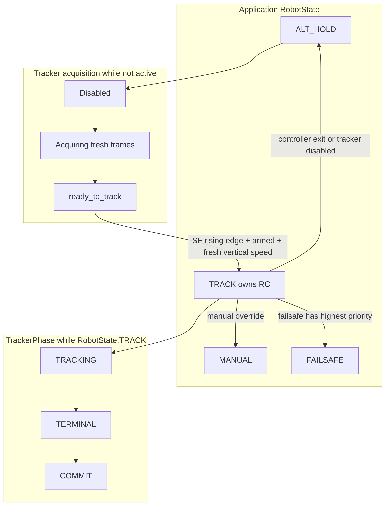
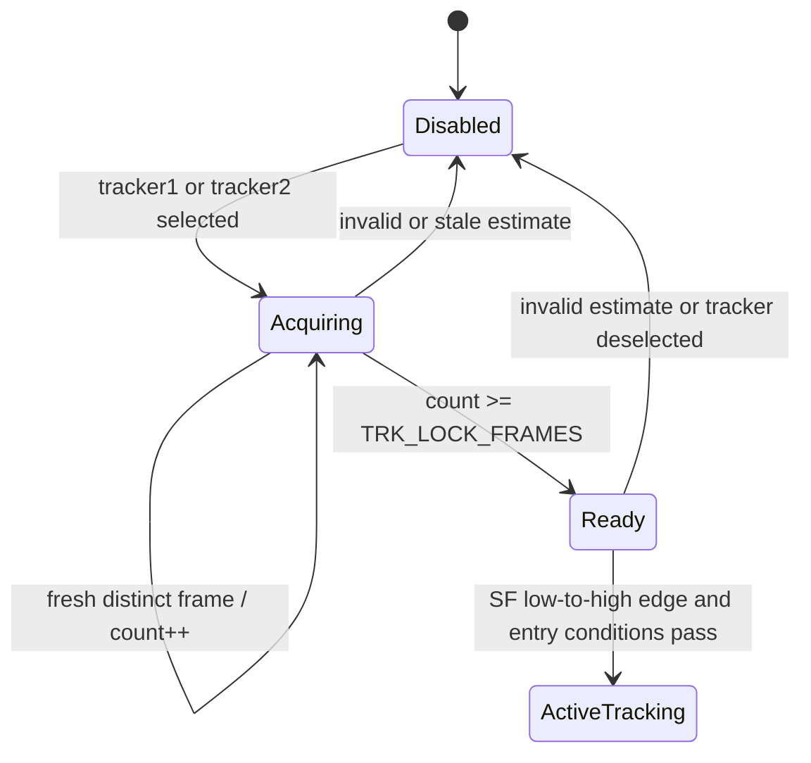
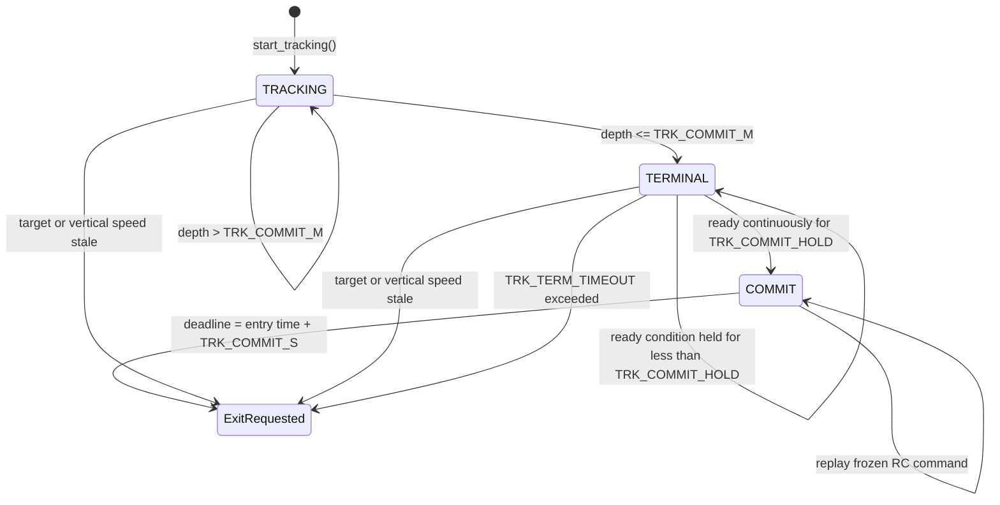
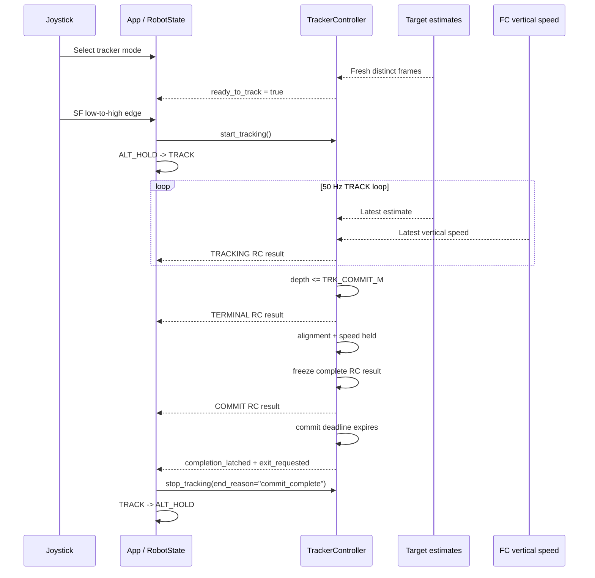
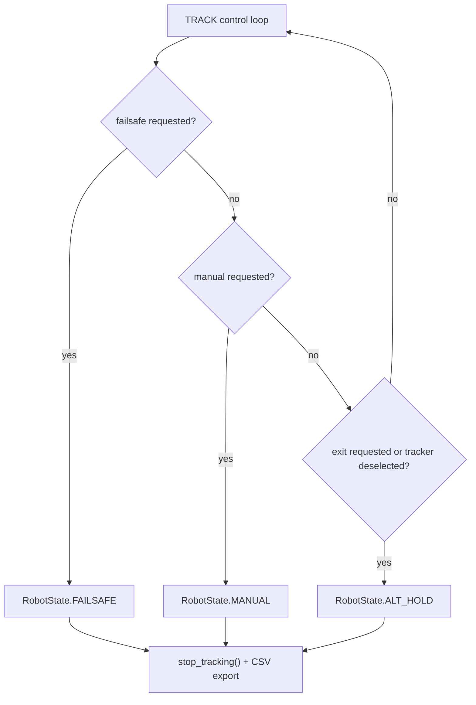

# Tracker states and phases

## Why there are multiple state layers

Tracking uses two state machines at different levels:

1. The application state machine decides which controller owns the drone RC
   channels. `RobotState.TRACK` is one application state alongside `ALT_HOLD`,
   `MANUAL`, and `FAILSAFE`.
2. `TrackerController` has internal phases that describe progress after TRACK
   owns RC: `TRACKING`, `TERMINAL`, and `COMMIT`.

Before application TRACK begins, the controller also maintains acquisition
flags. Disabled, acquiring, and ready are useful names for these conditions,
but they are not members of `TrackerPhase`.

## Acquisition and entry

`observe()` runs before TRACK owns RC. A selected tracker mode allows fresh,
valid estimates to build the lock counter. Only a distinct `frame_id` advances
the counter; repeated 50 Hz reads of one camera frame do not.

Entry from application `ALT_HOLD` to `TRACK` requires all of the following:

- the drone is armed;
- manual mode is not requested;
- tracker1 or tracker2 is selected;
- the fresh-frame lock has completed;
- FC vertical-speed telemetry is finite and no older than 0.30 seconds;
- an SF low-to-high edge produced `tracker_start_requested`.

`start_tracking()` initializes phase `TRACKING`, resets phase timers and frozen
commands, starts pitch at level, captures the initial target depth, and seeds
the vertical-speed setpoint from current FC vertical speed.

## Internal phase machine

### TRACKING

This is the normal visual approach phase.

- Pitch follows the range-based approach profile.
- Yaw follows horizontal camera error.
- Throttle follows vertical camera error and measured FC vertical speed.
- The controller remains in this phase until filtered optical depth is at or
  below `TRK_COMMIT_M`.

An invalid current frame does not immediately change RC. During the
`TRK_TIMEOUT_S` grace period, the controller holds its last valid complete
result. If no fresh valid estimate arrives before the last valid estimate
becomes stale, `exit_requested` is set.

### TERMINAL

TERMINAL begins once depth is at or below `TRK_COMMIT_M`. It is a stabilization
phase, not yet the blind commit.

- Target pitch becomes the terminal pitch (`-5 degrees`).
- The vertical-speed target is forced to zero and slews toward zero.
- Yaw and camera alignment remain active.
- The controller checks horizontal error, vertical error, and measured vertical
  speed on every update.

The readiness checks are evaluated in this order:

| Check | Ready condition | CSV block reason |
| --- | --- | --- |
| Horizontal alignment | `abs(error_x) <= TRK_COMMIT_XY` | `horizontal alignment` |
| Vertical alignment | `abs(error_y) <= TRK_COMMIT_XY` | `vertical alignment` |
| Vertical speed | `abs(vz) <= TRK_COMMIT_VZ` | `vertical speed` |

All conditions must remain true continuously for `TRK_COMMIT_HOLD`. Any failed
condition resets the hold timer. If stabilization takes longer than
`TRK_TERM_TIMEOUT`, the controller requests exit instead of committing.

### COMMIT

When terminal readiness has been held long enough, the complete last result is
copied to `_frozen_result` and the commit deadline is set.

During COMMIT:

- pitch, throttle, yaw, and auxiliary RC channels are replayed unchanged;
- new vision and vertical-speed values do not modify the frozen command;
- the phase lasts `TRK_COMMIT_S`;
- expiry sets `completion_latched=True` and `exit_requested=True`.

The completion latch lets the application distinguish a successful commit from
a generic controller-requested exit when it exports the CSV.

## Normal approach sequence

## Exit and safety paths

The application transition order from TRACK is significant: FAILSAFE is
checked first, MANUAL second, and normal ALT_HOLD exit third.

Controller exit requests include:

- stale, missing, or non-finite FC vertical speed;
- stale or invalid target after the visual-loss grace period;
- terminal stabilization timeout;
- commit deadline completion.

The application can also leave TRACK because the tracker switch is deselected,
manual control is requested, or failsafe wins transition priority.

`stop_tracking()` exports the buffered CSV and clears phase timers, acquisition
state, the frozen command, pitch and vertical setpoints, observations, and live
telemetry diagnostics. The internal phase is reset to `TRACKING` for the next
session, but the controller is inactive until `start_tracking()` is called.

## Flags and timers

| Field | Role |
| --- | --- |
| `_active` | Controller is inside application TRACK ownership |
| `_ready_to_track` | Pre-entry frame acquisition is complete |
| `_observation_valid` | Current observation may update the command |
| `_exit_requested` | Asks the application state machine to leave TRACK |
| `_completion_latched` | Records successful commit completion |
| `_terminal_started_at_s` | Enforces terminal stabilization timeout |
| `_terminal_ready_since_s` | Measures uninterrupted terminal readiness |
| `_commit_deadline_s` | Ends frozen-command commit |
| `_last_result` | Complete command held during short visual loss |
| `_frozen_result` | Complete command replayed throughout COMMIT |

## CSV interpretation

Use `phase`, `result_valid`, `result_reason`, `exit_requested`, and
`completion_latched` together. During temporary target loss, `observed_valid`
may be false while `result_valid` remains true because `_last_result` is being
held. During COMMIT, changing live telemetry can appear in diagnostic columns,
but the RC channels remain those in `_frozen_result`.

The current application end reason `target_lost_or_stale` is also used for some
other controller-requested exits, including stale vertical speed and terminal
timeout. Use `result_reason`, `phase`, and freshness columns to identify the
specific controller cause.
