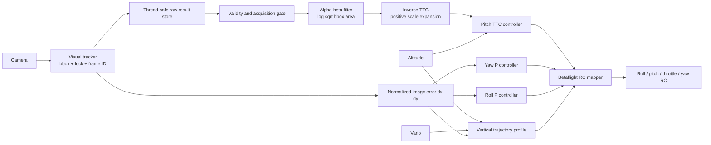

# Optical TTC tracker controller

## Overview

The TRACK flight state guides the drone toward a visually detected target. It
uses the target bounding box from the camera tracker, together with vehicle
altitude and vertical speed. The controller does not need a metric estimate of
the forward distance to the target.

The bounding-box center tells the controller where the target is in the image:

- horizontal error influences roll and yaw so the drone remains centered;
- vertical error contributes to the requested climb or descent speed;
- bounding-box growth controls forward pitch through time to contact.

Tracking progresses through four phases:

1. `ALIGN`: acquire reliable camera frames and move the target toward the image
   center while using a conservative forward pitch.
2. `TRACKING`: coordinate forward closing, image alignment, and vertical motion.
3. `COMMIT`: freeze the accepted RC command for a short final-contact interval.
4. Exit: request the application's normal fallback after commit completes or
   when camera or vertical-speed data becomes stale.

`TERMINAL` remains in the phase enum for API compatibility, but the active path
transitions directly from `TRACKING` to `COMMIT`.

## TTC in brief

TTC means **time to contact**: the estimated number of seconds before the drone
reaches the target at its current visual closing rate.

The controller estimates TTC without measuring target distance:

1. Measure bounding-box scale:

   ```text
   scale = sqrt(width * height)
   ```

2. Observe how quickly that scale grows. An alpha-beta filter estimates the
   rate of `log(scale)`:

   ```text
   inverse_ttc = d(log(scale)) / dt
   ```

3. Convert the positive expansion rate into an arrival time:

   ```text
   ttc = 1 / inverse_ttc
   ```

The controller compares two quantities:

- **measured TTC**: the arrival time predicted from visual expansion;
- **target TTC**: the desired arrival time derived from the altitude error and
  nominal vertical speed.

Pitch regulates the difference between their inverse values. If visual closing
is too slow, the controller commands more forward pitch. If it is too fast, it
relaxes the pitch. At the same time, the vertical controller uses the effective
measured TTC to plan a climb or descent that reaches the target height near the
forward contact time. Large horizontal error reduces forward pitch but does not
suppress this vertical command, so a simultaneous `dy` error can still close.

Near the target, the controller enters `COMMIT` only after bounding-box fill,
TTC, and image alignment satisfy their thresholds for several consecutive new
camera frames.

## What `d(log(scale))/dt` represents

`d(log(scale))/dt` is the target's **relative visual expansion rate**: how
quickly its image size is growing compared with its current size.

Because

```text
scale = sqrt(bounding_box_width * bounding_box_height)
```

the logarithmic derivative can be understood as

```text
d(log(scale))/dt = (1 / scale) * d(scale)/dt
```

It therefore measures fractional growth per second rather than raw pixel growth.
For example, growth from 50 px to 55 px and growth from 200 px to 220 px are both
10 percent. The raw changes differ—5 px versus 20 px—but the logarithmic rate
treats them as the same relative approach rate.

For a stationary target, approximately constant closing velocity, and a camera
approaching roughly along its viewing direction:

```text
inverse_ttc ~= d(log(scale))/dt
ttc ~= 1 / d(log(scale))/dt
```

For example:

```text
d(log(scale))/dt = 0.5 1/s
ttc ~= 1 / 0.5 = 2 seconds
```

The rate has the following practical meaning:

- a value near zero means the target size is stable and there is little or no
  visual closing;
- a positive, increasing value means the target is expanding more quickly and
  contact is approaching;
- `0.5 Hz` corresponds to approximately 2 seconds to contact;
- `2 Hz` corresponds to approximately 0.5 seconds to contact;
- a negative value means the target is shrinking. The controller treats this as
  zero inverse TTC because it does not represent forward contact.

The controller uses the estimate in three places:

1. **Forward pitch control.** It compares measured inverse TTC with desired
   inverse TTC. Closing too slowly produces more forward pitch; closing too
   quickly relaxes forward pitch.
2. **Vertical coordination.** The shorter of effective measured TTC and target
   TTC provides the time available to reach the configured target height:

   ```text
   vertical_schedule_ttc = min(effective_ttc, target_ttc)
   vertical_speed ~= vertical_distance / vertical_schedule_ttc
   ```

3. **Commit detection.** A sufficiently short effective TTC, together with a
   large and centered target for several consecutive frames, allows the
   controller to enter `COMMIT`.

This method provides a distance-independent arrival-time estimate, but it relies
on consistent bounding-box measurements and the stationary-target, straight-line
closing approximation. Target motion, camera rotation, occlusion, and changes in
the detected part of the target can all change image scale without representing
true forward closing.

## Data flow

This milestone replaces the metric-distance tracker control path. The controller uses raw bounding boxes, altitude, and vario. It does not estimate forward distance or forward velocity.



## Control laws

Bounding-box scale is `s = sqrt(width * height)`. An alpha-beta filter estimates `log(s)` and its rate. For a stationary target, positive log-scale rate is inverse time-to-contact:

```text
inverse_ttc_measured = clamp(max(0, d(log(s))/dt), 0, 4)
vertical_distance = target_height - altitude
ttc_target = max(abs(vertical_distance) / 1.25, 0.5)
pitch_raw = clamp(-5 - 8 * (1/ttc_target - inverse_ttc_measured), -15, 0)
```

Pitch is slew limited to 5 degrees per second. This makes pitch more negative when visual closing is too slow and relaxes it when closing is too fast.

The vertical loop uses the earlier of the visual and requested arrival times:

```text
vertical_schedule_ttc = min(effective_ttc, ttc_target)
vertical_nominal = vertical_distance / vertical_schedule_ttc
vertical_target = clamp(vertical_nominal + deadband(dy), -5, +2)
vertical_setpoint = slew(vertical_setpoint, vertical_target, TRK_VZ_ACCEL)
vertical_error = vertical_setpoint - vario
acceleration = low_pass(clamp(delta(vario) / delta(telemetry_time), -5, +5))
throttle = tilt_compensated_hover + clamp(
    20 * vertical_error + integral - 10 * acceleration,
    -100,
    +100,
)
```

The vertical setpoint starts at the measured vario when TRACK begins and is
rate-limited by `TRK_VZ_ACCEL` (0.5 m/s² by default). This prevents a target
appearing low in the image from creating an immediate multi-m/s descent step.
The velocity loop adds a slow integral correction (`TTC_VY_KI=3`) to remove
persistent speed error. It is limited to 40 RC (`TTC_VY_I_MAX`), uses
conditional anti-windup at the total correction limit, and resets at every
TRACK start and stop.

Acceleration damping updates only when a distinct vario timestamp arrives.
Raw acceleration is clamped to ±5 m/s² and low-pass filtered with
`TTC_AZ_ALPHA=0.2`; `TTC_VY_KD=10` then brakes developing vertical momentum
before the velocity error reverses.

Yaw and roll remain bounded proportional controllers on normalized horizontal
image error. Both commands are slew limited.

## Lifecycle and rejection rules

- Acquisition requires 8 accepted, distinct frames spanning at least 0.2 seconds.
- Duplicate and out-of-order frame IDs do not update the optical filter.
- A new tracker ID resets acquisition and the filter.
- Unlocked, clipped, non-positive, or greater-than-35% scale-innovation boxes are rejected.
- The last valid estimate may be used for at most 0.25 seconds. Prediction cannot advance commit.
- Stale camera or vario data requests an exit to the existing application fallback path.

## Collision commit

Commit requires five consecutive accepted camera frames with all of these gates true:

- bbox fill is at least 0.60 of either image dimension;
- measured TTC is no more than 0.50 seconds;
- `abs(dx)` and `abs(dy)` are no more than 0.15.

The controller then freezes the current RC command for `TRK_COMMIT_S` and requests exit when that interval completes. The objective in this simulation milestone is physical contact with the stationary target.

## Diagnostics

The controller performs no diagnostic file I/O. Use the application blackbox
for offboard analysis of tracker observations, vehicle telemetry, and final RC
output.
