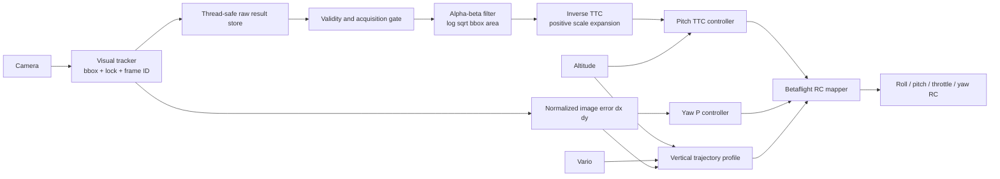

# Optical TTC tracker controller

This milestone replaces the metric-distance tracker control path. The controller uses raw bounding boxes, altitude, and vario. It does not estimate forward distance or forward velocity.



## Control laws

Bounding-box scale is `s = sqrt(width * height)`. An alpha-beta filter estimates `log(s)` and its rate. For a stationary target, positive log-scale rate is inverse time-to-contact:

```text
inverse_ttc_measured = clamp(max(0, d(log(s))/dt), 0, 4)
vertical_distance = target_height - altitude
ttc_target = max(abs(vertical_distance) / 1.25, 0.5)
pitch_raw = clamp(-5 - 8 * (1/ttc_target - inverse_ttc_measured), -15, 0)
```

Pitch is slew limited to 5 degrees per second. This makes pitch more negative when visual closing is too slow and relaxes it when closing is too fast.

The vertical loop follows the same arrival time:

```text
vertical_nominal = vertical_distance / ttc_target
vertical_target = clamp(vertical_nominal + deadband(dy), -5, +2)
vertical_setpoint = slew(vertical_setpoint, vertical_target, TRK_VZ_ACCEL)
vertical_error = vertical_setpoint - vario
acceleration = low_pass(clamp(delta(vario) / delta(telemetry_time), -5, +5))
throttle = tilt_compensated_hover + clamp(
    20 * vertical_error + integral - 10 * acceleration,
    -100,
    +100,
)
```

The vertical setpoint starts at the measured vario when TRACK begins and is
rate-limited by `TRK_VZ_ACCEL` (0.5 m/s² by default). This prevents a target
appearing low in the image from creating an immediate multi-m/s descent step.
The velocity loop adds a slow integral correction (`TTC_VY_KI=3`) to remove
persistent speed error. It is limited to 40 RC (`TTC_VY_I_MAX`), uses
conditional anti-windup at the total correction limit, and resets at every
TRACK start and stop.

Acceleration damping updates only when a distinct vario timestamp arrives.
Raw acceleration is clamped to ±5 m/s² and low-pass filtered with
`TTC_AZ_ALPHA=0.2`; `TTC_VY_KD=10` then brakes developing vertical momentum
before the velocity error reverses.

Yaw remains a bounded proportional controller on normalized horizontal image error. Roll stays centered.

## Lifecycle and rejection rules

- Acquisition requires 8 accepted, distinct frames spanning at least 0.2 seconds.
- Duplicate and out-of-order frame IDs do not update the optical filter.
- A new tracker ID resets acquisition and the filter.
- Unlocked, clipped, non-positive, or greater-than-35% scale-innovation boxes are rejected.
- The last valid estimate may be used for at most 0.25 seconds. Prediction cannot advance commit.
- Stale camera or vario data requests an exit to the existing application fallback path.

## Collision commit

Commit requires five consecutive accepted camera frames with all of these gates true:

- bbox fill is at least 0.60 of either image dimension;
- measured TTC is no more than 0.50 seconds;
- `abs(dx)` and `abs(dy)` are no more than 0.15.

The controller then freezes the current RC command for `TRK_COMMIT_S` and requests exit when that interval completes. The objective in this simulation milestone is physical contact with the stationary target.

## Diagnostics

`logs/tracker_controller.csv` is written when tracking stops. It records the raw bbox and frame timing, filter state and rejection reason, measured and target TTC, altitude/vario and vertical loop terms, pitch/yaw commands, commit state, exit reason, and all eight final RC channels. The next tuning pass should use this file together with Gazebo ground truth, which remains outside the controller for milestone 1.
