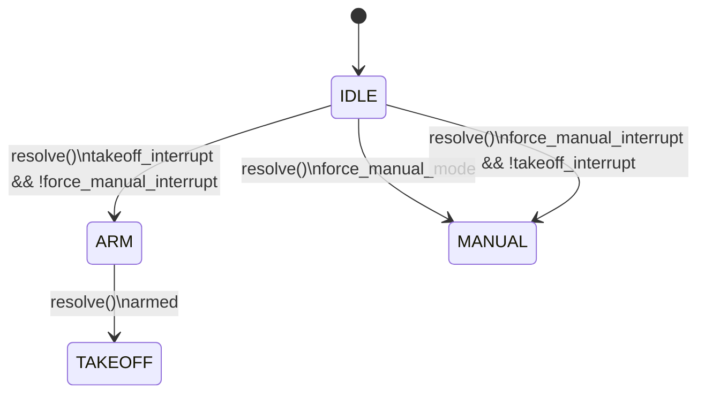

# Idle to Takeoff Flow

The active state machine does not transition directly from `IDLE` to `TAKEOFF`.
The takeoff request first moves the application into `ARM`; once Betaflight
reports the vehicle as armed, the next `resolve` call moves the application into
`TAKEOFF`.

## Transition Conditions

| Step | From | To | Guard method | Condition | Condition source |
| --- | --- | --- | --- | --- | --- |
| 1 | `IDLE` | `ARM` | `enter_arm` | `ctx.takeoff_interrupt == True` | `App.__handle_joy_interrupt` sets `ctx.takeoff_interrupt` when joystick `AUX4` / `JoyInterrupt.TAKEOFF_REQUEST` equals `RC_MAX`. |
| 1 | `IDLE` | `ARM` | `enter_arm` | `ctx.force_manual_interrupt == False` | `App.__handle_joy_interrupt` sets `ctx.force_manual_interrupt` when joystick `AUX5` / `JoyInterrupt.FORCE_MANUAL_REQUEST` equals `RC_MAX`; takeoff is allowed only while this request is not active. |
| 2 | `ARM` | `TAKEOFF` | `enter_takeoff_from_arm` | `ctx.armed == True` | `App.__update_state` reads MSP vehicle state and sets `ctx.armed` from `vehicle_state.get("box_mode_flags") == 3`. |

## Flow Notes

- All transitions are evaluated by the shared `resolve` trigger in
  `Robot_StateMachine`.
- `IDLE -> ARM` emits `on_before_state_changed`, and `App` resets the
  `ARMController` before the arming sequence starts.
- `ARM -> TAKEOFF` emits `on_before_state_changed`, and `App` resets the
  `TakeoffController` before altitude control starts.
- `enter_takeoff` contains the same takeoff-request guard as `enter_arm`, but it
  is not wired to an active transition. The implemented path is therefore
  `IDLE -> ARM -> TAKEOFF`.
