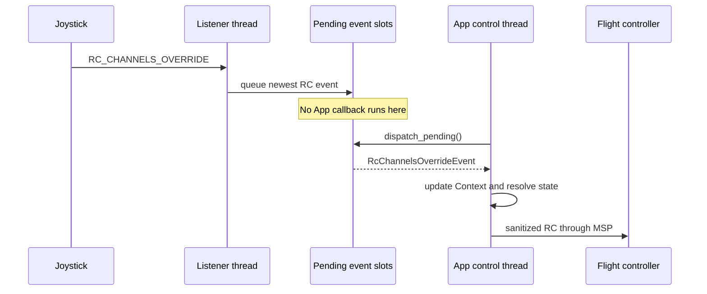
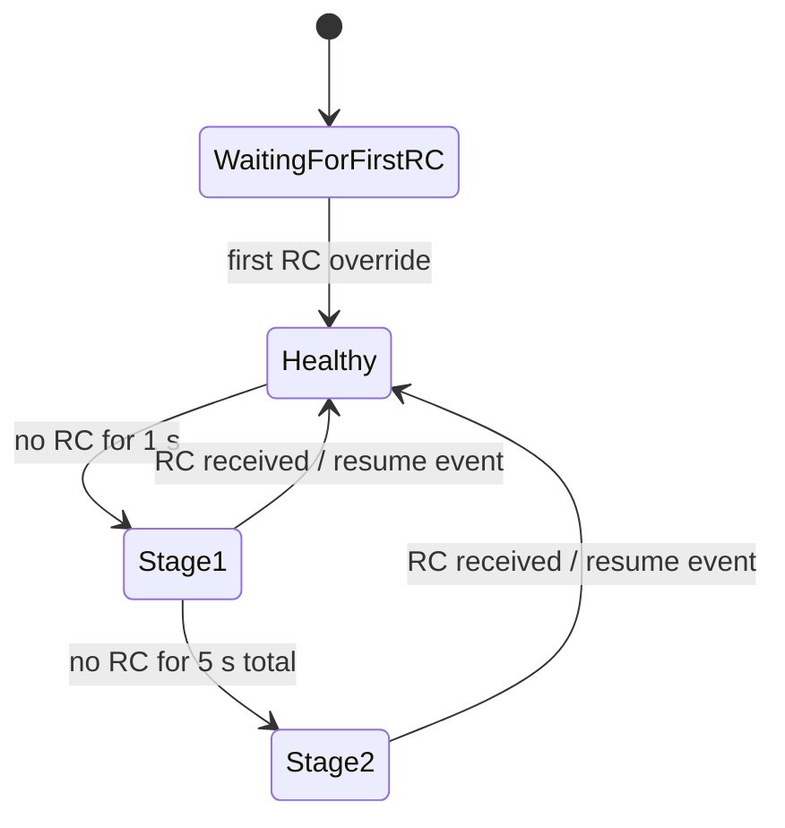
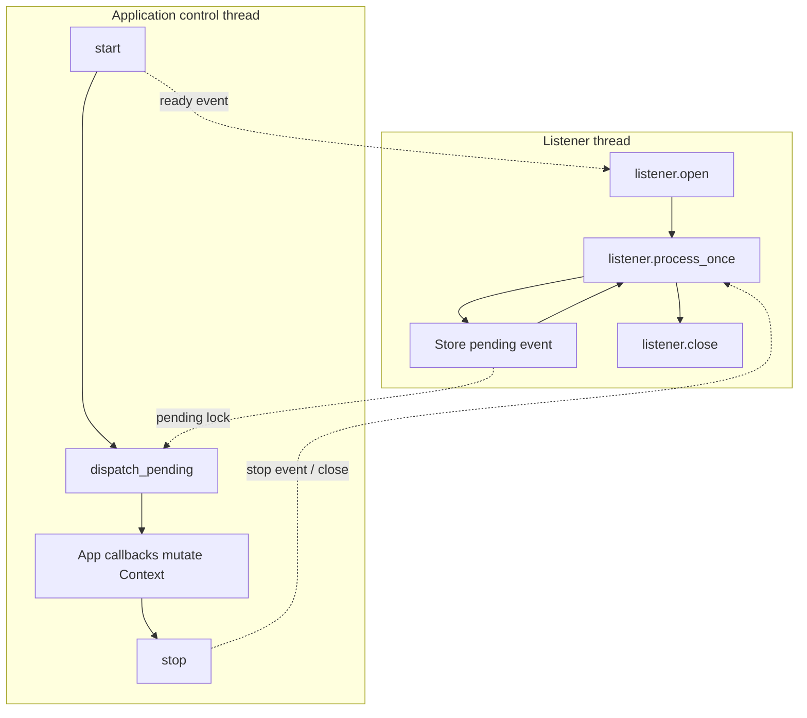
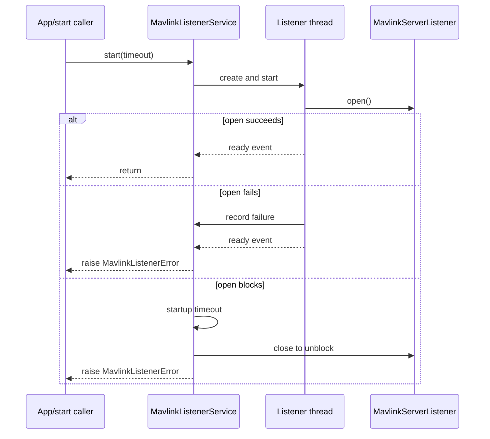
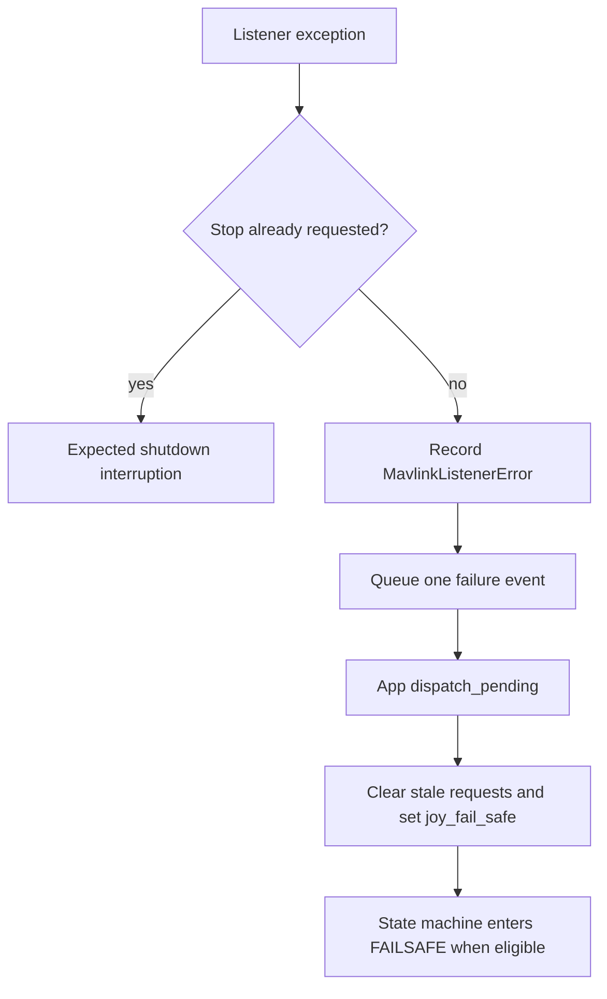

# MAVLink RC Channel Override: Requirements and Current Design

## Requirements

This document defines the requirements and describes the current implementation
of the MAVLink RC channel override path. It is a starting point for redesign;
items marked **Decision required** are not yet final requirements.

### Functional requirements

1. Receive MAVLink RC channel override messages on a configured MAVLink
   connection.
2. Convert each accepted message into an `RcChannelsOverrideEvent` containing
   the channel values and MAVLink source/target metadata.
3. Detect loss of communication in two configured timeout stages.
4. Detect communication recovery and deliver the newest RC input after the
   recovery notification.
5. Apply RC, timeout, recovery, and listener-failure events on the application
   control-loop thread. The listener thread must not mutate `Context` directly.
6. On communication timeout or permanent listener failure, clear stale pilot
   requests and enter the application's joystick failsafe path.
7. Report connection failure synchronously during application startup.
8. Support orderly application shutdown even when MAVLink receive is blocked.

### Safety requirements

1. A stale RC command must not remain authoritative after communication loss.
2. Listener failure must be observable; a dead listener thread must not leave
   the application running as though joystick input were healthy.
3. Arming, takeoff, manual-mode, and auto-mode requests must be cleared when
   joystick failsafe begins.
4. Related joystick state must be updated atomically from the control loop's
   perspective.
5. Callback failures must reach the existing `App.run()` exception boundary,
   which logs state, stops RC output, and performs ordered cleanup.
6. Shutdown must be bounded. A permanently blocked third-party receive call
   must not prevent process exit.

### Timing and capacity requirements

- The listener uses a 50 ms receive timeout in the current application
  configuration.
- Stage 1 communication timeout is currently 1 second.
- Stage 2 communication timeout is currently 5 seconds.
- The listener accepts 18 MAVLink channels; the application consumes the first
  eight internal joystick channels.
- RC delivery is latest-value-wins. The control loop does not need to replay
  every intermediate RC packet.
- Timeout/recovery delivery is latest-state-wins, while relative order between
  the retained communication event and retained RC event is preserved.

### Lifecycle requirements

- `start()` is idempotent while the service is already running.
- A successful `start()` means the MAVLink connection is open, not merely that
  a Python thread was created.
- An explicit start after stop creates a fresh listener and thread.
- `stop()` is safe before start and safe when called repeatedly.
- Startup, runtime, and shutdown failures remain distinguishable.

## MAVLink Flow

The joystick transmitter sends MAVLink messages to the application's UDP input.
The installed `bt_joy` listener parses the protocol and owns heartbeat and
communication-timeout detection. `MavlinkListenerService` adapts those events
to the `App` control loop.

```mermaid
flowchart LR
    Joy[Joystick / bt_joy client]
    UDP[MAVLink UDP<br/>udpin:0.0.0.0:14560]
    Listener[MavlinkServerListener<br/>bt_joy package]
    Queue[MavlinkListenerService<br/>coalesced pending events]
    Loop[App.run<br/>50 Hz control loop]
    Context[Context<br/>pilot requests and failsafe]
    SM[Robot state machine]
    Controller[Active controller]
    MSP[MSP dispatcher]
    FCU[Flight controller]

    Joy -->|HEARTBEAT / RC_CHANNELS_OVERRIDE| UDP
    UDP --> Listener
    Listener -->|RC event| Queue
    Listener -->|timeout / resume| Queue
    Queue -->|dispatch_pending| Loop
    Loop --> Context
    Context --> SM
    SM --> Controller
    Controller -->|sanitized RC| MSP
    MSP --> FCU
    Listener -->|server heartbeat| Joy
```

### Normal RC message flow

1. `MavlinkServerListener.process_once()` waits for one supported MAVLink
   message up to `receive_timeout_s`.
2. A heartbeat marks the client as seen but does not produce an RC event.
3. An RC override message updates the listener's last-seen timestamp.
4. If communication was previously timed out, the listener first emits
   `CommunicationResumedEvent`.
5. The listener emits `RcChannelsOverrideEvent` with configured channel count.
6. The service stores the newest events under `_pending_lock` and assigns a
   monotonically increasing sequence number.
7. At the beginning of the next `App.run()` iteration,
   `_dispatch_pending_joystick_events()` calls `dispatch_pending()`.
8. `App.__handle_joy_rc()` updates requested channels and derives arm, manual,
   takeoff, and auto-mode intent.
9. The state machine resolves, the active controller produces RC output, and
   the MSP dispatcher sends sanitized channels to the flight controller.

### Communication timeout and recovery flow

The underlying listener evaluates timeouts after every receive interval:

When `App` receives a timeout, `_enter_joystick_failsafe()`:

- sets `joy_fail_safe`;
- replaces cached and requested RC with `DEFAULT_RC_CHANNELS`;
- clears arm, takeoff, manual, arm-switch, and auto-mode requests;
- allows an armed `MANUAL` or `ALT_HOLD` state to transition to `FAILSAFE`.

When communication resumes, the resume event clears `joy_fail_safe`; the RC
event that follows supplies fresh pilot intent.

## Current Implementation

### Responsibilities

`MavlinkListenerService` currently performs all of these responsibilities:

| Responsibility | Current mechanism |
| --- | --- |
| Construct listener | Creates a new `MavlinkServerListener` for each start |
| Own worker lifecycle | Daemon `threading.Thread`, stop and ready events |
| Confirm startup | Waits for `_run()` to open the connection and set ready |
| Receive MAVLink | Calls `listener.process_once()` in `_run()` |
| Cross thread boundary | Stores pending events under `_pending_lock` |
| Limit backlog | One RC slot, one communication slot, one failure slot |
| Preserve retained order | Sequence number assigned when each event arrives |
| Dispatch application callbacks | `dispatch_pending()` on the caller thread |
| Report health | `failure` property and `on_failure` callback |
| Unblock shutdown | Timed join, `listener.close()`, second timed join |

### Thread ownership

The listener thread handles protocol I/O only. User callbacks are deferred to
the application thread so `Context` is not partially updated while the control
loop reads it.

### Startup flow

`start(timeout=2.0)` currently:

1. validates the timeout;
2. returns if the current thread is alive;
3. creates fresh stop/ready events and clears old errors and pending events;
4. creates a fresh listener and daemon thread;
5. starts the thread;
6. waits until `_run()` opens the connection or records a failure;
7. stops partial startup on timeout;
8. raises `MavlinkListenerError` if initialization failed.

### Runtime failure flow

An unexpected exception from open, receive, parsing, heartbeat, or internal
listener processing is caught at the worker boundary. If shutdown was not
already requested, the service records the first error and queues one failure
event. The application dispatches that event and enters joystick failsafe.

### Shutdown flow

`stop(timeout=2.0)` sets the stop event and waits for the receive loop. If the
thread remains blocked, it closes the listener connection and waits again. A
surviving thread or close failure raises `MavlinkListenerShutdownError`. The
thread is daemonized as the final protection against an uninterruptible
third-party receive operation preventing process exit.

## Current Design Strengths

- Startup success represents an open MAVLink connection.
- Runtime thread death is visible and activates failsafe.
- `Context` mutation occurs on the control thread.
- High-rate RC traffic cannot create an unbounded queue.
- Explicit restart creates fresh third-party listener state.
- Shutdown is bounded and reports failure.

## Current Design Costs and Weak Spots

1. `MavlinkListenerService` owns lifecycle, buffering, ordering, error policy,
   and callback dispatch, giving it several reasons to change.
2. `start()` is complex because it combines construction, synchronization,
   timeout cleanup, and error translation.
3. Only the latest communication event is retained. Stage 1 can be replaced by
   Stage 2 before the control loop observes it.
4. Runtime listener failure has no automatic recovery; the application remains
   in failsafe until restarted.
5. Failsafe transitions are not registered from every armed state. The state
   machine currently supports failsafe entry from `MANUAL` and `ALT_HOLD`, but
   not all other potentially armed states.
6. Configuration is constructed directly in `App.__load_controllers()` instead
   of being part of `VehicleConfig` or parameter configuration.
7. `bt_joy` is an external installed package, so behavior depends on the
   installed listener version and its `open`, `process_once`, and `close`
   contracts.

## Redesign Discussion

The redesign should begin by agreeing on behavior, then select structure. The
following decisions materially change the design.

### 1. Runtime failure policy — Decision required

Current behavior enters application failsafe and does not restart the listener.

Options:

- **Failsafe until process restart:** simplest and deterministic.
- **Retry listener while remaining in failsafe:** restores control without
  restarting the application but requires backoff, port cleanup, recovery
  criteria, and operator notification.
- **Terminate the application:** stops MSP RC output and delegates entirely to
  the flight controller's RX-loss failsafe.

### 2. Event delivery model — Decision required

Current behavior uses three coalesced slots and sequence numbers.

Options:

- **Latest-value slots:** bounded memory and lowest RC latency; intermediate
  timeout stages may be skipped.
- **Bounded ordered queue:** retains transitions but needs overflow policy.
- **Thread-safe state snapshot:** control loop reads one complete input state;
  event history moves to diagnostics only.

### 3. Lifecycle ownership — Decision required

Options:

- **Keep lifecycle in the service:** one public abstraction, with private helper
  methods extracted from `start()` for readability.
- **Separate worker and service:** a worker owns thread/I/O lifecycle while the
  service owns event buffering and application callbacks.
- **Move lifecycle into `bt_joy`:** smallest adapter, but requires changing and
  versioning the external dependency.

### 4. Failsafe scope — Decision required

Define which states may be armed and must react to joystick loss. At minimum,
confirm expected behavior for `ARM`, `TAKEOFF`, `MANUAL`, and
`ALT_HOLD`. This decision belongs to the state-machine safety requirements, not
only to the listener implementation.

### 5. Startup and restart contract — Decision required

Confirm whether explicit restart is a supported public operation. If the
service is application-lifetime-only, restart support and some lifecycle state
can be removed. If restart is required, define maximum attempts, backoff,
operator notification, and when fresh RC input may clear failsafe.

## Proposed Discussion Order

1. Choose the runtime failure policy.
2. Define failsafe behavior for every potentially armed state.
3. Choose the event delivery model and its overflow/coalescing rules.
4. Decide whether runtime restart is required.
5. Select component boundaries and simplify the public API.
6. Convert the decisions into acceptance tests before changing code.
