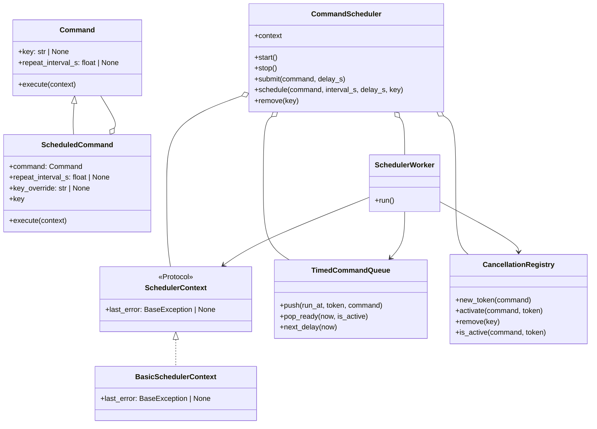
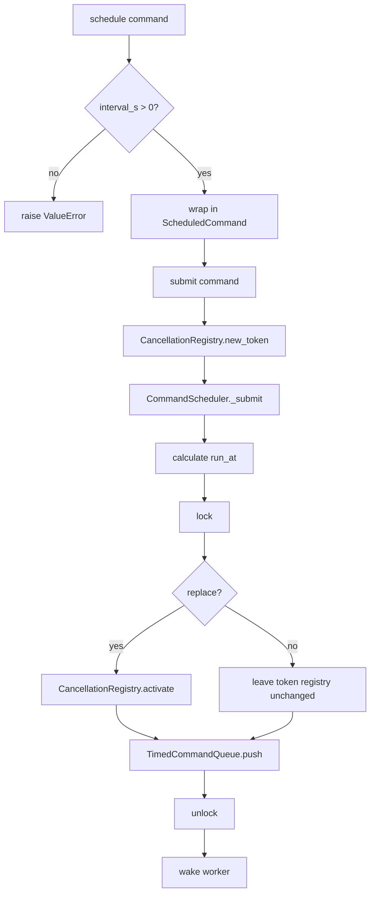
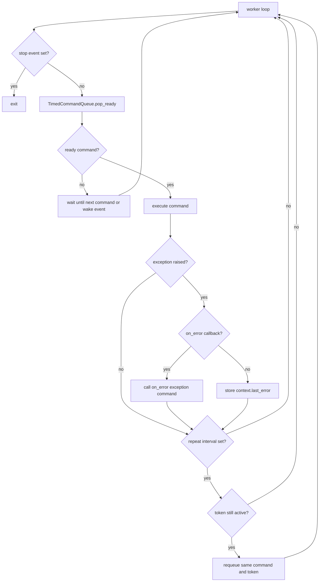
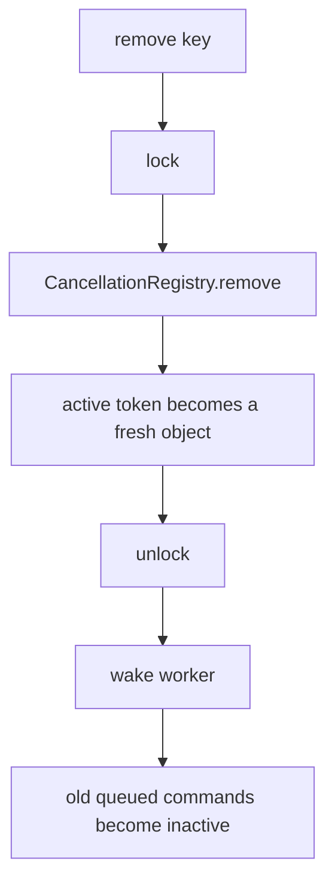

# Scheduler Skeleton

This document explains the SOLID version of the scheduler skeleton. The code is still educational and has no MSP-specific commands, but the responsibilities are now split across small modules.

The implementation lives in `scheduler_skeleton/`.

## Module Layout



## Responsibilities

- `commands.py`: command contracts only. `Command` depends on `SchedulerContext`, not on concrete `CommandScheduler`.
- `queue.py`: heap-backed timing queue. It knows when commands are due, but does not know thread or cancellation rules.
- `cancellation.py`: keyed token registry. It handles replacement and lazy removal.
- `worker.py`: worker loop. It pops ready commands, executes them, catches exceptions, and requeues repeating commands.
- `scheduler.py`: public facade. It owns lifecycle methods, receives an external context object, and wires the smaller pieces together.
- `usage_example.py`: very small runnable example.

## Command Contract

```python
class SchedulerContext(Protocol):
    last_error: BaseException | None


@dataclass
class BasicSchedulerContext:
    last_error: BaseException | None = None


class Command(ABC):
    key: ClassVar[str | None] = None
    repeat_interval_s: float | None = None

    @abstractmethod
    def execute(self, scheduler: SchedulerContext) -> Any:
        pass
```

The command interface is intentionally small:

- `key` is optional and lets commands replace older commands with the same key.
- `repeat_interval_s` is optional and controls repeating behavior.
- `execute()` receives only the scheduler context protocol, not the concrete scheduler.

`CommandScheduler` receives the context from outside:

```python
context = BasicSchedulerContext()
scheduler = CommandScheduler(context)
```

Real applications can subclass or replace `BasicSchedulerContext` with their own state object.

`ScheduledCommand` wraps another command and adds repeat scheduling. Its key uses `key_override` only when it is not `None`, so an empty string key is not accidentally ignored.

## Submit And Schedule Flow



The queue item still contains:

```text
(run_at, sequence, token, command)
```

The queue orders by `run_at` first, then by `sequence` as a tie-breaker.

## Worker Flow With Exceptions



Command exceptions no longer kill the worker thread. If `on_error` is passed to `CommandScheduler`, the worker calls it with `(exception, command)`. Otherwise, the worker stores the exception in `context.last_error` and continues.

## Remove And Replace Flow



Replacement uses the same token idea:

- Scheduling or submitting a keyed command creates a fresh token.
- `CancellationRegistry.activate()` stores that token for the key.
- Older queued commands with the same key still exist in the heap.
- When they reach the front of the queue, `pop_ready()` asks `CancellationRegistry.is_active()`.
- Inactive commands are skipped instead of being removed by scanning the heap.

## SOLID Notes

- SRP: queue timing, cancellation, worker execution, command contracts, and public lifecycle are separate.
- OCP: new command classes can be added without editing scheduler internals.
- LSP: `ScheduledCommand` can be used wherever a `Command` is expected.
- ISP: commands depend on the small `SchedulerContext` protocol.
- DIP: command execution depends on a protocol, and the worker is wired with collaborators instead of creating them itself.

## Minimal Usage

See `scheduler_skeleton/usage_example.py` for a small runnable version.

```python
from dataclasses import dataclass
import time
from typing import cast

from scheduler_skeleton import BasicSchedulerContext, Command, CommandScheduler, SchedulerContext


@dataclass
class AppContext(BasicSchedulerContext):
    count: int = 0


@dataclass
class ExampleCommand(Command):
    def execute(self, context: SchedulerContext) -> None:
        app_context = cast(AppContext, context)
        app_context.count += 1
        print("run")


context = AppContext()
scheduler = CommandScheduler(context)
scheduler.start()
scheduler.schedule(ExampleCommand(), interval_s=1.0, key="example")
time.sleep(2.0)
scheduler.remove("example")
scheduler.stop()
```

Run the example from the workspace root with:

```bash
PYTHONPATH=bt_app/docs python3 -m scheduler_skeleton.usage_example
```
