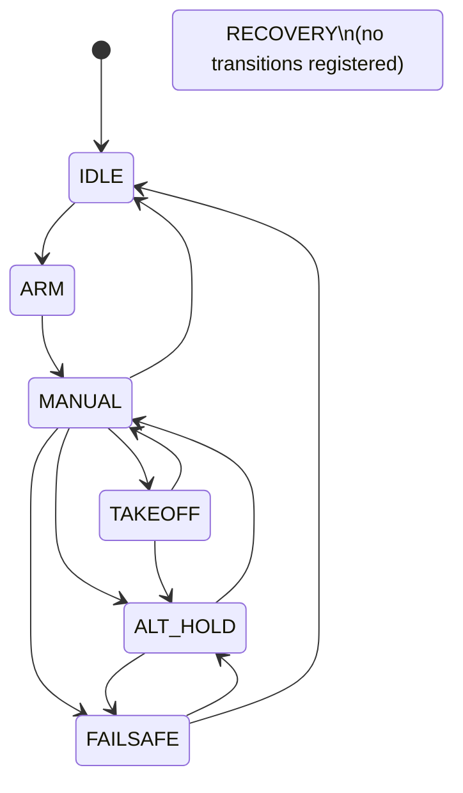

# Application State Machine Transitions

This document describes the transitions implemented in `bt_app/bt_app/sm.py`.
The state machine uses one trigger, `resolve`, and evaluates transitions from the
current state in the order they are registered.

## Mermaid Diagram

## Transition Conditions

| From | To | Condition function | Condition |
| --- | --- | --- | --- |
| `IDLE` | `ARM` | `enter_arm` | manual or auto-takeoff selected, ARM high, throttle below 1050, `armable`, and not `armed` |
| `ARM` | `MANUAL` | `enter_manual_mode_from_arm` | `armed` and manual selected |
| `MANUAL` | `TAKEOFF` | `enter_takeoff_from_manual` | `armed`, auto-takeoff selected, and `drone_alt < alt_setpoint` |
| `MANUAL` | `FAILSAFE` | `enter_failsafe` | `armed and joy_fail_safe` |
| `MANUAL` | `IDLE` | `enter_idle_from_manual` | manual selected, ARM off, and throttle below 1050 |
| `MANUAL` | `ALT_HOLD` | `enter_hover_from_manual` | throttle above 1050, manual not selected, and `armed` |
| `TAKEOFF` | `ALT_HOLD` | `enter_hover_from_takeoff` | `takeoff_reach` |
| `TAKEOFF` | `MANUAL` | `enter_manual_from_takeoff` | `armed`, manual selected, and auto-takeoff not selected |
| `ALT_HOLD` | `FAILSAFE` | `enter_failsafe` | `armed and joy_fail_safe` |
| `ALT_HOLD` | `MANUAL` | `enter_manual_mode_from_hover` | manual selected and `armed` |
| `FAILSAFE` | `ALT_HOLD` | `exit_failsafe` | `armed and not joy_fail_safe` |
| `FAILSAFE` | `IDLE` | `exit_failsafe_to_idle` | failsafe cleared, manual not selected, and auto-takeoff not selected |

## Context Fields

| Field | Meaning | Source / writer |
| --- | --- | --- |
| `state` | Current state-machine state. | `Robot_StateMachine.on_state_changed_handler` writes the destination state after each transition. |
| `arming_disable_flags` | Betaflight arming-disable reasons. | `App.__update_state` reads `services.drone.get_state()["arming_disable_flags"]`. |
| `armable` | Vehicle can currently arm. | `App.__update_state` reads `services.drone.get_state()["armable"]`. |
| `armed` | Vehicle is armed. | `App.__update_state` reads MSP state and RC arm channel; `App._arm_handler` also sets it from `ARMController.is_arm_done`; reset when entering `IDLE`. |
| `joy_fail_safe` | Joystick link or input-validation failsafe state. | `App._joystick_fs_enter` or invalid input sets it; `App.__joystick_fs_exit` clears it after communication resumes. |
| `take_control` | Flag reserved for control ownership. | Defined in `Context`; no active writer found in current app code. |
| `auto_arm` | Allows automatic arm without joystick AUX1 high. | Defined in `Context`; no active writer found in current app code. |
| `takeoff_reach` | Takeoff controller has reached/stabilized at target altitude. | `App._takeoff_handler` sets it from `TakeoffController.time_in_alt >= 1`. |
| `manual_land_confirmed` | Manual landing detector has confirmed landing. | `services.manual_land.update()` writes the detector result; `services.manual_land.reset()` clears it. |
| `drone_alt` | Current vehicle altitude in meters. | `App.__update_state` reads `services.drone.get_altitude()`. |
| `drone_vertical_speed` | Current vehicle vertical speed in m/s. | `App.__update_state` reads `services.drone.dispatcher.last_altitude["vertical_speed_m_s"]`. |
| `drone_rc` | Last RC channel values read from the vehicle. | `App.__update_state` reads `services.drone.get_rc()`. |
| `request_rc` | Last valid immutable `InternalJoystick` snapshot. | `App.__handle_joy_rc` validates the 18-channel MAVLink event; failures replace it with safe defaults and enter failsafe. |
| `sent_rc` | Last sanitized RC channels sent to the vehicle. | `App.run` writes sanitized controller output before `dispatcher.set_rc()`. |
| `battery_voltage` | Latest battery voltage used for telemetry. | `App.__update_state` reads `services.drone.dispatcher.last_battery["voltage_v"]` and applies the current `+20.0` hack. |
| `alt_setpoint` | Last altitude setpoint reported to GCS. | `App._takeoff_handler` and `App.hover_handler` update it when controller setpoint changes. |
