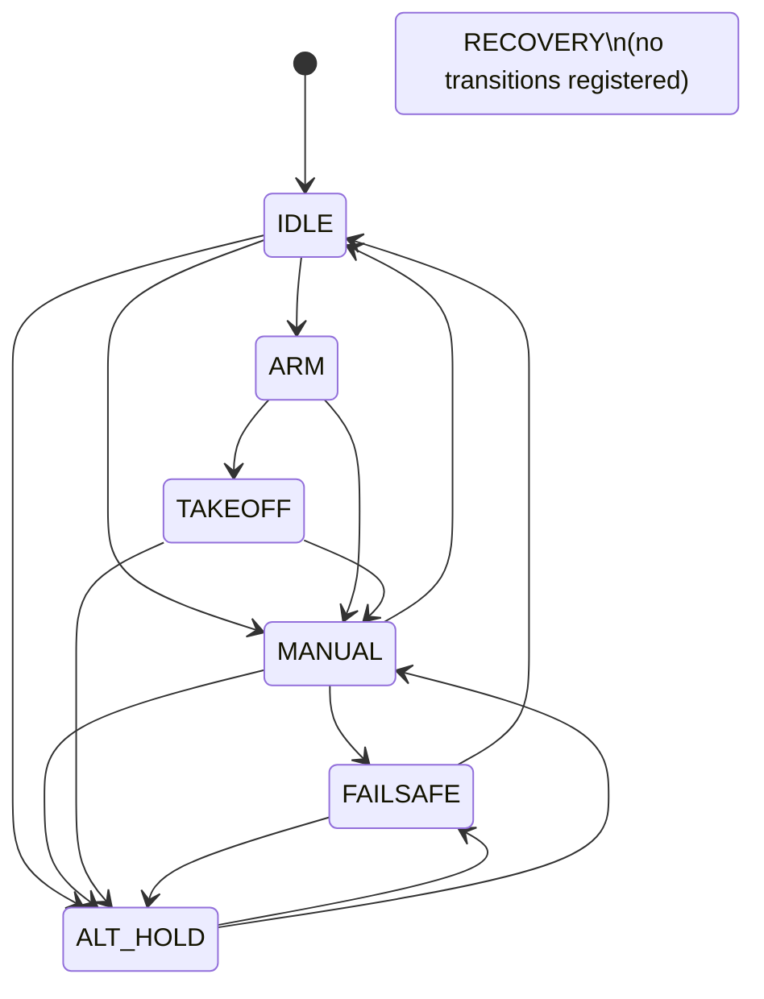

# Application State Machine Transitions

This document describes the transitions implemented in `bt_app/bt_app/sm.py`.
The state machine uses one trigger, `resolve`, and evaluates transitions from the
current state in the order they are registered.

## Mermaid Diagram

## Transition Conditions

| From | To | Condition function | Condition |
| --- | --- | --- | --- |
| `IDLE` | `ARM` | `enter_arm` | `(joy_takeoff_request or joy_manual_request) and armable and not armed and joy_arm_requested` |
| `IDLE` | `MANUAL` | `enter_manual_from_idle` | `armed and joy_arm_requested` |
| `IDLE` | `ALT_HOLD` | `enter_manual_from_alt_hold` | `armed and not joy_arm_requested` |
| `ARM` | `MANUAL` | `enter_manual_mode_from_arm` | `armed and joy_manual_request` |
| `ARM` | `TAKEOFF` | `enter_takeoff_from_arm` | `armed and joy_takeoff_request and not joy_manual_request` |
| `MANUAL` | `FAILSAFE` | `enter_failsafe` | `armed and joy_fail_safe` |
| `MANUAL` | `IDLE` | `enter_idle_from_manual` | `not joy_manual_request and not armed_allowed` |
| `MANUAL` | `ALT_HOLD` | `enter_hover_from_manual` | `request_rc[THROTTLE] > 1050 and not joy_manual_request and armed` |
| `TAKEOFF` | `ALT_HOLD` | `enter_hover_from_takeoff` | `takeoff_reach` |
| `TAKEOFF` | `MANUAL` | `enter_manual_from_takeoff` | `armed and joy_manual_request` |
| `ALT_HOLD` | `FAILSAFE` | `enter_failsafe` | `armed and joy_fail_safe` |
| `ALT_HOLD` | `MANUAL` | `enter_manual_mode_from_hover` | `joy_manual_request and armed` |
| `FAILSAFE` | `ALT_HOLD` | `exit_failsafe` | `armed and not joy_fail_safe` |
| `FAILSAFE` | `IDLE` | `exit_failsafe_to_idle` | `not joy_fail_safe and not joy_manual_request and not joy_takeoff_request` |

## Context Fields

| Field | Meaning | Source / writer |
| --- | --- | --- |
| `state` | Current state-machine state. | `Robot_StateMachine.on_state_changed_handler` writes the destination state after each transition. |
| `joy_takeoff_request` | Joystick request to enter takeoff flow. | `App.__handle_joy_interrupt` sets it from `AUX4 == RC_MAX`; reset when entering `IDLE`. |
| `joy_manual_request` | Joystick request to keep or return to manual control. | `App.__handle_joy_interrupt` sets it from `AUX1 == RC_MAX`; cleared on `MANUAL -> FAILSAFE`. |
| `joy_arm_requested` | Joystick arm-stick combination is active after arm is allowed. | `App._update_state_from_joystick` sets it from throttle low, yaw high, and `armed_allowed`; reset when entering `IDLE`. |
| `arming_disable_flags` | Betaflight arming-disable reasons. | `App.__update_state` reads `services.drone.get_state()["arming_disable_flags"]`. |
| `armable` | Vehicle can currently arm. | `App.__update_state` reads `services.drone.get_state()["armable"]`. |
| `armed` | Vehicle is armed. | `App.__update_state` reads MSP state and RC arm channel; `App._arm_handler` also sets it from `ARMController.is_arm_done`; reset when entering `IDLE`. |
| `armed_allowed` | Latch set by joystick arm/disarm stick command. | `App._update_state_from_joystick` sets true on throttle low + yaw high and false on throttle low + yaw low; reset when entering `IDLE`. |
| `joy_fail_safe` | Joystick link or joystick failsafe state. | `JoyZmqAdapter` emits failsafe events; `App._joystick_fs_enter` sets true and `App.__joystick_fs_exit` sets false. |
| `take_control` | Flag reserved for control ownership. | Defined in `Context`; no active writer found in current app code. |
| `auto_arm` | Allows automatic arm without joystick AUX1 high. | Defined in `Context`; no active writer found in current app code. |
| `takeoff_reach` | Takeoff controller has reached/stabilized at target altitude. | `App._takeoff_handler` sets it from `TakeoffController.time_in_alt >= 1`. |
| `manual_land_confirmed` | Manual landing detector has confirmed landing. | `App._update_manual_land_detector` writes detector result; `App._reset_manual_land_detector` clears it. |
| `drone_alt` | Current vehicle altitude in meters. | `App.__update_state` reads `services.drone.get_altitude()`. |
| `drone_vertical_speed` | Current vehicle vertical speed in m/s. | `App.__update_state` reads `services.drone.dispatcher.last_altitude["vertical_speed_m_s"]`. |
| `drone_rc` | Last RC channel values read from the vehicle. | `App.__update_state` reads `services.drone.get_rc()`. |
| `request_rc` | Last joystick-requested RC channels. | `App._update_state_from_joystick` copies `JoyZmqAdapter.last_rc_channels`. |
| `sent_rc` | Last sanitized RC channels sent to the vehicle. | `App.run` writes sanitized controller output before `dispatcher.set_rc()`. |
| `battery_voltage` | Latest battery voltage used for telemetry. | `App.__update_state` reads `services.drone.dispatcher.last_battery["voltage_v"]` and applies the current `+20.0` hack. |
| `alt_setpoint` | Last altitude setpoint reported to GCS. | `App._takeoff_handler` and `App.hover_handler` update it when controller setpoint changes. |
