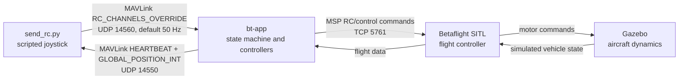

# Flight Scenario Examples

This directory contains 12 flight scenarios and two supporting utilities for
exercising `bt-app` through MAVLink RC overrides and visual tracking.

## Initial setup

The examples are intended for simulation. They expect Gazebo, Betaflight SITL,
and `bt-app` to communicate over the UDP endpoints configured in
[`../config/vehicle_config.yaml`](../config/vehicle_config.yaml).

From the workspace root, create/synchronize the `bt-app` environment with
`uv`:

```bash
cd bt_app
uv sync --extra dev
```

This installs `bt-app`, `pymavlink`, the local `bt-msgs` package, and the test
dependencies into `bt_app/.venv`. Run the following commands from separate
terminals.

### 1. Start Gazebo and Betaflight SITL

From the workspace root:

```bash
./bt_bringup/launch/launch.sh
```

Select `sim` from the displayed menu. This loads the simulation session that
starts Gazebo, the proxy, and Betaflight SITL. The SITL launcher currently
expects Betaflight at:

```text
/home/user/projects/betaflight/obj/main/betaflight_SITL.elf
```

Update [`../../bt_bringup/launch/run_sitl.sh`](../../bt_bringup/launch/run_sitl.sh)
if your Betaflight executable is located elsewhere.

### 2. Start `bt-app`

From the `bt_app` directory:

```bash
uv run bt-app run -c config/vehicle_config.yaml
```

Leave this process running. By default, `bt-app` listens for scenario RC
traffic on UDP port `14560` and publishes telemetry toward UDP port `14550`.

### 3. Run a scenario

In another terminal, from the `bt_app` directory, run the baseline automatic
takeoff and landing scenario:

```bash
uv run python example/send_rc.py
```

The scenario waits for live telemetry, arms in MANUAL, requests automatic
takeoff, verifies ALT_HOLD, descends, confirms touchdown, and disarms. Inspect
or change its available options with:

```bash
uv run python example/send_rc.py --help
```

For example, to hold altitude for 10 seconds and allow 90 seconds for landing:

```bash
uv run python example/send_rc.py \
  --alt-hold-duration 10 \
  --landing-timeout 90
```

Replace `send_rc.py` with any script from the scenario menu below. Tracking
scenarios additionally require the red-target detector and `bt-gst` pipeline
to be running before the scenario starts.

> **Safety:** These scripts command an armed aircraft and are intended for SITL.
> Do not point them at real hardware without a separate safety review and
> suitable operational controls.

## How the simulated joystick flight works

[`send_rc.py`](send_rc.py) acts like a scripted joystick. It does not directly
move the simulated aircraft and it does not skip the normal `bt-app` flight
logic. Instead, it repeatedly converts the desired stick and switch positions
into MAVLink `RC_CHANNELS_OVERRIDE` messages and sends them to `bt-app` at the
configured rate (50 Hz by default).

`bt-app` receives those virtual joystick channels, runs its normal state
machine and flight controllers, and commands Betaflight SITL. Gazebo simulates
the aircraft response. Telemetry then returns through `bt-app`, allowing the
scenario to verify each transition before it sends the next joystick command.



The baseline script builds complete eight-channel joystick snapshots. RC values
use approximately `1000` for low, `1500` for center, and `2000` for high.

### Joystick channel mapping

The Python constants use zero-based list indexes, while MAVLink and transmitter
channel numbers are one-based. For example, Python index `0` is RC channel 1.

| Python index | RC channel | Name | Input interpretation | Typical values | Boxer control |
|---:|---:|---|---|---|---|
| `0` | 1 | `ROLL` | Low rolls left, center is neutral, high rolls right. | `1000 / 1500 / 2000` | Right stick, horizontal |
| `1` | 2 | `PITCH` | Low pitches forward, center is neutral, high pitches backward. | `1000 / 1500 / 2000` | Right stick, vertical |
| `2` | 3 | `THROTTLE` | Low is minimum thrust; increasing the value increases thrust. `1500` is also the neutral altitude-setpoint command in ALT_HOLD. | `1000..2000` | Left stick, vertical |
| `3` | 4 | `YAW` | Low commands counter-clockwise yaw, center is neutral, high commands clockwise yaw. | `1000 / 1500 / 2000` | Left stick, horizontal |
| `4` | 5 | `ARM` | Low requests disarmed; high requests armed. | `1000 / 2000` | `SE` switch |
| `5` | 6 | `MANUAL` | Low selects MANUAL; high releases MANUAL so ALT_HOLD can be selected by the state machine. | `1000 / 2000` | `SA` switch |
| `6` | 7 | `AUTO_TAKEOFF` | Low is inactive; high requests automatic takeoff while armed in MANUAL. | `1000 / 2000` | `SD` switch |
| `7` | 8 | Reserved in `send_rc.py` | Not used by the baseline scenario; transmitted low. Extended tracking scenarios reuse later channels for tracker selection and enable. | `1000` | `SB` begins tracker selection in the transmitter configuration |

The helper `rc_channels()` always creates a complete snapshot rather than
changing only one channel. Its safe defaults are centered roll, pitch, and yaw;
minimum throttle; disarmed; automatic takeoff inactive; and MANUAL not selected.
Each scenario phase then overrides only the controls needed for that phase.

The tracking examples extend the snapshot beyond these eight baseline fields:

| RC channel | Tracking name | Meaning | Transmitter control |
|---:|---|---|---|
| 8 | `TRACKER_MODE` | `1000` disables tracking, `1500` selects tracker 1, and `2000` selects tracker 2. | `SB` switch |
| 9 | `TRACKER_ENABLE` | A low-to-high transition requests entry into TRACK after a valid target lock. | Momentary `SF` switch |

| Script phase | Simulated joystick command | Expected application result |
|---|---|---|
| Discover application | Neutral sticks, disarmed | Receive the first `bt-app` heartbeat. |
| Arm in MANUAL | ARM high, MANUAL selected, throttle low | `IDLE -> MANUAL`, armed flag set. |
| Request takeoff | ARM high, AUTO_TAKEOFF high | `MANUAL -> TAKEOFF`. |
| Complete takeoff | Continue holding the takeoff snapshot | `TAKEOFF -> ALT_HOLD`. |
| Hold altitude | Roll/pitch/yaw centered, throttle centered, armed | Remain in `ALT_HOLD` for the requested duration. |
| Descend | Select MANUAL and send fixed throttle below the hover baseline | `ALT_HOLD -> MANUAL`, followed by decreasing altitude. |
| Confirm touchdown | Continue the descent snapshot | Observe three consecutive altitude samples at or below the touchdown threshold. |
| Disarm | MANUAL selected, ARM low, throttle low | `MANUAL -> IDLE`, armed flag cleared. |

Every phase is feedback-gated: `_wait_for()` continues transmitting the current
joystick snapshot while reading telemetry, and advances only when its expected
state or altitude condition is true. A timeout raises `ScenarioError`. Before
takeoff, cleanup sends a final disarm snapshot; after takeoff, cleanup stops RC
traffic so the `bt-app` communication failsafe can take control.

## Scenario menu

| Scenario | Flight flow | Purpose |
|---|---|---|
| [`send_rc.py`](send_rc.py) | `IDLE -> MANUAL -> TAKEOFF -> ALT_HOLD -> MANUAL -> IDLE` | Baseline automatic takeoff, altitude hold, manual descent, touchdown, and disarm. |
| [`send_rc_manual_alt_hold.py`](send_rc_manual_alt_hold.py) | Manual climb -> ALT_HOLD -> manual landing | Gradually climbs to a target altitude, holds it, and lands using fixed manual throttle. |
| [`send_rc_manual_alt_hold_100.py`](send_rc_manual_alt_hold_100.py) | Manual climb -> ALT_HOLD -> selector scan -> TRACK -> ALT_HOLD -> landing | Performs a high-altitude climb and vertical image-selector scan before tracking a target. The current default target altitude is 50 m despite the `_100` filename. |
| [`send_rc_manual_reentry.py`](send_rc_manual_reentry.py) | Manual climb -> ALT_HOLD -> MANUAL hover -> ALT_HOLD -> landing | Tests two ALT_HOLD entries separated by a manual-hover attempt, followed by feedback-controlled descent. |
| [`send_rc_auto_yaw.py`](send_rc_auto_yaw.py) | Auto takeoff -> ALT_HOLD yaw turns -> landing | Executes measured clockwise and counter-clockwise yaw rotations before controlled descent. |
| [`send_rc_auto_roll.py`](send_rc_auto_roll.py) | Auto takeoff -> ALT_HOLD roll pattern -> landing | Applies balanced left/right roll commands while checking attitude and altitude drift. |
| [`send_rc_auto_pitch.py`](send_rc_auto_pitch.py) | Auto takeoff -> ALT_HOLD pitch pattern -> landing | Applies a smooth forward/backward pitch pattern while monitoring pitch, pitch rate, and altitude drift. |
| [`send_rc_auto_pitch_hold.py`](send_rc_auto_pitch_hold.py) | Auto takeoff -> forward-pitch hold -> recovery -> landing | Uses attitude feedback to hold a forward pitch, normally -10 degrees, and records diagnostic CSV data. |
| [`send_rc_takeoff_diagnostic.py`](send_rc_takeoff_diagnostic.py) | Auto takeoff -> TAKEOFF/ALT_HOLD recording -> landing | Records takeoff parameters, altitude, attitude, vertical speed, requested RC, and controller output. |
| [`send_rc_takeoff_tracker.py`](send_rc_takeoff_tracker.py) | Auto takeoff -> ALT_HOLD -> TRACK -> ALT_HOLD -> landing | Pulses tracker enable until tracking starts, waits for its automatic exit, and lands. |
| [`send_rc_takeoff_yaw_tracker.py`](send_rc_takeoff_yaw_tracker.py) | Auto takeoff -> yaw search -> TRACK -> ALT_HOLD -> landing | Yaws clockwise until a visual target is acquired, tracks it, and lands after tracking exits. |
| [`send_rc_takeoff_target_selector.py`](send_rc_takeoff_target_selector.py) | Auto takeoff -> image selection -> TRACK -> ALT_HOLD -> landing | Moves an image-space selector to a named left, center, or right target without moving the aircraft in roll or pitch. |

## Supporting utilities

| Utility | Purpose |
|---|---|
| [`mavlink_mock.py`](mavlink_mock.py) | Provides a mock MAVLink flight-controller peer and reports RC override ignore/release behavior. |
| [`yolo_one_frame.py`](yolo_one_frame.py) | Runs YOLO inference on one image and displays the annotated detections. It currently uses workspace-specific model and image paths. |

## Common lifecycle

Most scenarios follow this state sequence:

```text
telemetry -> arm in MANUAL -> climb/takeoff -> ALT_HOLD
          -> optional maneuver or tracking
          -> MANUAL landing -> touchdown confirmation -> disarm/IDLE
```

## Safety behavior

- Failures before takeoff send a ground-safe disarm command.
- Most airborne failures stop RC traffic so the `bt-app` failsafe can recover.
- Maneuver scenarios enforce mode, telemetry, attitude, altitude-drift, and/or timeout limits.
- Touchdown normally requires three consecutive altitude samples below the configured threshold.

## Verification notes

- All example Python files compile successfully.
- The associated scenario tests require `pymavlink`; without it, the tests fail during collection.
- The red-target scenarios require the detector, `bt-gst`, and `bt-app` to already be running.
