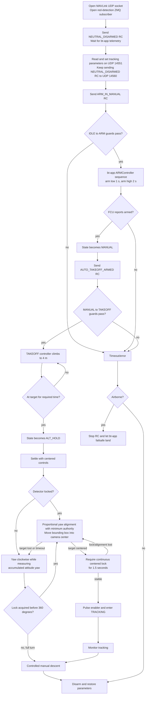

# Tracking RC scenario flow

This document describes `send_rc_tracking.py` from startup through landing and
shows which bt-app conditions must be true at each state transition.

## Top-level flow



## Commands sent by the script

The tuple order is roll, pitch, throttle, yaw, arm, manual, automatic-takeoff,
enabler, and tracker-mode.

The two outbound MAVLink paths use different bt-app UDP listeners:

```text
RC_CHANNELS_OVERRIDE  script:14550 -> bt-app:14560
PARAM_REQUEST/SET     script:14550 -> bt-app:14551
PARAM_VALUE/telemetry bt-app:14551 -> script:14550
```

| Phase | Important channel values | Meaning |
|---|---|---|
| Startup and parameter setup | throttle=1000, arm=1000, manual=2000 | Disarmed neutral heartbeat |
| Arm | throttle=1000, arm=2000, manual=1000 | Request arm in MANUAL |
| Automatic takeoff | throttle=1000, arm=2000, auto-takeoff=2000 | Request TAKEOFF from MANUAL |
| ALT_HOLD settle | throttle=1500, arm=2000 | Centered altitude command |
| PRE_TRACKING search | tracker-mode=2000, enabler=1000, yaw=1750 | Select tracking and search clockwise |
| Enable tracking | tracker-mode=2000, enabler pulse 1000→2000 | Enter TRACKING if detector lock is valid |

## Arming decision

`IDLE -> ARM` occurs only when all of these are true in `sm.py`:

```text
manual request OR takeoff request
AND FCU reports armable
AND FCU is not already armed
AND arm switch is high while throttle is below 1050
```

For `ARM_IN_MANUAL`, the script supplies the required manual request, arm-high,
and low-throttle values. The remaining external condition is `ctx.armable`,
which comes from the flight controller. If bt-app logs `Vehicle is not ready to
arm`, its arming-disable flags explain why the transition cannot start.

After entering `ARM`, bt-app—not the script—runs the physical arm sequence:

1. Arm low and throttle low for one second.
2. Arm high and throttle low for two seconds.
3. Wait until FCU telemetry reports `armed=True`.
4. Because the manual request remains active, transition `ARM -> MANUAL`.

## Takeoff decision

`MANUAL -> TAKEOFF` occurs only when:

```text
FCU reports armed
AND automatic-takeoff request is high
AND measured altitude is below TAKEOFF_ALT
```

The script does not directly command motor throttle for automatic takeoff. It
keeps sending the automatic-takeoff request; after the transition, bt-app's
`TakeoffController` owns throttle and uses `TAKEOFF_ALT` as its setpoint.

## Reading a failed run

| Last script state | Meaning | Check in bt-app log |
|---|---|---|
| `state=IDLE armed=False` | `IDLE -> ARM` guard failed | `Vehicle is not ready to arm` and arming-disable flags |
| `state=ARM armed=False` (`state=6`) | Arm sequence started, FCU did not arm | Betaflight arming-disable flags and ARM channel output |
| `state=MANUAL armed=True` | Arming succeeded; takeoff guard failed | `TAKEOFF_ALT`, current altitude, and auto-takeoff channel |
| `state=TAKEOFF armed=True` | Takeoff transition succeeded | Takeoff controller throttle, altitude, and vertical speed |

The startup message currently mentions red-detection data, but the initial wait
predicate only requires bt-app telemetry. Detector freshness becomes mandatory
later, when PRE_TRACKING search begins; it cannot block arming or takeoff.
