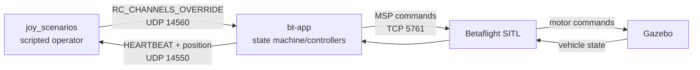

# Joystick Flight Scenarios

`joy_scenarios` provides reusable, operator-like joystick actions for exercising
`bt-app` in simulation. Each scenario sends complete MAVLink RC override
snapshots, waits for observed application state and altitude conditions, and
advances only after the expected feedback arrives.

> **SITL only:** these programs arm and command an aircraft. Do not connect them
> to real hardware without a separate safety review and suitable operational
> controls.

## Initial setup

From the workspace root:

```bash
cd bt_app
uv sync --extra dev
```

## Start the simulation

Terminal 1, from the workspace root:

```bash
./bt_bringup/launch/launch.sh
# Select: sim
```

This starts Gazebo, the proxy, and Betaflight SITL. The current SITL launcher
expects Betaflight at
`/home/user/projects/betaflight/obj/main/betaflight_SITL.elf`.

Terminal 2:

```bash
cd bt_app
uv run bt-app run -c config/vehicle_config.yaml
```

Terminal 3 runs the selected scenario.

## Run the migrated basic scenario

```bash
cd bt_app
uv run python -m joy_scenarios.01_basic_takeoff_land
```

Inspect all options:

```bash
uv run python -m joy_scenarios.01_basic_takeoff_land --help
```

Example slow fixed-throttle landing:

```bash
uv run python -m joy_scenarios.01_basic_takeoff_land \
  --alt-hold-duration 10 \
  --descent-throttle 1640 \
  --landing-timeout 120
```

`--descent-throttle` is a throttle command, not a descent-velocity command. The
configured hover baseline is approximately 1660, so a value closer to it
usually descends more slowly. The scenario limits this option to 1650 so it
remains below the nominal hover value.

## Run the altitude-steps scenario

This scenario takes off to 10 m, commands 15 m in ALT_HOLD, waits 10 seconds,
commands 8 m, waits another 10 seconds, and then lands in MANUAL:

```bash
cd bt_app
uv run python -m joy_scenarios.02_altitude_steps
```

The active `TAKEOFF_ALT` parameter must be 10 m (the repository default). The
scenario verifies that altitude before continuing. In ALT_HOLD it moves the
setpoint using high or low virtual throttle exactly like an operator, watches
the `alt_sp` telemetry published by `bt-app`, centers throttle at the requested
setpoint, and waits for the measured altitude to settle.

All targets and dwell times are configurable:

```bash
uv run python -m joy_scenarios.02_altitude_steps \
  --takeoff-altitude 10 \
  --high-altitude 15 \
  --low-altitude 8 \
  --hold-duration 10
```

## How it works



The toolkit behaves like an operator: it holds each stick/switch snapshot at
50 Hz by default, observes telemetry, and moves to the next action only after
the requested state is confirmed. Before takeoff, failures send a final disarm
snapshot. In the air, failures stop RC traffic so the `bt-app` communication
failsafe can recover.

## Run the ALT_HOLD yaw scenario

Scenario 03 takes off to 10 m and uses measured attitude feedback for this yaw
profile:

```text
90° CCW → 180° CW → 90° CCW → land
```

Run it with:

```bash
cd bt_app
uv run python -m joy_scenarios.03_alt_hold_yaw
```

Full yaw stick is configured for approximately 15°/s through
`HY_MAX_RATE=15`. Each turn integrates fresh `ATTITUDE.yaw` samples, including
correct handling across the 0°/360° boundary, and centers yaw for one second
between turns. The scenario logs the measured average rate after each turn.

## Run the tracker-glide scenario

Start the detector and `bt-gst` tracking pipeline before running scenario 04.
Then take off, move the image-space target gate downward, lock its target, and
glide under tracker control with:

```bash
cd bt_app
uv run python -m joy_scenarios.04_tracker_glide
```

The scenario selects tracker 1, applies pitch 1300 for 2 seconds to move the
target gate downward, then centers the pitch/roll command. It repeatedly pulses
RC channel 9 until the application reports `TRACK`. It then keeps tracker 1
selected and waits up to 60 seconds for the
controller to return automatically to `ALT_HOLD`. That transition is treated
as target contact because the current telemetry does not expose a separate
impact event. On acquisition or tracking timeout, the scenario disables the
tracker, confirms `ALT_HOLD`, lands and disarms, and returns a failure status.

Tune the two tracker time limits without changing the maneuver code:

```bash
uv run python -m joy_scenarios.04_tracker_glide \
  --tracker-entry-timeout 30 \
  --tracking-timeout 60 \
  --gate-pitch 1300 \
  --gate-move-duration 2
```

## Joystick mapping

| RC channel | Control | Low / center / high behavior |
|---:|---|---|
| 1 | Roll | Left / neutral / right |
| 2 | Pitch | Forward / neutral / backward |
| 3 | Throttle | Minimum / mid / maximum thrust |
| 4 | Yaw | Counter-clockwise / neutral / clockwise |
| 5 | Arm (`SE`) | Disarmed / — / armed |
| 6 | Manual (`SA`) | MANUAL selected / — / MANUAL released |
| 7 | Auto takeoff (`SD`) | Inactive / — / takeoff requested |
| 8 | Tracker mode (`SB`) | Disabled / tracker 1 / tracker 2 |
| 9 | Tracker enable (`SF`) | Low-to-high edge requests TRACK after lock |
| 10–18 | Reserved | Sent low (1000) by this toolkit |

Low, center, and high normally correspond to RC values 1000, 1500, and 2000.

## Create a scenario

Migrated scenarios compose the reusable operator actions instead of inheriting
from another maneuver:

```python
from joy_scenarios import JoyScenario, ScenarioConfig

config = ScenarioConfig()
with JoyScenario(config) as scenario:
    scenario.wait_for_telemetry()
    scenario.arm_manual()
    scenario.auto_takeoff()
    scenario.hold_altitude(10.0)
    # Add only the new scenario's unique maneuver here.
    scenario.land_manual(1640)
    scenario.disarm()
    scenario.complete()
```

Use `send`, `send_for`, `wait_until`, and `wait_for_state` when implementing a
new maneuver. Keep reusable operator actions in `steps.py`, transport behavior
in `transport.py`, and presentation in `console.py`.

## Scenario menu and migration status

Migrated scenarios use `python -m joy_scenarios.<name>`. Legacy scenarios remain
available during the incremental migration and run from the `bt_app` directory
with `uv run python example/<script>.py`.

| Scenario | Purpose | Status | Command |
|---|---|---|---|
| 01 — Basic takeoff and landing | Automatic takeoff, ALT_HOLD, fixed-throttle MANUAL landing | Migrated | `uv run python -m joy_scenarios.01_basic_takeoff_land` |
| 02 — ALT_HOLD altitude steps | Take off to 10 m, hold 15 m, hold 8 m, then land | Migrated | `uv run python -m joy_scenarios.02_altitude_steps` |
| 03 — ALT_HOLD measured yaw | Take off to 10 m, turn 90° CCW, 180° CW, and 90° CCW, then land | Migrated | `uv run python -m joy_scenarios.03_alt_hold_yaw` |
| 04 — Tracker glide | Take off to 10 m, move the gate down, lock tracker 1, glide until TRACK exits or timeout, then land | Migrated | `uv run python -m joy_scenarios.04_tracker_glide` |
| Manual ALT_HOLD | Manual climb, ALT_HOLD dwell, manual landing | Legacy | `uv run python example/send_rc_manual_alt_hold.py` |
| Manual climb and selector scan | High manual climb, vertical target scan, TRACK | Legacy | `uv run python example/send_rc_manual_alt_hold_100.py` |
| Manual re-entry | Two ALT_HOLD entries separated by MANUAL hover | Legacy | `uv run python example/send_rc_manual_reentry.py` |
| Automatic yaw | Clockwise and counter-clockwise yaw turns | Legacy | `uv run python example/send_rc_auto_yaw.py` |
| Automatic roll | Balanced left/right roll maneuver | Legacy | `uv run python example/send_rc_auto_roll.py` |
| Automatic pitch | Smooth balanced pitch maneuver | Legacy | `uv run python example/send_rc_auto_pitch.py` |
| Forward pitch hold | Feedback-controlled forward-pitch hold with diagnostics | Legacy | `uv run python example/send_rc_auto_pitch_hold.py` |
| Takeoff diagnostic | Record takeoff and ALT_HOLD handoff telemetry | Legacy | `uv run python example/send_rc_takeoff_diagnostic.py` |
| Takeoff tracker | Automatic takeoff followed by target tracking | Legacy | `uv run python example/send_rc_takeoff_tracker.py` |
| Yaw-search tracker | Yaw until target acquisition, then TRACK | Legacy | `uv run python example/send_rc_takeoff_yaw_tracker.py` |
| Target selector | Move image selector to a named target, then TRACK | Legacy | `uv run python example/send_rc_takeoff_target_selector.py` |
| Baseline legacy flow | Original automatic takeoff and landing implementation | Legacy reference | `uv run python example/send_rc.py` |

Tracking scenarios also require the detector and `bt-gst` pipeline to be
running before launch.
