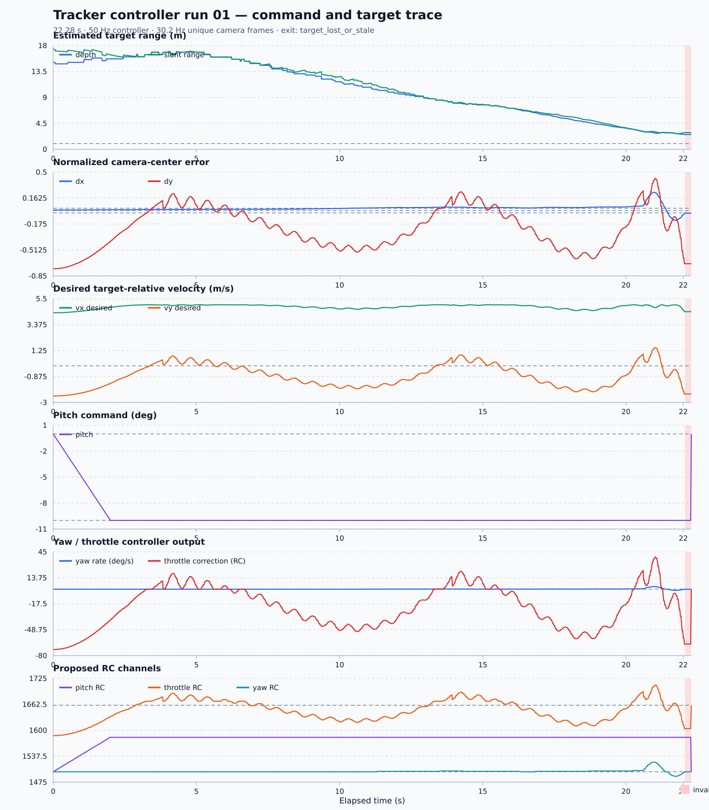

# Tracker Controller Run 01 Analysis

Source: `tracker_controller_01.csv`  
Plot: [tracker_controller_01_analysis.svg](tracker_controller_01_analysis.svg)

## Executive summary

The controller loop itself is regular and its pitch command is smooth, but the
target does not converge vertically toward the camera center. Horizontal
centering is generally good until a short late excursion. Vertical error
oscillates, then moves rapidly toward the lower image edge. The bounding box is
reported as clipped at about 2.57 m estimated depth, and TRACK exits through the
configured stale-target grace path rather than COMMIT.

This CSV records desired target-relative velocity and proposed RC commands. It
does not record actual vehicle pose, velocity, attitude, altitude, or the final
RC command dispatched to the FCU. Consequently, it can describe controller
intent and image-space behavior, but it cannot prove that the vehicle followed
a smooth physical slant trajectory.

## Run overview

| Metric | Result |
| --- | ---: |
| Samples | 1,115 |
| Duration | 22.280 s |
| Controller rate | 50.000 Hz |
| Mean loop interval | 20.000 ms |
| 95th-percentile interval | 20.041 ms |
| Maximum interval | 20.191 ms |
| Unique camera frames | 667 |
| Approximate camera rate | 30.22 Hz |
| Duplicate-frame controller rows | 448 |
| Exit reason | `target_lost_or_stale` |
| TRACKING rows | 1,115 |
| COMMIT rows | 0 |
| Invalid observation rows | 12 |

The 50 Hz command trace is exceptionally regular. Timing jitter is not an
obvious explanation for the observed image-error behavior.

## Approach and range behavior

- Estimated optical depth begins at 15.09 m, rises to a maximum of 16.84 m at
  3.44 s, and then falls to 2.57 m by the last valid estimate at 22.04 s.
- Slant range begins at 17.36 m and reaches a minimum of 2.73 m at 21.86 s.
  The difference between depth and slant range is substantial at the beginning
  because the target is far below the camera center.
- From 5–20 s, estimated depth closes at an average linear rate of about
  0.87 m/s. From 20–22.04 s, that rate slows to about 0.45 m/s.
- `TRK_COMMIT_M` is 1.0 m, but the minimum valid depth is 2.57 m. Therefore the
  controller never enters COMMIT and never freezes a close-range approach
  command intentionally.

The initial increase in optical depth should not automatically be interpreted
as the drone flying away. Slant range is already decreasing while the large
vertical target offset changes; bounding-box geometry and perspective affect
the depth estimate.

## Camera-centering behavior

| Error metric | Horizontal `dx` | Vertical `dy` |
| --- | ---: | ---: |
| Mean absolute error | 0.034 | 0.293 |
| RMS error | 0.047 | 0.358 |
| Time inside ±0.03 deadband | 47.0% | 6.9% |
| Minimum | -0.127 | -0.758 |
| Maximum | +0.238 | +0.417 |

Horizontal control is comparatively stable. `dx` remains small for most of the
run, so yaw commands are usually close to neutral. A late horizontal excursion
peaks at `dx = +0.238` around 20.96 s and produces the maximum yaw RC of 1523.

Vertical control is the main weakness:

- The target starts well below center at `dy = -0.758`.
- It passes above and below the center repeatedly, with eight sign crossings.
- At 21.02 s, `dy` reaches +0.417 and throttle RC reaches 1709.
- It then reverses sharply; the last valid held estimate has `dy = -0.692`.

This is consistent with an underdamped image-space vertical response, detector
geometry changing rapidly near the target, or both. Because actual altitude,
vertical speed, pitch, and thrust response are absent, this log alone cannot
separate controller tuning from vehicle dynamics or estimator motion.

## Desired velocity and RC behavior

The distance estimator produces a desired velocity vector with a constant
5 m/s magnitude. It is diagnostic input only: `TrackerController` does not use
`vx_m_s` or `vy_m_s` to calculate RC commands.

- Desired `vx` stays between 4.35 and 5.00 m/s and remains 4.44 m/s at the last
  valid estimate. There is no requested forward deceleration near the target.
- Desired `vy` ranges from -2.47 to +1.49 m/s and follows the changing vertical
  target geometry.
- Pitch ramps cleanly from 0° to -10° over two seconds. Tracker-specific RC
  mapping changes pitch RC from 1500 to 1583, after which it stays fixed.
- Yaw rate ranges from -1.45 to +3.11 deg/s, mapping to yaw RC 1489–1523.
- Throttle correction ranges from -72.83 to +38.67 RC units. With hover and
  pitch compensation, proposed throttle spans 1587–1709.

The present approach is therefore not a velocity loop. It combines fixed
forward pitch, proportional yaw from `dx`, and proportional throttle correction
from `dy`. The calculated desired velocities do not close a feedback loop.

## Tracker loss and exit

The first invalid observation occurs at 22.060 s with reason
`bounding box clipped by image edge`. Twelve invalid rows follow. During the
grace period, the controller correctly holds the last valid estimate and RC
command. The final row occurs at 22.280 s when control-estimate age reaches
0.258 s, exceeding `TRK_TIMEOUT_S = 0.25 s`.

The final controller result is invalid and requests exit, with centered
pitch/yaw and hover throttle. This confirms the loss-grace and stale-target
handoff logic behaves as designed.

## Implications for a smoother slant approach

1. **Stabilize vertical image behavior first.** Add filtering and/or slew limits
   to the throttle correction, then test lower `TRK_THR_KP` values. Use measured
   altitude and vertical speed before deciding whether the oscillation is gain,
   delay, or estimator driven.
2. **Replace fixed pitch with an approach profile.** A depth-dependent pitch or
   forward-velocity controller should accelerate smoothly, cruise, and reduce
   forward command before the target instead of holding -10° until vision loss.
3. **Do not tune COMMIT blindly from this run.** Raising the 1 m threshold above
   2.57 m could hide the detector failure by committing earlier, but it would
   also freeze a command while the target is far from centered. Improve
   close-range detection or define explicit commit-entry centering constraints.
4. **Expand the next dataset.** Record actual pitch, altitude, vertical speed,
   vehicle velocity, and final dispatched RC alongside this trace. Those fields
   are required to design and validate a closed-loop physical trajectory rather
   than only an image-space pursuit law.

## Conclusion

The command loop timing and pitch slew are smooth. The limiting behavior in
this run is vertical target motion and loss at the image edge, not loop jitter
or yaw control. The next controller iteration should focus on vertical damping,
close-range tracker robustness, and measured vehicle-state logging before using
the desired `vx/vy` fields as velocity-control references.
