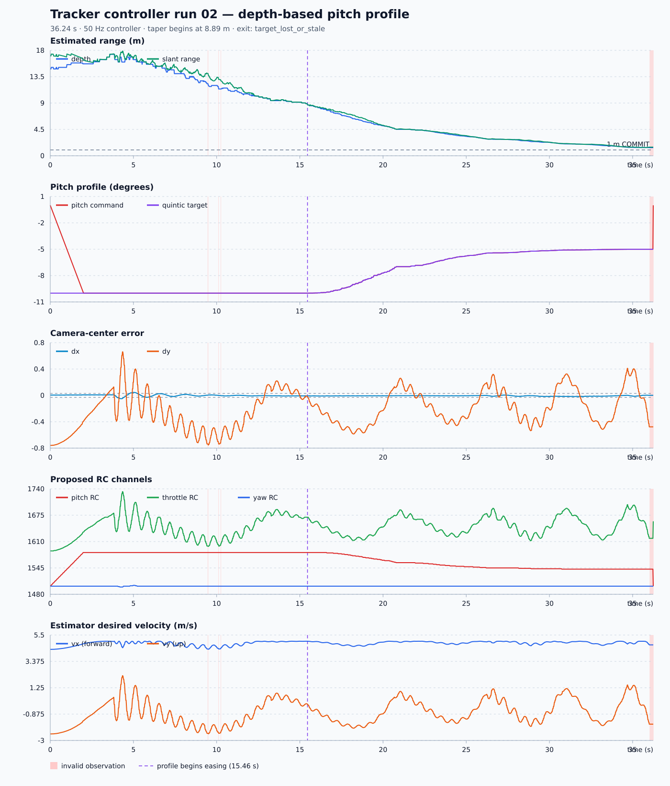

# Tracker Controller Run 02 Analysis

Source: `tracker_controller_02.csv`  
Plot: [tracker_controller_02_analysis.svg](tracker_controller_02_analysis.svg)

## Executive summary

The new depth-based pitch profile worked as implemented. The controller held
the normal `-10 deg` cruise pitch until the latched depth passed the calculated
8.89 m taper point, then smoothly relaxed pitch toward `-5 deg`. The logged
command follows the reconstructed quintic target almost exactly after the
initial slew.

Compared with run 01, tracking lasted longer and the final valid estimated
depth improved from 2.57 m to 1.39 m. Estimated closing also slowed as pitch
relaxed. This is encouraging evidence for the new command profile, but it is
not proof of vehicle deceleration because the CSV has no measured vehicle
position or forward velocity.

The remaining failure is still vertical image behavior. The target oscillates
above and below center, eventually moves toward the lower image edge, and is
lost before reaching the 1.0 m COMMIT threshold. The run exits through the
stale-target path rather than completing the approach.

## Run overview

| Metric | Run 02 |
| --- | ---: |
| Samples | 1,813 |
| Duration | 36.240 s |
| Controller rate | 50.000 Hz |
| Mean loop interval | 20.000 ms |
| 95th-percentile interval | 20.046 ms |
| Maximum interval | 22.778 ms |
| Unique control camera frames | 1,074 |
| Approximate camera rate | 29.81 Hz |
| Duplicate-frame controller rows | 739 |
| Exit reason | `target_lost_or_stale` |
| TRACKING rows | 1,813 |
| COMMIT rows | 0 |
| Invalid observation rows | 16 |

Controller timing remains stable. The 50 Hz loop and repeated camera frames
behave normally and do not explain the tracker loss.

## Pitch-profile behavior

The profile uses the first depth of 14.821 m:

- Taper start: `14.821 * 0.60 = 8.893 m`.
- Profile endpoint: `TRK_COMMIT_M = 1.0 m`.
- Cruise pitch: `-10 deg`.
- Terminal pitch: `-5 deg`.

Observed milestones:

| Event | Time | Latched depth | Pitch command |
| --- | ---: | ---: | ---: |
| Initial command | 0.00 s | 14.82 m | 0.00 deg |
| Initial slew reaches cruise | about 2.00 s | 15.69 m | -10.00 deg |
| Taper begins | 15.46 s | 8.77 m | -10.00 deg |
| Near profile midpoint | 20.24 s | 5.00 m | -7.56 deg |
| Pitch reaches about `-5.1 deg` | 30.74 s | 2.06 m | -5.10 deg |
| Last valid estimate | 36.00 s | 1.39 m | -5.006 deg |

After the initial two-second slew, the pitch command differs from the
reconstructed quintic target by only 0.0008 deg RMS, with a maximum difference
of 0.028 deg. The small difference is consistent with the existing slew and
brief observation holds. There is no visible discontinuity at profile entry.

The closest-depth latch also behaves as intended: temporary increases in the
range estimate do not move pitch back toward the more aggressive cruise
command.

## Range and apparent closing behavior

- Optical depth starts at 14.82 m and initially rises to 17.31 m at 3.58 s.
  As in run 01, this early rise can be influenced by vertical target geometry
  and should not automatically be interpreted as backward vehicle motion.
- The profile starts easing at about 15.46 s. Depth then passes 5.0 m at
  20.24 s, 2.0 m at 31.58 s, and reaches 1.39 m at the last valid observation.
- A linear fit to estimated depth gives about 0.72 m/s closure from 5-20 s,
  0.28 m/s from 20-30 s, and 0.15 m/s from 30 s until final loss.
- Minimum slant range is 1.41 m; the final valid slant range is 1.47 m.

The decreasing optical-depth slope is consistent with the pitch profile
reducing forward demand. It cannot establish cause or physical speed: optical
depth comes from the target bounding box, and the log contains neither actual
attitude nor horizontal velocity.

## Camera-centering behavior

| Error metric | Run 02 `dx` | Run 02 `dy` | Run 01 `dx` | Run 01 `dy` |
| --- | ---: | ---: | ---: | ---: |
| Mean absolute error | 0.0086 | 0.2971 | 0.0341 | 0.2926 |
| RMS error | 0.0112 | 0.3550 | 0.0465 | 0.3584 |
| Time inside +/-0.03 deadband | 97.7% | 5.6% | 47.0% | 6.9% |
| Minimum | -0.050 | -0.758 | -0.127 | -0.758 |
| Maximum | +0.045 | +0.660 | +0.238 | +0.417 |
| Sign crossings | 6 | 22 | 1 | 8 |

Horizontal centering is excellent in run 02. Almost all `dx` samples are in
the deadband, and proposed yaw RC remains between 1498 and 1502.

Vertical centering did not improve materially. Its MAE and RMS are almost
unchanged, only 5.6% of samples are within the deadband, and the target crosses
the vertical center 22 times. The maximum positive error grows to +0.660 at
4.34 s, producing the maximum proposed throttle of 1733. The last valid error
is `dy = -0.477`, after which the bounding box is clipped by the image edge.

The pitch profile therefore improved the forward command shape without fixing
the underdamped or delayed vertical response.

## RC and desired-velocity behavior

- Pitch RC moves from 1500 through the initial forward-pitch slew, holds near
  1583 at `-10 deg`, then relaxes smoothly toward 1542 at `-5 deg`.
- Proposed throttle spans 1587-1733. Throttle correction spans -72.83 to
  +63.04 RC units and continues to respond directly to `dy`.
- Proposed yaw stays nearly neutral because horizontal error is small.
- Estimator `vx` ranges from 4.35 to 5.00 m/s and `vy` from -2.47 to
  +2.22 m/s. These are desired camera-relative vector components; they are not
  measured drone velocities and are not used by `TrackerController` to create
  the RC commands.

## Observation loss and exit

There are three short estimator disagreements before the final loss:

- Two invalid rows at 9.46-9.48 s.
- One invalid row at 10.10 s.
- One invalid row at 10.24 s.

All report `width/height depth disagreement`. Each recovers within the 0.25 s
grace window, and the controller correctly holds its last command.

The terminal loss begins at 36.02 s with `bounding box clipped by image edge`.
The controller holds the last valid command for 12 rows. At 36.24 s the last
estimate is about 0.255 s old, so the result becomes invalid, exit is requested,
and the controller output returns to level pitch, neutral yaw, and hover
throttle.

The closest valid depth is 1.388 m, so the 1.0 m COMMIT condition is never
reached.

## Run 01 comparison and next priorities

| Outcome | Run 01 | Run 02 |
| --- | ---: | ---: |
| Duration | 22.28 s | 36.24 s |
| Last valid depth | 2.57 m | 1.39 m |
| Last pitch command | -10.00 deg | -5.006 deg |
| Horizontal MAE | 0.0341 | 0.0086 |
| Vertical MAE | 0.2926 | 0.2971 |
| COMMIT reached | No | No |
| Final failure | Image-edge clipping | Image-edge clipping |

Run 02 lasts 62.7% longer and reaches an estimated depth about 1.19 m closer
than run 01. The pitch-profile fix is operating correctly, and the late
approach is less aggressive in the logged command. The next limiting issue is
not pitch-command smoothness; it is vertical tracking and close-range target
visibility.

Recommended next steps:

1. Log actual pitch, altitude, vertical speed, and final dispatched RC so the
   image motion can be separated from vehicle response and estimator effects.
2. Add damping or a slew limit to throttle correction and test a lower
   `TRK_THR_KP`; evaluate changes using vertical MAE, RMS, crossings, and
   image-edge-loss depth.
3. Investigate why the target reaches the image edge before 1 m. Do not simply
   raise the COMMIT distance until acceptable center-error conditions are
   defined, because COMMIT freezes yaw and throttle as well as pitch.
4. Keep the new pitch profile for the next controlled test: this run shows it
   executes smoothly and does not introduce a new horizontal-control problem.

## Conclusion

The pitch fix succeeded at the command level. It produces the intended smooth
`-10 deg` to `-5 deg` transition and the estimated approach slows late in the
run. The drone still does not complete the approach because vertical error
remains oscillatory and the tracker loses the target at 1.39 m, before COMMIT.
The next controller iteration should focus on vertical damping and richer
vehicle-state logging rather than further pitch-profile smoothing.
