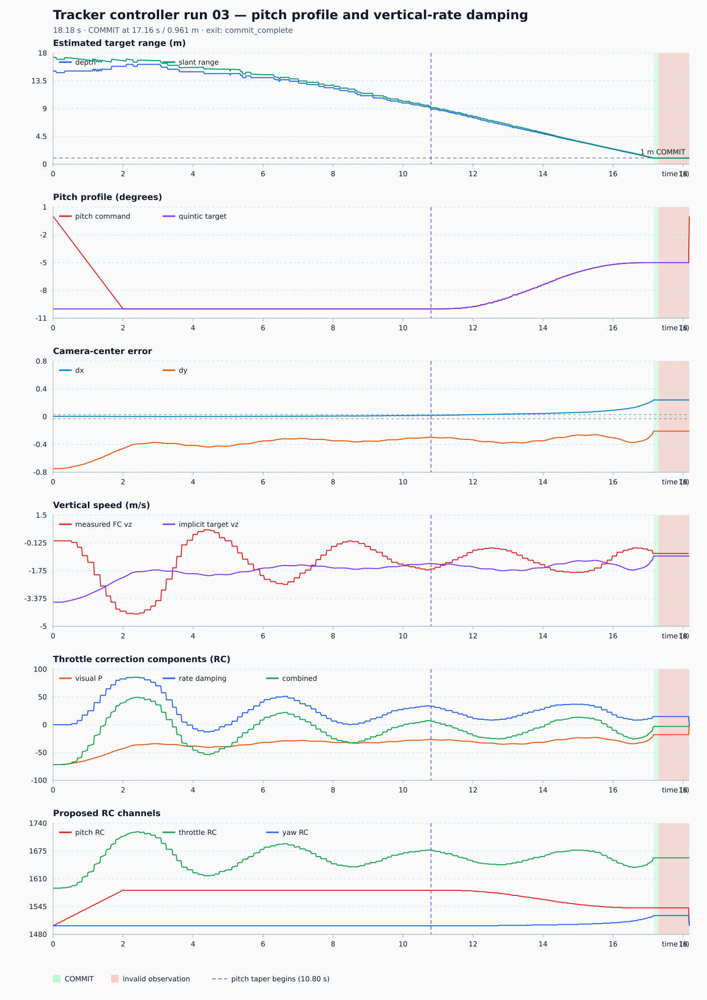

# Tracker Controller Run 03 Analysis

Source: `tracker_controller_03.csv`  
Plot: [tracker_controller_03_analysis.svg](tracker_controller_03_analysis.svg)



## Executive summary

Run 03 completes the programmed approach: it crosses the 1.0 m depth boundary,
enters COMMIT at 17.16 s, freezes the command for one second, and exits with
`commit_complete`. The pitch profile again operates correctly, and proposed
throttle is substantially smoother than run 02.

The vertical-rate damping is active and prevents the repeated center crossings
seen previously. However, it replaces oscillation with a persistent vertical
offset: `dy` remains negative throughout TRACK and never enters the deadband.
Measured vertical speed reaches `-4.28 m/s`, which is too aggressive for a
smooth approach. COMMIT also begins with `dx = +0.241` and `dy = -0.208`, so
completion does not mean the target was well centered.

The next improvement should make desired vertical speed explicit, capped, and
slew-limited. Increasing damping alone would not address the aggressive
implicit speed request.

## Run overview

| Metric | Result |
| --- | ---: |
| Samples | 910 |
| Duration | 18.180 s |
| Controller rate | 50.000 Hz |
| Mean loop interval | 20.000 ms |
| 95th-percentile interval | 20.037 ms |
| Maximum interval | 20.395 ms |
| TRACKING rows | 858 |
| COMMIT rows | 52 |
| Unique control camera frames before COMMIT | 513 |
| Approximate camera rate | 29.9 Hz |
| Exit reason | `commit_complete` |
| COMMIT entry | 17.160 s at 0.961 m depth |
| Final result | safe handoff after commit timeout |

Loop timing is regular and is not a source of visible command roughness.

## Pitch and range behavior

The initial depth is 15.088 m, producing a 60% taper boundary of 9.053 m.

| Event | Time | Depth | Pitch command |
| --- | ---: | ---: | ---: |
| TRACK begins | 0.00 s | 15.09 m | 0.00 deg |
| Initial slew reaches cruise | about 2.00 s | 15.85 m | -10.00 deg |
| Pitch taper begins | about 10.82 s | 8.92 m | -10.00 deg |
| Near taper midpoint | 13.96 s | 4.98 m | -7.44 deg |
| Depth passes 2 m | 16.36 s | 1.96 m | -5.07 deg |
| COMMIT | 17.16 s | 0.961 m | -5.00 deg |

The pitch command is continuous and follows the quintic target. Minimum slant
range at COMMIT is approximately 1.000 m. The profile is not the main remaining
smoothness problem.

Run 03 reaches the target much faster than run 02: COMMIT occurs after 17.16 s,
while run 02 was still at 1.39 m after 36.00 s. Because the CSV has no measured
horizontal velocity or position, this difference cannot be attributed solely
to the pitch controller.

## What the vertical controller is doing

The implemented correction is:

```text
u = 100 * dy_deadbanded - 20 * measured_vz
```

It can be rewritten as:

```text
u = 20 * (5 * dy_deadbanded - measured_vz)
```

This reveals an implicit vertical-speed target:

```text
vz_target = 5 * dy_deadbanded
```

At startup, deadbanded `dy` is about `-0.72`, so the loop implicitly requests
approximately `-3.6 m/s`. The measured rate later reaches `-4.28 m/s`.
Therefore the high descent rate is consistent with the selected gain ratio; it
is not evidence that the damping term failed.

Vertical telemetry was usable for 99.88% of TRACKING rows. Accepted sample age
has a 95th percentile of 0.159 s and a maximum of 0.219 s, safely below the
0.30 s cutoff. Only the first controller row lacks a usable rate sample.

| Vertical quantity | Minimum | Maximum | Mean |
| --- | ---: | ---: | ---: |
| Measured `vz` | -4.28 m/s | +0.64 m/s | -1.28 m/s |
| Visual P term | -72.0 RC | -20.3 RC | -35.2 RC |
| Rate-damping term | -12.8 RC | +85.6 RC | +25.6 RC |
| Combined correction | -72.0 RC | +49.4 RC | -9.6 RC |

When descent becomes faster than the implicit target, damping correctly adds
throttle. For example, near 2.3 s the measured rate is `-4.28 m/s`; the visual
term requests `-36.8 RC`, while damping adds `+85.6 RC`. The net correction is
upward, braking the descent.

## Camera-centering behavior

| Error metric | Run 03 `dx` | Run 03 `dy` | Run 02 `dx` | Run 02 `dy` |
| --- | ---: | ---: | ---: | ---: |
| Mean absolute error | 0.0271 | 0.3820 | 0.0086 | 0.2970 |
| RMS error | 0.0466 | 0.3970 | 0.0112 | 0.3550 |
| Time inside +/-0.03 deadband | 72.1% | 0.0% | 97.7% | 5.6% |
| Minimum | +0.0016 | -0.750 | -0.050 | -0.758 |
| Maximum | +0.231 | -0.233 | +0.045 | +0.660 |
| Sign crossings | 0 | 0 | 6 | 22 |

Vertical behavior is less oscillatory but not better centered. The target
starts below center and remains below center for the entire approach. Its error
improves toward zero, but never reaches the deadband before COMMIT.

Horizontal centering is acceptable for most of the run but drifts right near
the target. At COMMIT, `dx = +0.241`, producing yaw RC 1524. This command is
then frozen along with pitch and throttle.

## Command smoothness

| Throttle smoothness metric | Run 02 | Run 03 | Change |
| --- | ---: | ---: | ---: |
| Mean absolute step per 20 ms | 1.215 RC | 0.638 RC | -47.5% |
| 95th-percentile step | 5 RC | 4 RC | -20% |
| Maximum step | 15 RC | 15 RC | unchanged |
| Total variation per second | 60.8 RC/s | 31.9 RC/s | -47.5% |

The proposed throttle trace is clearly smoother overall. The remaining sharp
changes mostly come from the unfiltered 10 Hz rate term:

- Visual-term variation is about 7.2 RC/s.
- Damping-term variation is about 24.6 RC/s.
- The largest damping step is 14.6 RC.

Thus the damping improves the low-frequency oscillation but is now the dominant
source of short command steps. A later slew limit or carefully chosen filter
could improve command smoothness, but it should not hide the more important
excessive vertical-speed target.

## COMMIT and tracker loss

COMMIT begins at 17.160 s with:

| Value | At COMMIT |
| --- | ---: |
| Depth | 0.961 m |
| Slant range | 1.000 m |
| `dx` | +0.241 |
| `dy` | -0.208 |
| Measured vertical speed | -0.74 m/s |
| Pitch | -5.00 deg |
| Visual throttle term | -17.83 RC |
| Damping term | +14.80 RC |
| Combined correction | -3.03 RC |
| Pitch / throttle / yaw RC | 1542 / 1659 / 1524 |

The target becomes invalid at 17.30 s with `bounding box clipped by image
edge`, 0.14 s after COMMIT begins. This is ignored as designed because COMMIT
freezes the complete command. After one second the controller returns the safe
handoff command and reports `commit_complete`.

This is a successful state-machine completion, but the sizable center errors
mean it should not yet be treated as a well-aligned contact.

## Recommendation for smoother flight

The next controller should expose the velocity target instead of creating it
implicitly through the P/D gain ratio:

```text
vz_requested = clamp(K_image * dy_deadbanded, -VZ_MAX, +VZ_MAX)
vz_setpoint = slew(vz_setpoint, vz_requested, VZ_ACCEL_MAX)
throttle_correction = clamp(
    K_velocity * (vz_setpoint - measured_vz),
    -TRK_THR_MAX,
    +TRK_THR_MAX,
)
```

Suggested conservative first experiment:

- `VZ_MAX = 1.0 m/s`.
- `VZ_ACCEL_MAX = 0.5-1.0 m/s^2`.
- Start with proportional velocity feedback only; add integral action only if
  logs show a repeatable steady velocity error.
- Apply a throttle-correction slew limit only after the velocity cap is in
  place, because limiting an emergency braking correction can be unsafe.

Additional safeguards and diagnostics:

1. Require acceptable `dx`, `dy`, and vertical speed before entering COMMIT,
   or abort to ALT_HOLD when depth crosses the boundary while misaligned.
2. Log altitude, actual pitch, and final dispatched RC. These are required to
   distinguish smooth command output from smooth physical motion.
3. Continue logging raw rate, sample age, and each correction term. They clearly
   exposed the implicit high-speed request in this run.

## Conclusion

Run 03 is a meaningful improvement in command smoothness and state-machine
completion. Vertical oscillation is gone, the pitch profile works, and COMMIT
is reached. However, the current gain ratio implicitly requests several metres
per second of vertical motion, measured descent peaks at `-4.28 m/s`, and the
target remains off-center when commands freeze.

For a smoother physical flight, replace the implicit velocity target with a
bounded and acceleration-limited vertical-speed setpoint before adding more
damping or filtering.
