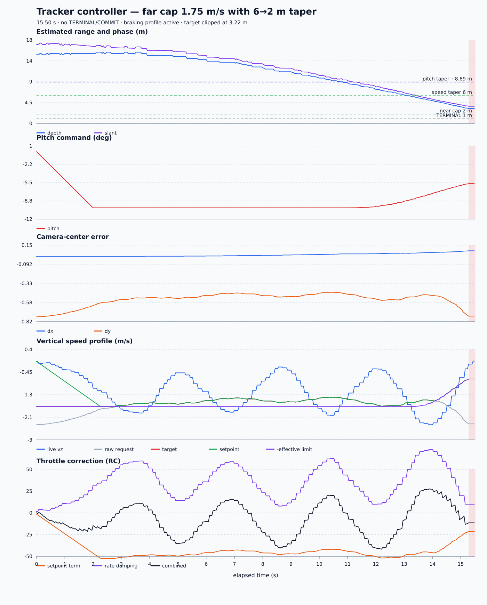

# Tracker Controller Analysis — 1.75 m/s Far Cap, 6→2 m Taper

Source: `tracker_controller.csv`  
Plot: [tracker_controller_analysis.svg](tracker_controller_analysis.svg)



## Executive summary

The 1.75 m/s far cap solves the previous far-range vertical-alignment problem,
but the current 6→2 m braking profile slows the descent too early and too
strongly. The target remains near `dy=-0.45` to `-0.53` before the speed taper,
then falls toward the lower image edge as the effective cap drops. Tracking is
lost at 3.22 m with `dy=-0.75` and `bounding box clipped by image edge`.

The flight never reaches TERMINAL or COMMIT, so the zero-speed terminal target,
alignment gate, vertical-speed gate, and two-second terminal timeout remain
untested.

Recommended next controlled change:

```text
TRK_VZ_TAPER_S: 6.0 -> 4.0 m
```

Keep the far cap at 1.75 m/s, taper end at 2 m, near cap at 0.5 m/s, and braking
rate at 1.5 m/s². This preserves the far-range authority that improved
alignment while delaying the strong reduction in descent until closer to the
target.

## Run overview

| Metric | Result |
| --- | ---: |
| Samples | 776 |
| Duration | 15.500 s |
| Controller rate | 50.000 Hz |
| 95th-percentile loop interval | 20.046 ms |
| Maximum loop interval | 20.251 ms |
| Valid control rows | 775 |
| Unique control camera frames | 457 |
| Approximate camera rate | 29.5 Hz |
| TRACKING rows | 775 |
| TERMINAL / COMMIT rows | 0 / 0 |
| Initial / final depth | 14.82 / 3.22 m |
| Initial / final slant range | 17.06 / 3.70 m |
| Exit reason | `target_lost_or_stale` |

Timing and camera delivery are stable. Unlike earlier logs, all invalid
observations belong to one terminal episode; there are no width/height depth
disagreement rejections in this run.

## What improved

The previous 1.25 m/s run lost the target at 5.43 m with `dy=-0.833`. This run
reaches 3.22 m, and vertical alignment is materially better before braking:

| Segment | Typical `dy` behavior |
| --- | ---: |
| Startup | improves from -0.760 |
| 6–13 s, before range taper | approximately -0.45 to -0.53 |
| After range taper starts | worsens toward -0.75 |

The far cap change was therefore useful. It supplies enough descent authority
to compensate for the forward slant trajectory through most of the approach.

Horizontal alignment also remains reasonable. `dx` stays positive and reaches
only `+0.078` at the last valid estimate, still inside the future COMMIT limit
of `0.10`.

## Range-based braking behavior

Logged profile:

```text
far cap       = 1.75 m/s
taper start   = 6.0 m
taper end     = 2.0 m
near cap      = 0.50 m/s
braking rate  = 1.50 m/s²
```

| Event | Time | Depth | Effective cap | Setpoint | Live `vz` | `dy` |
| --- | ---: | ---: | ---: | ---: | ---: | ---: |
| Far setpoint reached | 2.28 s | 15.38 m | 1.75 | -1.75 | -1.14 | -0.581 |
| Pitch taper visibly changes | 11.04 s | 8.61 m | 1.75 | -1.48 | -1.45 | -0.475 |
| Speed taper activates | 13.28 s | 5.76 m | 1.748 | -1.59 | -1.92 | -0.506 |
| Depth passes 4 m | 14.68 s | 3.98 m | 1.113 | -1.113 | -1.35 | -0.579 |
| Last valid estimate | 15.24 s | 3.22 m | 0.712 | -0.712 | about -0.33 | -0.750 |

By 3.22 m, the effective cap has fallen by 59%, from 1.75 to 0.712 m/s. Live
vertical speed subsequently reaches approximately `-0.04 m/s` during the held
estimate period. In other words, the vehicle is nearly no longer descending
while it continues its forward/pitch trajectory. The target consequently moves
down and exits the image.

With a 4→2 m taper, the effective limit at 3.22 m would be approximately
1.35 m/s rather than 0.71 m/s. That is a focused change to the braking location,
not a relaxation of the 0.5 m/s terminal limit.

## Vertical-loop behavior

| Vertical quantity during TRACK | Minimum | Maximum | Mean | Final held control |
| --- | ---: | ---: | ---: | ---: |
| Raw requested speed | -2.435 | -1.400 | -1.701 | -2.400 m/s |
| Effective speed limit | 0.712 | 1.750 | 1.684 | 0.712 m/s |
| Capped target | -1.750 | -0.712 | -1.551 | -0.712 m/s |
| Setpoint | -1.750 | -0.050 | -1.426 | -0.712 m/s |
| Measured speed | -2.430 | -0.050 | -1.158 | -0.330 m/s |
| Speed error | -1.393 | +0.926 | -0.268 | -0.382 m/s |
| Throttle correction | -41.8 | +27.8 | -8.05 | -11.46 RC |

The loop tracks the long-term request but has substantial low-frequency
under/overshoot. Measured speed alternates between roughly `-0.4` and
`-2.4 m/s` while the far setpoint is around `-1.5` to `-1.75 m/s`. This remains
a smoothness concern, but it is not the immediate cause of loss: after the
range taper, both the setpoint and physical descent trend sharply toward zero.

Do not increase `TRK_VZ_KD`. The current gain already produces correction swings
from about -42 to +28 RC and would amplify the 10 Hz telemetry steps. Do not
change gain in the same experiment as taper timing.

## Camera centering

| Error metric | `dx` | `dy` |
| --- | ---: | ---: |
| Mean absolute error | 0.0261 | 0.5403 |
| RMS error | 0.0327 | 0.5467 |
| Time inside +/-0.03 deadband | 63.9% | 0.0% |
| Range | +0.0078 to +0.0781 | -0.760 to -0.450 |

Vertical MAE improves from 0.626 in the 1.25 m/s run to 0.540 here. The target
never crosses vertical center, but its far-range position is substantially
more stable. The renewed late drift begins after the braking schedule reduces
the allowed descent.

## Pitch profile

The initial 14.82 m depth produces a nominal pitch-taper boundary of 8.89 m.
The first visible relaxation from -10 degrees occurs at 11.04 s and 8.61 m.
Pitch reaches -5.70 degrees at the final held estimate.

The pitch transition is continuous. However, as pitch relaxes toward -5
degrees, the vertical loop must still descend sufficiently to keep the target
in frame. The present speed taper simultaneously reduces descent, creating two
changes in the same direction from the camera's perspective. Delaying the
speed taper separates these effects for longer.

## Tracker loss and safety behavior

The only invalid-observation episode begins at 15.280 s and contains 12 rows,
all `bounding box clipped by image edge`. The held control estimate reaches age
0.256 s, exceeds the 0.25 s timeout, and safely exits to ALT_HOLD.

Because depth never reaches 1 m:

- phase remains TRACKING;
- `terminal_ready` remains false;
- no terminal block reason is emitted;
- no command is frozen;
- COMMIT safety cannot yet be assessed.

Increasing `TRK_TIMEOUT_S` would not help; it would merely continue forward
flight after the target has left the camera.

## Command smoothness

| Proposed-throttle metric | 1.25 m/s run | Current tapered 1.75 run | Static 1.75 run |
| --- | ---: | ---: | ---: |
| Mean absolute 20 ms step | 0.387 RC | 0.685 RC | 0.568 RC |
| 95th-percentile step | 3 RC | 5 RC | 4 RC |
| Maximum step | 7 RC | 10 RC | 13 RC |
| Total variation | 19.33 RC/s | 34.24 RC/s | 28.39 RC/s |

The output is more active than both comparison runs, mainly because the
velocity loop repeatedly corrects its under/overshoot. Maximum individual
steps remain below the static run, but total variation is now the highest.
This should be tuned only after the trajectory reaches TERMINAL reliably.

## Recommended next experiment

Change one parameter only:

```text
TRK_VZ_TAPER_S = 4.0
```

This recommendation was subsequently applied to the canonical parameter
default in `bt_app/parameters.yaml`.

Keep:

```text
TRK_VZ_MAX      = 1.75
TRK_VZ_TAPER_E  = 2.0
TRK_VZ_NEAR     = 0.50
TRK_VZ_BRAKE    = 1.50
TRK_VZ_ACCEL    = 0.75
TRK_VZ_KD       = 30
TRK_COMMIT_XY   = 0.10
TRK_COMMIT_VZ   = 0.50
TRK_COMMIT_HOLD = 0.25
TRK_TERM_TIMEOUT = 2.0
```

Success criteria for the next log:

1. `dy` remains better than approximately `-0.70` down to 2 m.
2. The target stays inside the image and depth reaches 1 m.
3. The effective cap remains 1.75 m/s until 4 m, then smoothly reaches 0.5 m/s
   at 2 m.
4. Measured descent is already trending downward before TERMINAL.
5. At 1 m, TERMINAL forces a zero-speed target and blocks COMMIT until
   `abs(vz)<=0.5 m/s` and alignment is safe.

If the next run reaches TERMINAL but vertical speed remains too high, the
subsequent change should increase `TRK_VZ_BRAKE` or modestly move the taper
start back outward based on the measured braking curve. If it again loses the
target around 3 m, retain the far cap and consider moving taper end closer to
the 1 m boundary rather than weakening the terminal speed requirement.

## Conclusion

The 1.75 m/s far cap is the correct direction: it improves alignment and moves
tracker loss from 5.43 to 3.22 m. The new range profile also clearly brakes the
vehicle, but its 6 m start reduces descent too early for the current forward
trajectory. Move only `TRK_VZ_TAPER_S` to 4 m next. Preserve the near-speed cap
and COMMIT safety gate so progress toward the target does not come at the cost
of an unsafe terminal state.
