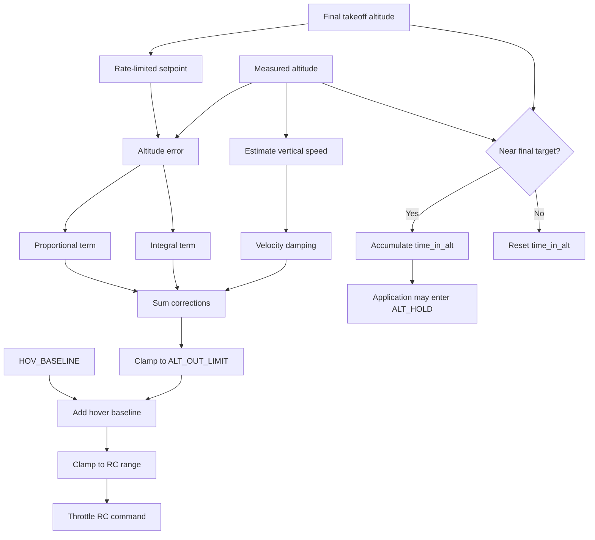
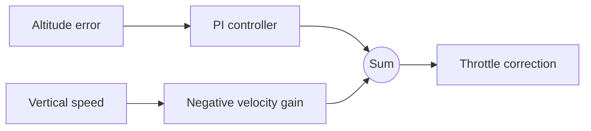

# Takeoff altitude control

The takeoff controller converts an altitude target into an RC throttle command.
It combines a ramped altitude setpoint, proportional-integral (PI) altitude
feedback, and vertical-speed damping. This structure behaves similarly to a
PID controller, but its derivative-like term is based on vehicle velocity
rather than the derivative of altitude error.

The implementation is in
[`takeoff_controller.py`](https://github.com/mayaboker/bt_ws/blob/main/bt_app/bt_app/control/takeoff_controller.py).

## Control flow



The controller does not switch flight modes. It exposes `time_in_alt`, and the
application state machine decides when to transition from `TAKEOFF` to
`ALT_HOLD`.

## Control equation

The commanded throttle is approximately:

\[
u = u_{hover} + K_p e + K_i \int e\,dt - K_v v_z
\]

where:

| Symbol | Code or parameter | Meaning |
| --- | --- | --- |
| \(u\) | RC throttle output | Final throttle command |
| \(u_{hover}\) | `HOV_BASELINE` | Estimated throttle required to hover |
| \(e\) | `internal_setpoint - altitude` | Altitude error |
| \(K_p\) | `ALT_KP` | Proportional gain |
| \(K_i\) | `ALT_KI` | Integral gain |
| \(K_v\) | `ALT_KD` | Vertical-speed damping gain |
| \(v_z\) | Derived vertical speed | Positive while climbing |

The correction is restricted by `ALT_OUT_LIMIT` before it is added to the
hover baseline.

## Why use proportional control?

The proportional term reacts immediately to altitude error:

\[
P = K_p e
\]

If the drone is below the internal setpoint, the term increases throttle. If it
is above the setpoint, it decreases throttle. A larger `ALT_KP` produces a
stronger response, but too much proportional gain can cause overshoot and
oscillation.

Proportional control alone may settle with a remaining altitude error. For
example, an inaccurate hover baseline may require a constant positive
correction. A proportional controller can produce that correction only while
some error remains.

## Why add integral control?

The integral term accumulates altitude error over time:

\[
I = K_i \int e\,dt
\]

It compensates for persistent disturbances such as:

- An inaccurate `HOV_BASELINE`
- Changes in battery voltage
- Changes in vehicle mass
- A steady aerodynamic bias

Integral control should normally be added only after proportional and velocity
damping behavior is stable. Excessive integral gain stores too much correction
while the vehicle is moving and can produce slow, growing oscillations or
overshoot. Output limiting does not necessarily eliminate integral windup.

## Why use vertical-speed damping?

Altitude error describes where the vehicle is. Vertical speed describes where
it is going. The damping term is:

\[
D_v = -K_v v_z
\]

Consider a target of 4 m while the drone is at 3.9 m and climbing at 1 m/s.
The proportional term still asks for more thrust because the drone is below
the target. The negative velocity term recognizes that the drone is already
approaching rapidly and reduces throttle before it overshoots.

This term acts like derivative damping, but it is not a second PD controller.
It is one feedback branch within the altitude controller:



## Why not use conventional PID derivative-on-error?

A conventional PID derivative term uses the rate of change of error:

\[
\dot e = \dot h_{setpoint} - v_z
\]

During takeoff, the internal altitude setpoint is deliberately moving. A
derivative-on-error controller therefore reacts both to actual drone motion
and to the commanded setpoint ramp. This can cause a derivative kick or an
unwanted response when the requested trajectory changes.

The current controller instead configures the reusable `PID` object with
`kd=0` and subtracts measured vertical speed separately. This has several
advantages:

- It damps actual vehicle motion without opposing a setpoint change directly.
- The gain has a clear physical interpretation.
- Sensor velocity can be filtered independently.
- It avoids differentiating noisy altitude error.

When the altitude setpoint is stationary, derivative-on-error and negative
vertical-speed feedback are closely related because
\(\dot h_{setpoint}=0\), so \(\dot e=-v_z\).

## Ramped setpoint

The controller does not command the final altitude as an immediate step. On
its first update, it initializes its internal setpoint at the measured
altitude. Later updates move it toward the final target at no more than
`TAKEOFF_RATE` metres per second.

```text
final target:       4.0 m
measured altitude:  0.0 m
TAKEOFF_RATE:        0.5 m/s

internal setpoint:  0.0 -> 0.5 -> 1.0 -> ... -> 4.0 m
```

The ramp prevents the PI controller from seeing the entire takeoff altitude as
an instantaneous error. `TAKEOFF_RATE` must still be achievable: if it is too
fast, the controller remains behind the ramp and can saturate its output.

## Takeoff-to-ALT_HOLD transition

The current controller accumulates `time_in_alt` while measured altitude is
within `ALT_REACH_DELTA` of the final target. Altitude proximity alone does not
prove that the vehicle has settled. The drone can pass through the tolerance
band with significant vertical speed and enter `ALT_HOLD` while still moving.

For a smooth transition, evaluate both position and motion:

```python
altitude_reached = abs(final_setpoint - altitude) < altitude_tolerance
vertical_settled = abs(vertical_speed) < vertical_speed_tolerance

if altitude_reached and vertical_settled:
    time_in_alt += dt_s
else:
    time_in_alt = 0.0
```

A practical starting point is an altitude tolerance around 0.5 m and a
vertical-speed tolerance around 0.15--0.20 m/s. These are initial test values,
not universal limits.

The ALT_HOLD controller should also receive enough state for a bumpless
transfer: current altitude, sensor timestamp, current vertical speed, and the
last takeoff throttle output. Otherwise resetting its history and returning
immediately to a static hover baseline can create a throttle discontinuity.

## Suggested tuning order

!!! warning
    Tune in a simulator or restrained test environment first. Keep altitude,
    attitude, output, and timeout safety limits active.

1. Measure a reasonable `HOV_BASELINE`.
2. Set `ALT_KI` to zero.
3. Choose a conservative, achievable `TAKEOFF_RATE`.
4. Increase `ALT_KP` until the drone follows the ramp without a weak or
   excessively delayed response.
5. Increase `ALT_KD` until approach to the target is well damped.
6. Check that the correction does not remain at `ALT_OUT_LIMIT`.
7. Add only enough `ALT_KI` to remove persistent error.
8. Validate arrival vertical speed before tuning the ALT_HOLD handoff.

Change one parameter at a time and repeat the same takeoff profile. Comparing
different flights is difficult if the target, battery condition, mass, or
setpoint rate also changes.

## Data required for tuning

Record these values on every controller update, including at least five
seconds before and fifteen seconds after the state transition:

| Group | Signals |
| --- | --- |
| Timing | Controller timestamp, altitude-sample timestamp, update period |
| State | Flight state, transition marker, `time_in_alt` |
| Position | Final target, ramped setpoint, altitude, altitude error |
| Motion | Sensor vertical speed, controller-derived vertical speed |
| Controller | P term, I term, velocity-damping term |
| Output | Raw correction, limited correction, saturation flag, baseline, final throttle PWM |
| Configuration | Active Kp, Ki, velocity gain, output limit, takeoff rate |
| Vehicle | Roll, pitch, battery voltage when available |

At the transition, explicitly compare the last TAKEOFF output with the first
ALT_HOLD output. A sudden throttle change, loss of velocity damping, or
non-zero arrival speed can explain a transient oscillation even when both
controllers are individually stable.
