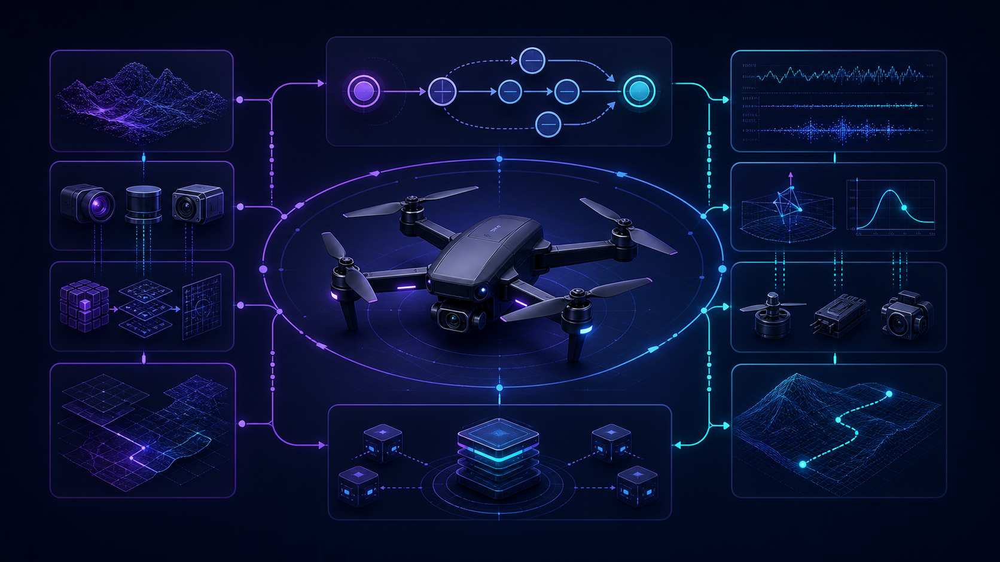
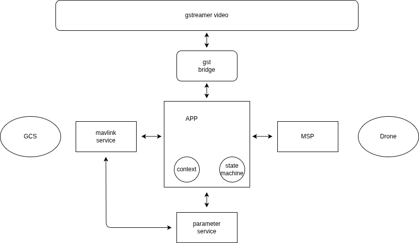
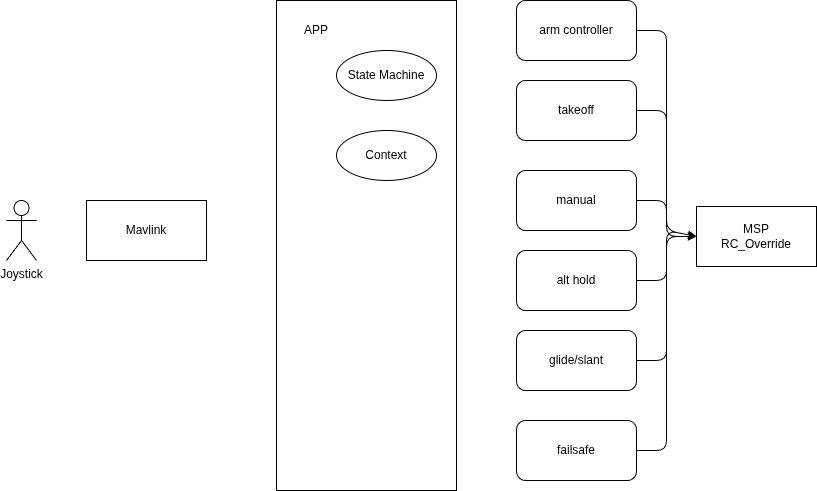
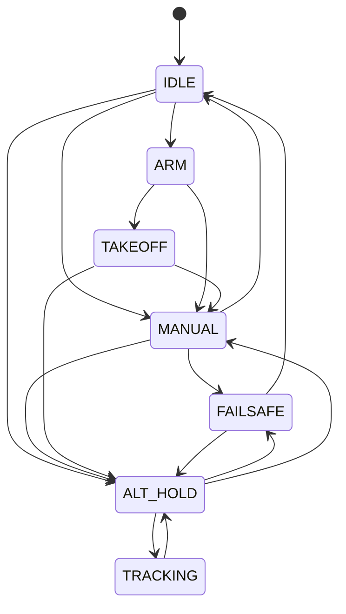
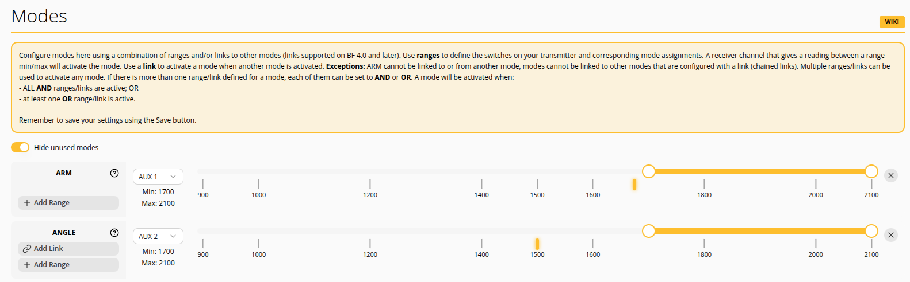

# Application

{ .section-hero }

Runtime architecture, flight modes, controllers, communication services, and
application-level integration belong in this section.

## Block diagram

## Controllers

## State Machine

### States

| mode  | description  |
|---|---|
| IDLE  | send low pwn to drone (safety mode)  |
| ARM   | send arm sequence to drone  |

---

### Controllers

#### ARM

Send ARM sequence
- ARM / AUX1 and Throttle to pwm min for 1 sec
- ARM / AUX1 to High pwm and Throttle to Mon pwm for 2 sec

!!! 
    Hold ARM hight until disarmed

!!!
    Aux1 must config to ARM in betaflight configure

    

!!!
    The system set ARM and init in ANGEL mode

#### rc_channel_override
The controller open mavlink udp socket and listen to rc_channel_override message

#### Manual

Manual mode pass through joystick request , 

TODO: what about acro
TODO: what about payload

