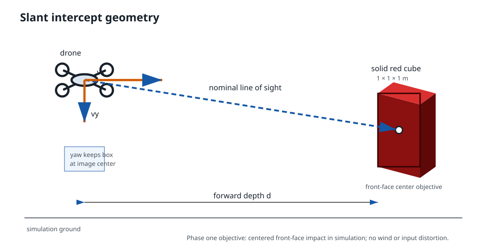
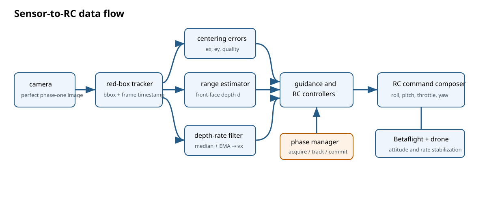
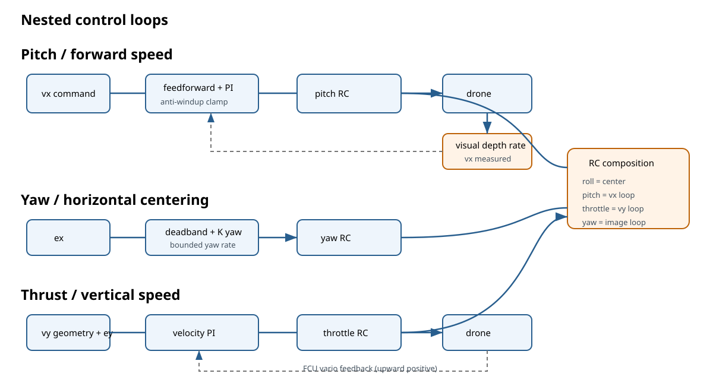
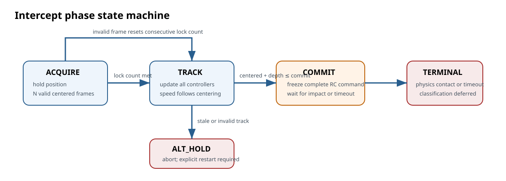

# Visual slant intercept of a red cube

## Objective

Guide the drone into the center of the front face of a stationary, solid,
collidable red cube measuring **1 × 1 × 1 m**. The controller uses camera
tracking and RC commands to approach at the highest permitted velocity that
still keeps the cube centered in the image.

This first design phase is simulation-only. It assumes perfect, timely tracker
results, no camera distortion, and no wind. Vehicle dynamics, acceleration,
RC limits, and collision physics remain active. Wind, sensor degradation, and
automatic collision-result classification are later phases.

The implementation is divided into independently reviewable milestones in the
[glide intercept implementation plan](glide_slant_implementation.md).



## System boundary

The tracker supplies a timestamped bounding box around the red cube. The
control system turns that observation into:

- pitch RC for body-forward velocity,
- yaw RC for horizontal image centering,
- throttle RC for upward-positive vertical velocity,
- centered roll RC.

The flight controller remains responsible for stabilizing attitude and yaw
rate. The visual controller is responsible for guidance and velocity tracking.



## Coordinates and observations

The initial controller operates in a yaw-aligned two-dimensional plane:

- `vx` is body-forward velocity toward the cube.
- `vy` is vertical velocity, positive upward.
- `ex` is normalized horizontal bounding-box center error in `[-1, 1]`.
- `ey` is normalized vertical bounding-box center error in `[-1, 1]`.
- `d` is forward camera depth to the cube's front face.

For a bounding box `(x, y, width, height)` in an image of size `(W, H)`:

```text
u = x + width / 2
v = y + height / 2

ex = (u - W / 2) / (W / 2)
ey = (H / 2 - v) / (H / 2)
```

Depth is estimated independently from the known 1 m face dimensions and the
camera focal lengths. Width- and height-derived depth must agree within the
configured geometry tolerance.

## Desired velocity

The guidance routine supplies nominal `vx_geometry` and `vy_geometry`. Image
centering limits how aggressively the drone may approach.

Define radial centering error:

```text
r = clamp(sqrt(ex^2 + ey^2), 0, 1)
```

`speed_quality(r)` is `1` inside a configured center deadband, decreases
smoothly to `0`, and remains `0` beyond the configured maximum centering error.

```text
vx_command = clamp(vx_geometry * speed_quality(r), 0, vx_max)

vy_command = clamp(
    vy_geometry + K_center_y * deadband(ey),
    -vy_max,
    +vy_max,
)
```

`vx_max` is 15 m/s for the initial simulation. Maximum speed is permitted only
while the cube remains well centered.

## Measured forward velocity

Forward velocity is estimated from decreasing visual depth:

```text
vx_raw = -(d_k - d_(k-1)) / (t_k - t_(k-1))
```

Only a new tracker frame with a strictly increasing timestamp updates the
estimate. Duplicate, non-monotonic, or stale samples are rejected. A
three-sample median rejects isolated jumps, followed by an exponential moving
average used as `vx_measured`.

## RC control loops



### Forward pitch

The pitch command combines calibrated feedforward with PI feedback:

```text
pitch_ff = pitch_at_vx_max * vx_command / vx_max
vx_error = vx_command - vx_measured
pitch_rc = pitch_ff + Kp_x * vx_error + Ki_x * integral(vx_error)
```

The PI controller updates only on new accepted tracker frames. Its correction
is held between frames. Pitch output is bounded, and conditional-integration
anti-windup prevents integration that would deepen saturation.

### Yaw centering

Horizontal image error requests a bounded yaw rate:

```text
yaw_rate_command = clamp(
    K_yaw * deadband(ex),
    -yaw_rate_max,
    +yaw_rate_max,
)
```

The yaw-rate request is mapped to RC; Betaflight closes the inner yaw-rate
loop. No visual integral term is used in phase one.

### Vertical thrust

Vertical image error adjusts the geometry-derived velocity request. The
existing vertical-speed PI loop compares `vy_command` with measured vario and
maps the correction around hover throttle.

### Command composition

The final RC command contains:

```text
roll     = RC_MID
pitch    = bounded forward velocity command
throttle = bounded vertical velocity command
yaw      = bounded image-centering command
arm      = armed
angle    = enabled
```

## Intercept phases

Implementation detail: [milestone 3 — guarded application integration](glide_slant_milestone_3_integration.md)



### ACQUIRE

- Hold position with neutral pitch.
- Require a configured number of consecutive valid detections.
- Accept radial centering error up to `center_error_max`; TRACK performs final
  centering before full forward speed or COMMIT.
- Reset velocity filters and controller integrators when acquisition begins.

### TRACK

- Update depth, `vx_measured`, desired velocities, and RC commands.
- Reduce forward velocity as centering error grows.
- Abort to `ALT_HOLD` if the tracker becomes stale before commit.
- Enter `COMMIT` only below configured commit depth with a valid centered track.

### COMMIT

The cube will fill or clip against the image near impact, making visual range
and centering unreliable. On commit, freeze the **complete last valid RC
command**. Do not update visual, forward-speed, vertical-speed, or yaw
controllers. The simulator continues this command until physical contact or
the configured commit timeout.

### Terminal handling

Automated collision sensing and centered-impact scoring are deliberately out
of scope for this phase. The simulator's collision physics provides the
physical result. A later collision interface can classify centered impact,
off-center impact, and timeout without changing the guidance loops.

## Required configuration

All values must be finite and validated before enabling the intercept:

| Parameter | Meaning |
| --- | --- |
| `vx_max` | Maximum forward request; staged at 2 m/s before 15 m/s commissioning |
| `vy_max` | Symmetric climb/descent speed limit |
| `pitch_at_vx_max` | Calibrated pitch RC deflection at `vx_max` |
| `pitch_min`, `pitch_max` | Safe pitch RC bounds |
| `Kp_x`, `Ki_x` | Forward velocity PI gains |
| `K_yaw`, `yaw_rate_max` | Visual yaw controller gain and limit |
| `K_center_y` | Image-Y to vertical-speed correction gain |
| `center_deadband` | Error radius that permits full speed |
| `center_error_max` | Error radius that reduces speed to zero |
| `lock_frame_count` | Consecutive centered frames required to engage |
| `tracker_timeout_s` | Maximum accepted observation age |
| `commit_depth_m` | Last depth at which visual control may enter commit |
| `commit_timeout_s` | Maximum duration of frozen RC command |
| `depth_ema_alpha` | EMA coefficient for measured forward speed |

## Phase-one acceptance criteria

- With a centered, stationary cube and no wind, the controller enters `TRACK`
  only after the configured lock sequence.
- Forward speed never exceeds the configured staged limit.
- Increasing centering error smoothly reduces the forward request.
- The cube remains inside the configured center-error bound until `COMMIT`.
- Forward PI state changes only on new tracker timestamps and does not wind up
  against pitch limits.
- Tracker loss before commit transitions to `ALT_HOLD` with neutral forward
  pitch.
- Entry into commit freezes every RC channel and terminates on physical
  contact or timeout.

## Later phases

1. Add tracker noise, depth error, latency, dropped frames, and camera
   distortion.
2. Add wind and verify reacquisition, centering authority, and speed reduction.
3. Add collision sensing and centered-impact scoring.
4. Replace linear pitch feedforward with a calibrated curve if simulation logs
   show significant model error.
