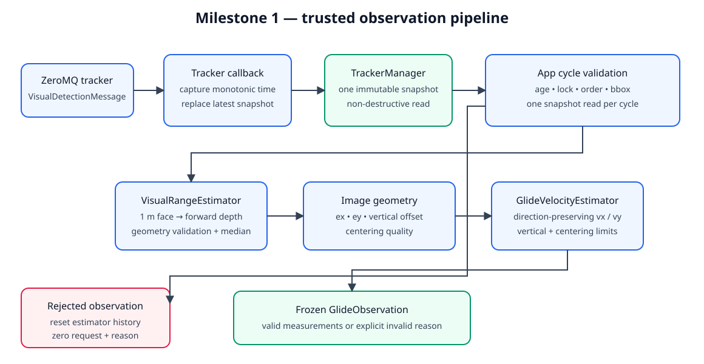
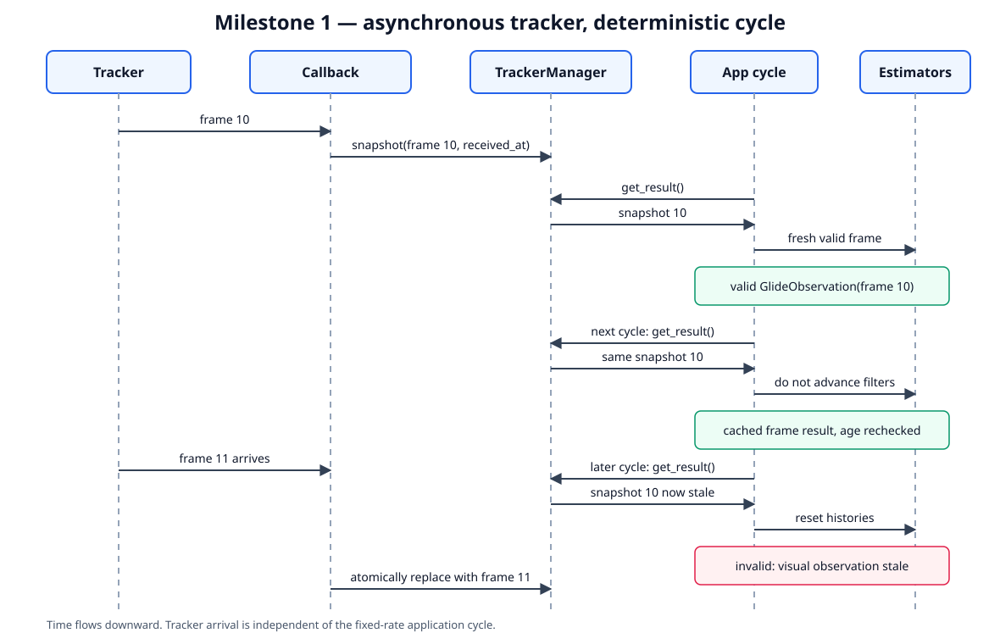

# Milestone 1: trusted observation and glide-vector estimation

## Goal and boundary

Milestone 1 creates a deterministic boundary between asynchronous tracker data
and the future glide controller. Once per application cycle, the pipeline
produces exactly one immutable `GlideObservation`: either a fresh, geometrically
valid request or an invalid value with a specific reason.

This milestone does **not** route the observation into `GlideController`, alter
the active state machine, or change any RC channel. Existing flight behavior
must remain identical.



## Data contracts

### `TrackerSnapshot`

`TrackerManager` retains a single snapshot and replaces it atomically whenever
a callback receives another result.

```text
TrackerSnapshot
  tracker_id: str
  detection: VisualDetectionMessage
  received_at_s: float        # local monotonic clock
```

`get_result()` returns the retained snapshot without removing it. The local
timestamp is captured in the callback path, not when the control loop reads the
snapshot. This makes age meaningful even when the same retained result is read
over many cycles. `VisualDetectionMessage` is already frozen and may be stored
directly.

### `GlideObservation`

The application constructs the controller-facing value without exposing
mutable estimator state.

```text
GlideObservation
  frame_id: int | None
  source_timestamp_ns: int | None
  received_at_s: float | None
  age_s: float | None
  bbox: (x, y, width, height) | None
  ex: float | None
  ey: float | None
  centering_error: float | None
  speed_quality: float
  depth_m: float | None
  vertical_offset_m: float | None
  vx_geometry_m_s: float
  vy_geometry_m_s: float
  achieved_speed_m_s: float
  vertical_limited: bool
  valid: bool
  reason: str | None
```

Invalid observations use `None` for unavailable measurements, zero for quality
and requested velocities, `valid=False`, and a non-empty reason. Consumers must
branch on `valid`; zero velocity is not itself a validity signal.

## Per-cycle flow



1. The ZeroMQ receiver decodes a detection and invokes the tracker callback.
2. The callback captures `time.monotonic()` and atomically replaces the retained
   `TrackerSnapshot`.
3. At the start of a control cycle, `App` reads the snapshot once and uses that
   same value for every calculation in the cycle.
4. `App` checks receipt age and detection trust before calling either estimator.
5. `VisualRangeEstimator` validates bounding-box geometry and produces filtered
   forward depth.
6. `App` calculates normalized image errors and centering quality.
7. `GlideVelocityEstimator` calculates the target-relative velocity vector and
   applies centering and vertical limits.
8. `App` publishes a frozen `GlideObservation` for diagnostics and later
   milestones. It does not send it to the active controller in milestone 1.

## Validation and freshness

Validation order is stable so a frame always reports the same first failure:

1. no snapshot: `no tracker result`
2. negative or non-finite local age: `invalid receipt timestamp`
3. age greater than `tracker_result_timeout_s`: `visual observation stale`
4. detection not found: `target not found`
5. detection not locked: `target not locked`
6. non-positive bounding-box dimensions: `non-positive bounding box`
7. bounding box outside or touching an image edge: `bounding box clipped by image edge`
8. non-finite depth or excessive width/height disagreement: preserve the range estimator reason
9. invalid vector geometry: preserve the glide estimator reason

Frame ID is the primary ordering authority. Only a frame ID newer than the last
accepted frame may update range or velocity filters. When both consecutive
accepted frames provide a source timestamp, that timestamp must also increase.
A duplicate cycle read creates a new frozen observation with refreshed `age_s`
but cached geometry; it does not advance filters. A duplicate transport delivery
is ignored and cannot extend the original receipt time. A lower frame ID or a
non-increasing available source timestamp is invalid and resets filters as
`non-monotonic visual frame`.

A new tracker session clears the retained snapshot, estimator histories, and
ordering gates. It therefore requires a detection received after the new session
starts.

Any invalid observation resets the range and glide estimator history. It must
not reuse depth, image errors, or requested velocity from the previous valid
frame.

## Image and target geometry

The bounding-box center and normalized error are:

```text
u = x + width / 2
v = y + height / 2

ex = (u - cx) / (image_width / 2)
ey = (cy - v) / (image_height / 2)
r  = clamp(hypot(ex, ey), 0, 1)
```

`ex > 0` means the target is right of image center. `ey > 0` means the target is
above image center and therefore requests upward-positive motion.

For the known 1 m square front face, the range estimator calculates forward
camera depth independently from width and height:

```text
depth_width  = fx * target_width / width
depth_height = fy * target_height / height
```

The two results must be finite, positive, and agree within the configured
relative tolerance. Their accepted filtered result is forward depth `d`; it is
not a slant range and drone altitude is not used to recover horizontal distance.

Target vertical displacement in the camera-aligned glide plane is:

```text
pixel_y_up       = cy - v
vertical_offset = pixel_y_up * d / fy
```

Phase one assumes camera axes are aligned with the body glide plane. Camera
extrinsics and attitude compensation are deferred.

## Velocity-vector calculation

Before centering derating, point a vector of magnitude `target_speed` from the
camera toward the observed front-face center:

```text
path_length = hypot(d, vertical_offset)
vx_nominal  = target_speed * d / path_length
vy_nominal  = target_speed * vertical_offset / path_length
```

If `abs(vy_nominal)` exceeds `vy_max`, scale **both** components by
`vy_max / abs(vy_nominal)`. This preserves the approach direction and allows
the achieved vector speed to fall below 15 m/s.

Centering then limits forward speed. With `r_deadband < r_max`:

```text
quality = 1                                      if r <= r_deadband
quality = 0                                      if r >= r_max
quality = (r_max - r) / (r_max - r_deadband)    otherwise

vx_geometry = clamp(vx_nominal * quality, 0, vx_max)
vy_geometry = clamp(vy_nominal, -vy_max, vy_max)
```

The quality ramp is continuous and monotonic. Vertical image correction is not
added here; milestone 2 owns the bounded vertical control correction.

## Mapping to the current code

- Change `TrackerManager` from a retained `(tracker_id, result)` tuple to a
  retained `TrackerSnapshot`, preserving non-destructive `get_result()`.
- Make `_visual_range_handler()` validate the retained snapshot on every cycle,
  reset estimators when invalid, and store the current `GlideObservation`.
- Keep `_load_range_visual_estimator()` as the application-owned construction
  boundary and keep `GlideController` free of visual-estimator dependencies.
- Rewrite `GlideVelocityEstimator` for forward depth and vertical image offset;
  remove the current slant-range/altitude calculation.
- Expose the latest frozen value through the read-only `App.glide_observation`
  property; do not add estimator state to the global flight `Context`.
- Use retained-snapshot receipt age instead of calling nonexistent
  `fresh_observation()` or `is_healthy()` methods on the raw `GST_Bridge`.
- Temporarily reject legacy visual `TRACKING` engagement in `ALT_HOLD` and send
  a GCS warning that it remains disabled until milestone 2. A forced TRACKING
  state uses neutral ALT_HOLD output.

The geometry settings are startup-validated `VehicleConfig` fields with these
defaults: target speed 15 m/s, maximum vertical speed 3 m/s, center deadband
0.05, and maximum center error 0.40.

## Tests and completion criteria

Milestone 1 is complete when automated tests demonstrate:

- the tracker snapshot is retained, returned non-destructively, timestamped at
  receipt, and atomically replaced;
- valid centered 1 m bounding boxes produce expected depth and a forward vector;
- vertical pixel offsets produce correctly signed upward-positive `vy`;
- the vertical limit scales both vector components and preserves direction;
- centering quality is one inside the deadband, continuous in the ramp, and zero
  at or beyond the maximum error;
- duplicate reads do not advance filters, but the retained result still expires;
- missing, stale, unlocked, clipped, inconsistent, duplicate, and non-monotonic
  frames produce the specified invalid observations and clear estimator history;
- the application creates at most one observation from one snapshot per cycle;
- all non-TRACKING RC output and state-machine behavior are unchanged, while
  legacy TRACKING engagement is rejected safely as specified above.

Run the focused milestone tests first:

```bash
cd /home/user/projects/bt_ws/bt_app
pytest -q tests/test_tracker_manager.py tests/test_visual_range.py \
  tests/test_glide_estimator.py tests/test_tracker_request.py
```

Then run the regression gate from the workspace root so tests that use
workspace-relative fixture paths resolve correctly:

```bash
cd /home/user/projects/bt_ws
pytest -q bt_app/tests
```

The full environment must provide the Gazebo Python message package used by
`test_yolo_segmentation_frame.py`; without it, pytest stops during collection
before application tests run. No SITL/Gazebo flight is required because this
milestone does not route the observation into RC output.
