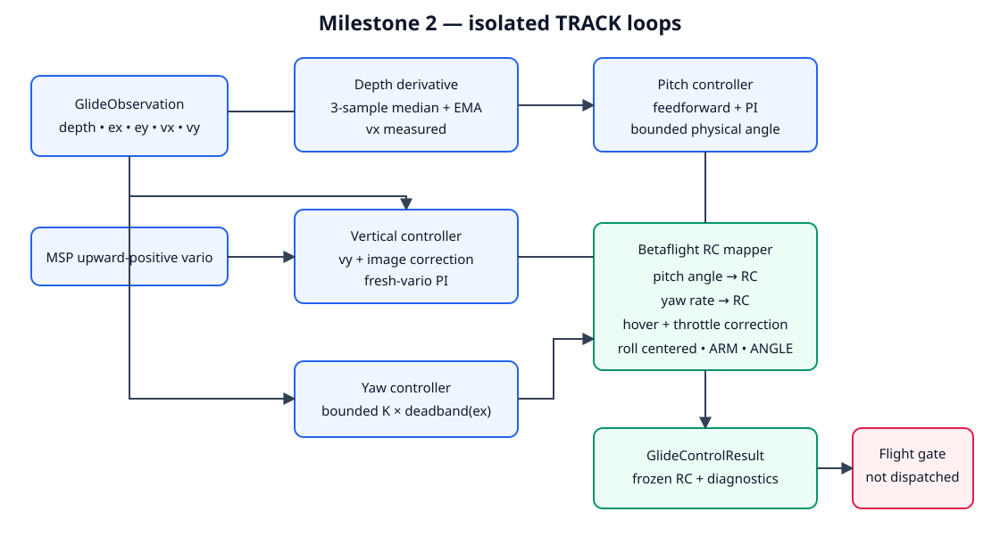
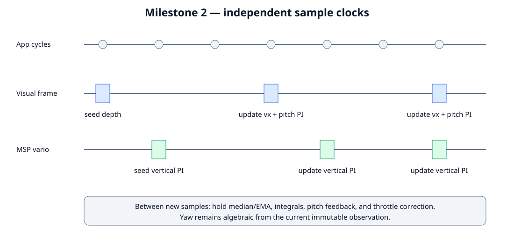

# Milestone 2: isolated TRACK controller

## Goal and safety boundary

Milestone 2 replaces the old landing/descent `GlideController` with the three
TRACK control loops and physical-command-to-RC mapping. The controller is tested
directly but cannot command the drone: `ALT_HOLD → GLIDE` is gated, a joystick
request is rejected with a GCS warning, and forced GLIDE handling returns neutral
ALT_HOLD output. Acquisition, commit, abort, and App routing belong to milestone 3.



## Typed interface

```text
update(GlideObservation,
       vertical_speed_m_s,
       vertical_speed_received_at_s,
       now_s=None) -> GlideControlResult
```

`GlideControlResult` freezes the complete RC command and diagnostics: desired
and measured velocities, pitch feedforward/feedback/final angle, yaw rate,
throttle correction, feedback state, saturation flags, validity, and reason.
`reset()` clears all samples, filters, timestamps, integrals, and held outputs.

## Forward loop

Only a new frame ID updates the loop. Forward speed uses local monotonic receipt
time, deliberately ignoring the optional source clock:

```text
vx_raw = -(depth_new - depth_old) / (received_new - received_old)
vx_median = median(last 3 raw samples)
vx_measured = alpha * vx_median + (1-alpha) * previous
```

The first frame has no derivative and uses feedforward only. Later frames use:

```text
pitch_ff = pitch_at_15_m_s * vx_desired / 15
error_x = vx_desired - vx_measured
pitch_feedback = -(Kp_x * error_x + Ki_x * integral(error_x))
pitch = clamp(pitch_ff + pitch_feedback, -pitch_max, +pitch_max)
```

Conditional integration rejects error that deepens saturation. Duplicate App
cycles hold the measured velocity, integral, and pitch feedback.

## Vertical and yaw loops

```text
vy_desired = clamp(vy_geometry + K_center_y * deadband(ey), -vy_max, +vy_max)
throttle_correction = PI(vy_desired - vario)
yaw_rate = clamp(K_yaw * deadband(ex), -yaw_max, +yaw_max)
```

The vertical PI advances only on increasing vario timestamps. Stale, future,
or non-finite telemetry returns the safe result and resets state. Throttle is
bounded around `HOV_BASELINE`. Yaw is proportional with no visual integrator.



## RC mapping and safe result

`BetaflightRcMapper.angle_to_rc()` maps physical pitch against the configured
Betaflight angle limit; the existing mapper handles yaw rate. Forward physical
pitch is negative and the configured RC sign maps it to the simulator's forward
stick direction. Roll remains centered; ARM and ANGLE remain high.

An invalid observation, invalid depth, non-finite input, or stale vario returns
neutral pitch/yaw and hover-baseline throttle with `valid=False` and a reason.
It also resets both PIs and the depth filter.

## Parameters

The obsolete landing/flare GLIDE parameters are replaced by:

| Parameter | Default | Unit |
| --- | ---: | --- |
| `GLIDE_PITCH_FF` | -20 | degrees at 15 m/s |
| `GLIDE_PITCH_MAX` | 25 | degrees |
| `GLIDE_VX_KP` | 1.0 | degrees per m/s |
| `GLIDE_VX_KI` | 0.1 | degrees per metre |
| `GLIDE_VY_KP` | 10 | RC per m/s |
| `GLIDE_VY_KI` | 0 | RC per metre |
| `GLIDE_VY_OUT` | 100 | RC |
| `GLIDE_YAW_KP` | 15 | deg/s per normalized error |
| `GLIDE_YAW_MAX` | 20 | deg/s |
| `GLIDE_CENTER_KY` | 1.0 | m/s per normalized error |
| `GLIDE_DEPTH_EMA` | 0.35 | ratio |
| `BF_ANGLE_LIMIT` | 60 | degrees |

Milestone-1 `VehicleConfig` continues to own target speed, vertical-speed limit,
and normalized centering thresholds.

## Test procedure and completion gate

Run from the workspace root:

```bash
pytest -q bt_app/tests/test_glide_controller.py \
  bt_app/tests/test_glide_estimator.py \
  bt_app/tests/test_parameters.py \
  bt_app/tests/test_robot_state.py
```

Tests cover receipt-time differentiation, median/EMA filtering, duplicate holds,
feedforward and PI signs, saturation and anti-windup, upward-positive vertical
control, vario timestamp gating, yaw deadband/limits, RC bounds, reset, safe
results, parameter registry, and the GLIDE flight gate. Milestone 2 is complete
when these deterministic tests pass and no App path dispatches its TRACK result.
