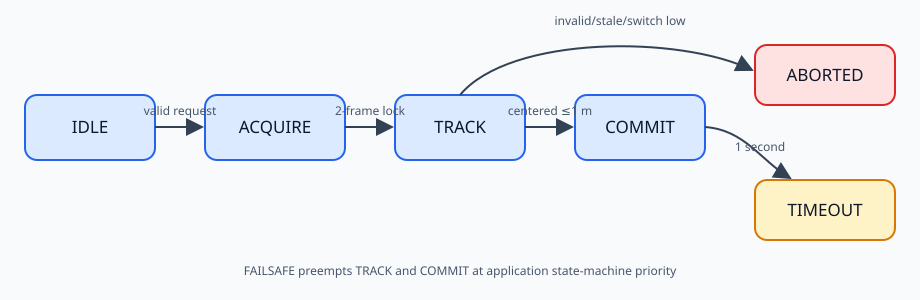
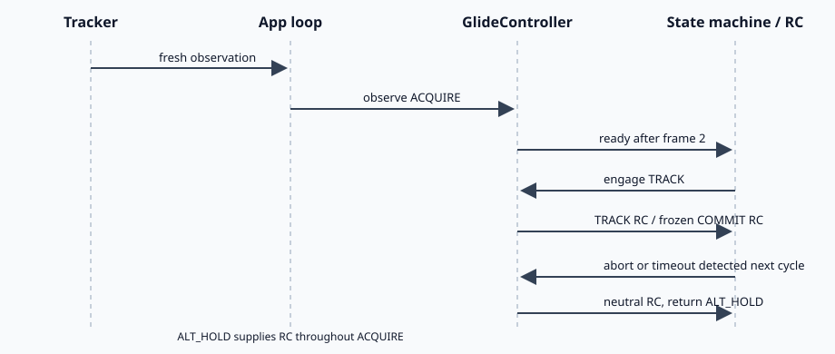

# Glide slant milestone 3 — guarded application integration

## Scope and capability

Milestone 3 connects the milestone 1 observation pipeline and milestone 2
controller to the flight state machine. The first integrated speed is 2 m/s.
It does not add wind, camera distortion, collision sensing, or automated impact
scoring.



The controller owns `IDLE`, `ACQUIRE`, `TRACK`, `COMMIT`, `ABORTED`, and
`COMMIT_TIMEOUT`. The application remains in `ALT_HOLD` during acquisition, so
the hover controller owns RC output until visual lock is proven.

## Entry contract

A rising glide-switch edge is accepted only when all of these are true:

- the vehicle is armed and in `ALT_HOLD`;
- the tracker selector is `TRACKING`;
- a tracker session is active;
- the current glide observation is valid and fresh.

ACQUIRE then requires two distinct consecutive frames whose radial normalized
error is inside `glide_center_error_max`. This wider gate lets TRACK use yaw and
vertical control to center a target that begins away from the image center.
A duplicate frame neither advances nor resets the counter. A new invalid frame
or one outside the maximum centering region resets it. Switch release, tracker
selector change, session loss, or leaving altitude hold aborts acquisition.
Bounding boxes clipped by the literal image edge remain invalid because their
visual range is unreliable.



## TRACK, COMMIT, and exit contract

In TRACK, a visual/range-invalid frame holds the last valid depth and velocity
vector for up to 0.25 seconds. If the detector still supplies a usable bounding
box, its newest image X/Y errors continue driving centering during that hold.
If X/Y are unavailable, the last errors are held too. The controller cannot
enter COMMIT from held data. It marks the attempt `ABORTED` only when the hold
expires; stale vario and non-finite control inputs still abort immediately. On
the next application cycle, the state machine changes `GLIDE` to `ALT_HOLD`.
Failsafe is evaluated first and therefore has priority.

COMMIT begins only when the current TRACK result is valid, both image errors
are inside the deadband, and depth is at most `glide_commit_depth_m`. The whole
RC tuple is frozen. Ordinary switch and tracker changes cannot cancel COMMIT.
After `glide_commit_timeout_s`, the controller emits neutral armed-hover RC,
marks `COMMIT_TIMEOUT`, and the state machine returns to `ALT_HOLD` next cycle.

## Configuration

| Vehicle configuration | Initial value | Purpose |
| --- | ---: | --- |
| `glide_target_speed_m_s` | 2.0 | staged first-flight vector speed |
| `glide_lock_frame_count` | 2 | consecutive valid in-region frames |
| `glide_center_error_max` | 0.40 | maximum radial error accepted by ACQUIRE |
| `glide_commit_depth_m` | 1.0 | visual-control cutoff |
| `glide_commit_timeout_s` | 1.0 | maximum frozen-command interval |
| `glide_diagnostic_rate_hz` | 5.0 | structured phase log rate |

## How to test

Run the focused deterministic tests:

```bash
pytest -q bt_app/tests/test_glide_controller.py bt_app/tests/test_robot_state.py -k glide
```

Then run a no-wind, no-distortion simulation at 2 m/s. Select TRACKING, wait for
a stable fresh red-box detection, release and raise the glide switch, and
verify `acquire -> track -> commit -> commit_timeout -> ALT_HOLD` in logs.
During ACQUIRE, confirm RC still comes from altitude hold. Cover the camera
before COMMIT and verify one neutral GLIDE command followed by ALT_HOLD. Repeat
with a failsafe during TRACK and COMMIT and verify FAILSAFE wins. Do not raise
the speed until video and logs show the box remains centered and no pitch,
yaw, or throttle channel saturates unexpectedly.
