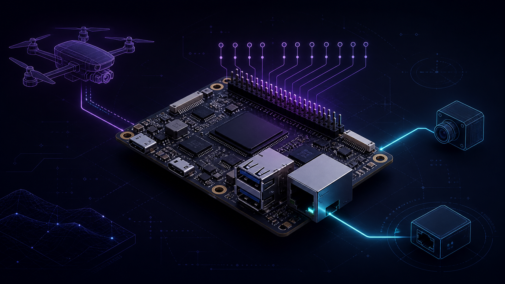

---
hide:
  - navigation
  - toc
---

# BT Drone Documentation

<div class="hero-copy" markdown>

Build notes, flight hardware, autonomy software, simulation, computer vision,
video pipelines, and field-test procedures for the BT drone platform.

</div>

<div class="grid cards section-grid" markdown>

-   [](application/index.md)

    **Application**

    Runtime services, control logic, state machines, and telemetry.

-   [](deploy/index.md)

    **Deployment**

    Install, configure, launch, and operate the complete system.

-   [](fc/index.md)

    **Flight Controller**

    FC wiring, receiver integration, firmware, and reference manuals.

-   [](joystick/index.md)

    **Joystick**

    Radio mapping, switches, arming, and manual flight controls.

-   [](radxa/index.md)

    **Radxa**

    Companion-computer pinout, power, serial links, and setup.

-   [](simulation/index.md)

    **Simulation**

    Gazebo, SITL, simulated sensors, and repeatable scenarios.

-   [](test_field/index.md)

    **Field Tests**

    Test procedures, video-link trials, recording, and evidence.

-   [](trackers/index.md)

    **Trackers**

    Detection, optical flow, target metadata, and visual control.

-   [](video/index.md)

    **Video**

    GStreamer capture, overlays, encoding, transport, and display.

</div>

!!! tip "Start here"
    Begin with **Simulation** when validating software changes. Use the hardware
    and field-test sections only after the behavior is repeatable in SITL.

## Preview the site locally

```bash
python3 -m venv venv
venv/bin/python -m pip install -r requirements-docs.txt
venv/bin/mkdocs serve
```

Open `http://127.0.0.1:8000`. Build the static site with
`venv/bin/mkdocs build --strict`; output is written to `bt_docs_site/`.
