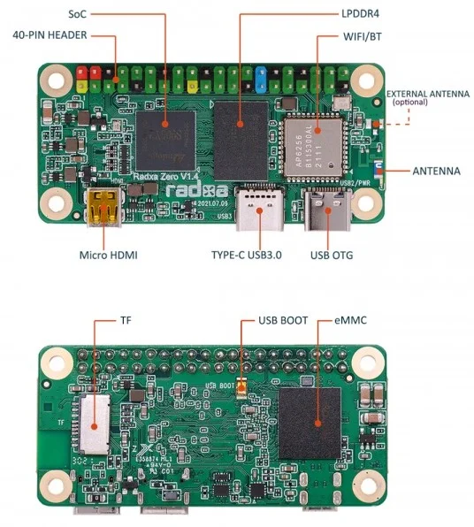
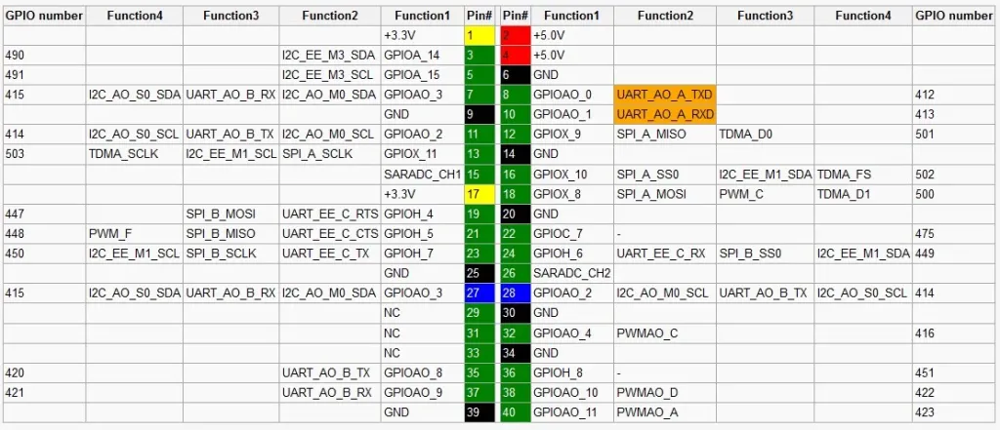

# Radxa

[Radxa Zero | GPIO Pinout | Specs](https://iotbyhvm.ooo/radxa-zero-gpio-pinout-specs/)

## Pinout 

## Power
[source doc](https://docs.radxa.com/en/zero/zero3/hardware-design/hardware-interface#gpio-voltage)
[describe gpio power connection](https://docs.radxa.com/en/rock5/rock5b/hardware-design/power_board_from_40pin?utm_source=chatgpt.com)

## Wiring

### Power

| pin | dest pin | note  |
| --- | -------- | ----- |
| 5v  | 5v       | 2,4   |
| gnd | GND      | 34,29 |

### radxa

## Wiring

| pin    | dest pin | note |
| ------ | -------- | ---- |
| rx(10) | T4       |      |
| tx (8) | R4       |      |
| GND    | GND      |      |