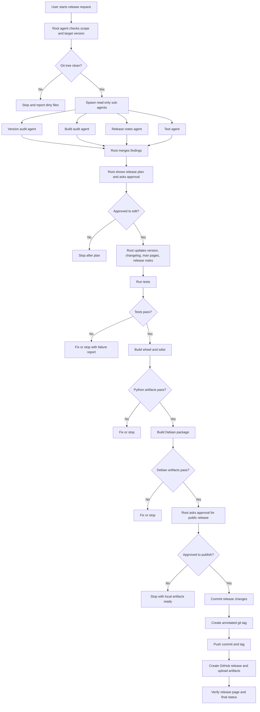

# bt_joy Release Workflow

This document describes a multi-agent release workflow for `bt_joy`. The goal is to make releases repeatable while keeping one root agent in control of all git, GitHub, and artifact publishing actions.

## Main idea

Use sub-agents for parallel inspection and drafting. Use the root agent for decisions and every destructive or public action.

The root agent is the only agent allowed to:
- edit release files
- create commits
- create tags
- push to git
- create a GitHub release
- upload release artifacts

Sub-agents can inspect, build, test, and report. They should not mutate git state unless the root agent gives them a narrow file ownership scope.

## Agent split

| Agent | Role | Work | Suggested model | Writes |
| --- | --- | --- | --- | --- |
| Root release agent | Coordinator | Owns plan, approvals, final edits, commit, tag, push, GitHub release | GPT-5.5 or current best coding model | Yes |
| Version audit agent | Inspector | Find every version/date reference and report needed updates | GPT-5.4-Mini or inherited default | No |
| Build audit agent | Inspector/verifier | Check wheel and Debian build commands, dependencies, artifact paths | gpt-5.4 or inherited default | No |
| Test agent | Verifier | Run focused and full test commands, report failures | gpt-5.4 or inherited default | No |
| Release notes agent | Writer | Draft release notes from git history and changelog | GPT-5.4-Mini or inherited default | No |
| Packaging agent | Worker, optional | If needed, patch Debian packaging files only | gpt-5.3-codex or inherited default | Limited |

## Can I control the model?

Yes. When asking the root agent to spawn sub-agents, you can request a specific model for each agent. If you do not specify a model, sub-agents inherit the root agent model by default.

Prefer this default unless there is a clear reason to override it:
- use the strongest available model for the root agent
- use smaller/faster models for read-only scans and release-note drafts
- use coding-focused models for packaging patches or release script implementation

Example prompt:

```text
Act as the root release agent for bt_joy version 0.0.7.
Use sub-agents.
Use the default inherited model for all agents unless a task needs code edits.
Do not commit, tag, push, or create a GitHub release until I approve.
First show me the release plan and blockers.
```

Example prompt with explicit model control:

```text
Act as the root release agent for bt_joy version 0.0.7.
Use GPT-5.5 for the root agent.
Use GPT-5.4-Mini for version audit and release notes.
Use gpt-5.4 for build verification.
Use gpt-5.3-codex only if a packaging patch is needed.
Do not push or create a GitHub release until I approve.
```

## Release flow drawing



## Release stages

### 1. Preflight

The root agent checks:

```bash
cd /home/user/projects/bt_ws
git status --short --branch
git remote -v
git tag --list --sort=-version:refname
gh auth status
```

Stop if:
- the worktree has unrelated uncommitted changes
- `gh` is not authenticated
- the target version is invalid
- the current branch is not the intended release branch
- the tag already exists locally or remotely

### 2. Version audit

The version audit agent checks release touchpoints:

```text
bt_joy/pyproject.toml
bt_joy/debian/changelog
bt_joy/CHANGELOG.md
bt_joy/docs/man/*.1
bt_joy/docs/man/*.5
bt_joy/docs/man/*.8
bt_joy/README.md
```

Known current version source:

```text
bt_joy/pyproject.toml
```

`bt_joy/bt_joy/__init__.py` reads the installed package metadata, so it should not normally need a hardcoded version edit.

### 3. Release notes

The release notes agent gathers:

```bash
git log --oneline --decorate --no-merges <previous-tag>..HEAD
git diff --stat <previous-tag>..HEAD
```

If there is no previous tag, use `CHANGELOG.md` and recent commits as the source of truth.

The root agent reviews and edits the final release notes before publishing.

### 4. Tests

Run from the `bt_joy` package directory:

```bash
cd /home/user/projects/bt_ws/bt_joy
python3 -m pytest tests
```

The test agent reports:
- command run
- pass/fail status
- failing test names
- short failure summary

### 5. Python package build

Build artifacts:

```bash
cd /home/user/projects/bt_ws/bt_joy
rm -rf dist
python3 -m build
ls -lh dist
```

Expected artifacts:

```text
dist/bt_joy-<version>.tar.gz
dist/bt_joy-<version>-py3-none-any.whl
```

### 6. Debian package build

Build from the package root:

```bash
cd /home/user/projects/bt_ws/bt_joy
dpkg-buildpackage -us -uc
```

Expected artifacts are written beside the package directory:

```text
/home/user/projects/bt_ws/bt-joy_<version>_*.deb
/home/user/projects/bt_ws/bt-joy_<version>_*.buildinfo
/home/user/projects/bt_ws/bt-joy_<version>_*.changes
```

### 7. Final gate before publishing

Before commit, tag, push, or GitHub release:

```bash
git status --short
python3 -m pytest tests
ls -lh bt_joy/dist
ls -lh bt-joy_*.deb
```

The root agent should show:
- exact changed files
- exact tag name
- exact push commands
- exact GitHub release command
- artifact list

### 8. Commit, tag, push, release

Only after explicit approval:

```bash
git add bt_joy/pyproject.toml bt_joy/debian/changelog bt_joy/CHANGELOG.md bt_joy/docs/man
git commit -m "Release bt-joy <version>"
git tag -a "v<version>" -m "Release bt-joy <version>"
git push origin HEAD
git push origin "v<version>"
```

Create the GitHub release:

```bash
gh release create "v<version>" \
  bt_joy/dist/* \
  bt-joy_<version>_*.deb \
  --title "bt-joy <version>" \
  --notes-file RELEASE_NOTES.md
```

## Approval gates

Use three explicit gates:

1. Plan approval
   - approve version target and files to edit

2. Publish approval
   - approve commit, tag, push, and GitHub release

3. Recovery approval
   - approve cleanup if a tag, push, or release partially succeeds

The root agent should never assume approval for public release steps.

## Suggested root prompt

```text
Act as the root release agent for bt_joy.
Target version: 0.0.7.
Use multi-agent analysis.

Spawn:
- a version audit agent
- a build audit agent
- a release notes agent
- a test verification agent

Use inherited models by default.
Use a coding-focused model only if a packaging patch is needed.

Rules:
- Do not commit without approval.
- Do not create tags without approval.
- Do not push without approval.
- Do not create GitHub releases without approval.
- Stop if the git tree has unrelated uncommitted changes.

First output:
1. current repo state
2. version touchpoints
3. planned file edits
4. build/test commands
5. release artifacts
6. risks and blockers
7. approval questions
```

## Recovery notes

If commit succeeds but tag fails:

```bash
git status --short --branch
git tag --list "v<version>"
```

If local tag exists but push fails:

```bash
git tag -d "v<version>"
```

If remote tag exists but GitHub release fails, do not delete it automatically. Inspect first:

```bash
git ls-remote --tags origin "v<version>"
gh release view "v<version>"
```

If GitHub release exists with bad artifacts:

```bash
gh release view "v<version>"
gh release delete "v<version>"
```

Only run destructive recovery commands after explicit approval.
