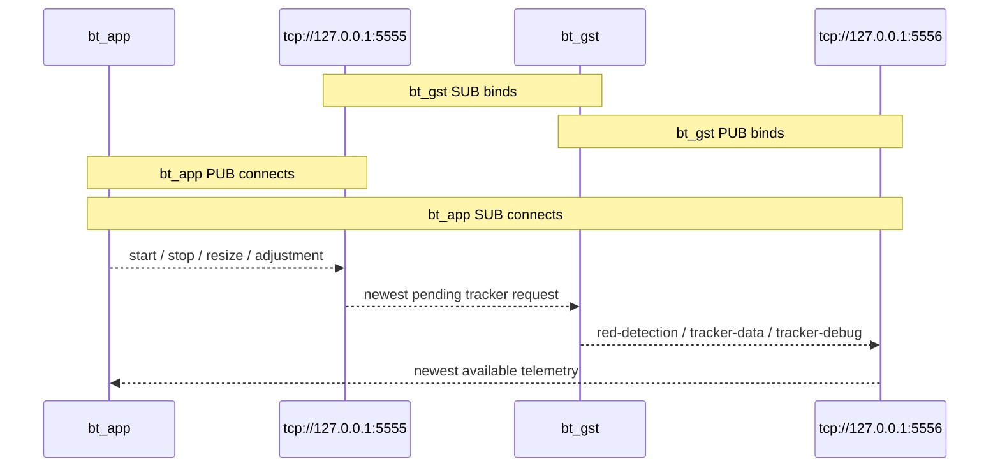

# `bt_app` and `bt_gst` ZMQ interface

This document defines the ZeroMQ interface between `bt_app` and `bt_gst`.
The transport is intended for local, real-time control and telemetry. It is
lossy by design: current state is more important than delivery of every frame.

## Architecture



`bt_app` owns a lifecycle-managed request publisher and continuously receives
`red-detection` messages. Tracker commands are accepted while the joystick is
in its pre-tracking session; tracker results are not granted flight-control
authority until the enabler is toggled in TRACKING from ALT_HOLD.

## Transport contract

| Channel | Endpoint | `bt_gst` | `bt_app` | Purpose |
|---|---|---|---|---|
| Tracker requests | `tcp://127.0.0.1:5555` | SUB, binds | PUB, connects | Send tracker commands to `bt_gst` |
| Telemetry | `tcp://127.0.0.1:5556` | PUB, binds | SUB, connects | Send detections and tracker results to `bt_app` |

Every message is exactly one ZMQ frame containing one MessagePack map. The
`type` map field identifies the logical message type. There is no separate ZMQ
topic frame, so consumers must subscribe with `SUBSCRIBE=b""` and filter the
decoded `type` value.

PUB/SUB does not acknowledge or retry messages. Messages sent before a
subscriber finishes connecting can be lost. The telemetry publisher uses a
small high-water mark and non-blocking sends so a slow controller cannot stall
the video pipeline.

## Requests from `bt_app` to `bt_gst`

### Start tracking

```json
{"type": "start", "x": 320, "y": 240}
```

`x` and `y` are the initial target point in image pixels.

### Stop tracking

```json
{"type": "stop"}
```

### Resize the tracker area

```json
{"type": "resize", "width": 120, "height": 80}
```

### Adjust the target position

```json
{"type": "adjustment", "delta_x": -5, "delta_y": 3}
```

When several requests are waiting, `bt_gst` drains the socket and applies all
valid requests in receive order. This preserves sequences such as `start`
followed by `adjustment` or `resize`.

## Telemetry from `bt_gst` to `bt_app`

### Red detection

```json
{
  "type": "red-detection",
  "frame_id": 42,
  "timestamp_ns": 1366666653,
  "found": true,
  "x": 210,
  "y": 130,
  "width": 80,
  "height": 60,
  "locked": true,
  "lock_found_frames": 10,
  "lock_missing_frames": 0
}
```

| Field | Type | Meaning |
|---|---|---|
| `frame_id` | integer | Counter assigned by `bt_gst` |
| `timestamp_ns` | integer or null | GStreamer buffer presentation timestamp |
| `found` | boolean | Whether the detector found a target in this frame |
| `x`, `y` | integer | Top-left bounding-box position in pixels |
| `width`, `height` | integer | Bounding-box size in pixels |
| `locked` | boolean | Detector session has acquired the target |
| `lock_found_frames` | integer | Consecutive found frames, capped at 10 |
| `lock_missing_frames` | integer | Consecutive missing frames, capped at 5 |

When `found` is false, the box fields are zero. `bt_app` uses this message to
calculate normalized target error:

```text
error_x = (box_center_x - image_width / 2) / (image_width / 2)
error_y = (image_height / 2 - box_center_y) / (image_height / 2)
```

Both errors are clamped to `[-1, 1]`. Positive X means the target is to the
right; positive Y means the target is above the image center.

The lock becomes true after 10 consecutive found frames and false after five
consecutive missing frames. A `start` request resets and activates acquisition;
a `stop` request clears it. Consumers decoding an older message without lock
fields treat it as unlocked.

In TRACKING, `bt_app` uses horizontal error for bounded yaw, commands a fixed
forward pitch, and leaves throttle under the ALT_HOLD controller.

### Tracker data

```json
{
  "type": "tracker-data",
  "frame_id": 42,
  "timestamp": 1.366,
  "dx": -4,
  "dy": 2,
  "score": 0.91,
  "status": 1
}
```

### Tracker debug

```json
{
  "type": "tracker-debug",
  "frame_number": 42,
  "status": 1,
  "active_feature_count": 18,
  "features_json": "[]"
}
```

## Configuration

`bt_gst` owns and binds the telemetry socket:

```yaml
zmq:
  enabled: true
  telemetry_endpoint: tcp://127.0.0.1:5556
  bind: true
```

`bt_app` connects its diagnostic observer to the same endpoint:

```yaml
visual_observer_enabled: true
visual_zmq_endpoint: tcp://127.0.0.1:5556
visual_image_width: 640
visual_image_height: 480
visual_print_rate_hz: 2.0
```

The configured image dimensions must match the image coordinates produced by
the detector.

## Minimal MessagePack examples

Receive `bt_gst` telemetry:

```python
import msgpack
import zmq

context = zmq.Context()
subscriber = context.socket(zmq.SUB)
subscriber.setsockopt(zmq.SUBSCRIBE, b"")
subscriber.connect("tcp://127.0.0.1:5556")

while True:
    message = msgpack.unpackb(subscriber.recv(), raw=False)
    if message.get("type") == "red-detection":
        print(message)
```

Send a tracker request:

```python
import time

import msgpack
import zmq

context = zmq.Context()
publisher = context.socket(zmq.PUB)
publisher.connect("tcp://127.0.0.1:5555")
time.sleep(0.2)  # Allow the PUB/SUB connection to become ready.
publisher.send(msgpack.packb({"type": "start", "x": 320, "y": 240}))
```

## Operational rules

- Start `bt_gst` before relying on telemetry in `bt_app`.
- Treat telemetry as snapshots; do not assume consecutive `frame_id` values.
- Clear target state after a `found=false` message or a telemetry timeout.
- Keep video processing independent of subscriber speed.
- Keep TCP endpoints on loopback unless authentication and network access
  controls are added; raw ZMQ TCP in this interface is not authenticated.

The protocol dataclasses and codec are implemented in
`bt_gst/bt_gst/bridge/zmq_models.py`. Socket ownership and high-water-mark
behavior are implemented in `bt_gst/bt_gst/bridge/zmq_io.py`. The current
`bt_app` consumer is implemented in
`bt_app/bt_app/control/visual_controller.py`.
