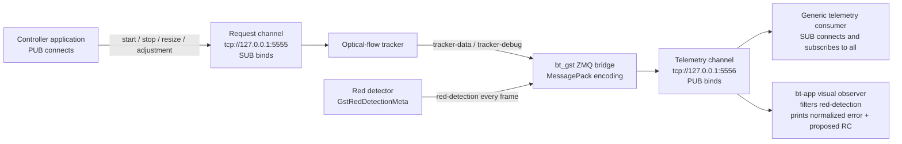

# ZMQ bridge

`bt_gst` uses two ZeroMQ PUB/SUB channels. Messages are single-frame
MessagePack maps. The `type` field is the logical topic; it is not a separate
multipart ZMQ subscription frame.



The `bt-app` visual observer is diagnostic only. It converts the bounding-box
center into horizontal and vertical errors in `[-1, 1]`, runs the visual
controller, and logs the proposed RC channels. It never sends those channels
to the flight controller.

## Channels

| Direction | Endpoint | `bt_gst` socket | Peer socket | Behavior |
|---|---|---|---|---|
| Commands into tracker | `tcp://127.0.0.1:5555` | SUB binds | PUB connects | Drains pending commands and applies the newest valid request |
| Telemetry out | `tcp://127.0.0.1:5556` | PUB binds | SUB connects | Non-blocking, high-water mark 1; drops instead of blocking video |

## Logical topics and messages

| `type` | Direction | Fields |
|---|---|---|
| `start` | request | `x`, `y` |
| `stop` | request | none |
| `resize` | request | `width`, `height` |
| `adjustment` | request | `delta_x`, `delta_y` |
| `tracker-data` | telemetry | `frame_id`, `timestamp`, `dx`, `dy`, `score`, `status` |
| `tracker-debug` | telemetry | `frame_number`, `status`, `active_feature_count`, `features_json` |
| `red-detection` | telemetry | `frame_id`, `timestamp_ns`, `found`, `x`, `y`, `width`, `height` |

Example detection:

```json
{
  "type": "red-detection",
  "frame_id": 42,
  "timestamp_ns": 1366666653,
  "found": true,
  "x": 210,
  "y": 130,
  "width": 80,
  "height": 60
}
```

A not-found frame is also published so consumers can clear stale boxes:

```json
{
  "type": "red-detection",
  "frame_id": 43,
  "timestamp_ns": 1399999986,
  "found": false,
  "x": 0,
  "y": 0,
  "width": 0,
  "height": 0
}
```

## Receiving telemetry

```python
import zmq

from bt_gst.bridge.zmq_models import decode_telemetry_message

context = zmq.Context()
subscriber = context.socket(zmq.SUB)
subscriber.setsockopt(zmq.SUBSCRIBE, b"")
subscriber.connect("tcp://127.0.0.1:5556")

while True:
    message = decode_telemetry_message(subscriber.recv())
    print(message)
```

## Sending tracker requests

```python
import time
import zmq

from bt_gst.bridge.zmq_models import TrackStartRequest, encode_message

context = zmq.Context()
publisher = context.socket(zmq.PUB)
publisher.connect("tcp://127.0.0.1:5555")
time.sleep(0.2)  # Allow the PUB/SUB subscription handshake.
publisher.send(encode_message(TrackStartRequest(x=320, y=240)))
```
