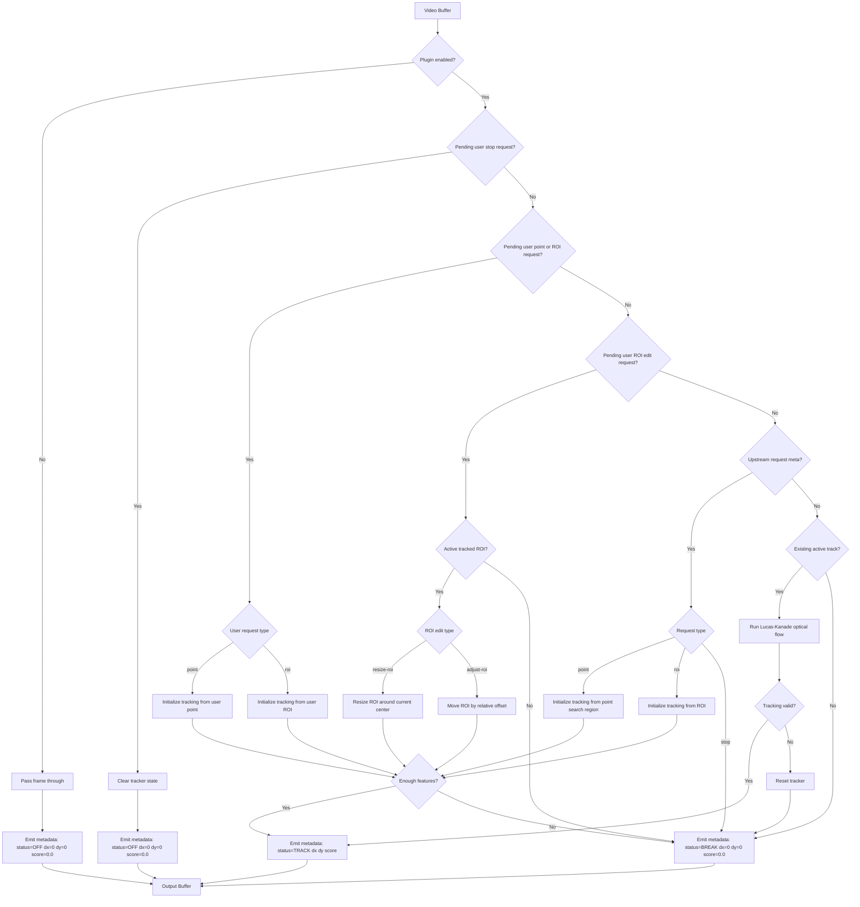

# Optical Flow Tracker Plugin Requirement

## Summary
Create a GStreamer Python plugin named `bt_optical_flow` that tracks image
motion with optical flow and writes tracker metadata to each output buffer.

This document is the source of truth for the plugin interface. The exposed
properties and metadata fields should stay stable because they will be used to
generate the plugin interface later.

## Element
- Element name: `bt_optical_flow`
- Plugin file: `plugins/python/gstbt_optical_flow.py`
- Helper module: `bt_gst/optical_flow_tracker.py`
- Mode: in-place `GstBase.BaseTransform`
- Input caps: `video/x-raw`
- Output caps: `video/x-raw`

## Pipeline Usage
```text
filesrc location="..." ! decodebin ! videoconvert ! bt_optical_flow ! tee name=metadata_tee
metadata_tee. ! queue ! gtksink name=video_sink
metadata_tee. ! queue leaky=downstream max-size-buffers=1 ! appsink name=metadata_sink emit-signals=false sync=false max-buffers=1 drop=true
```

## Metadata Contract
- Meta name: `bt-tracker-meta`

| Field | Type | Meaning |
|---|---|---|
| `dx` | int | Horizontal pixel offset from frame center. |
| `dy` | int | Vertical pixel offset from frame center. |
| `score` | float | Tracker confidence from `0.0` to `1.0`. |
| `status` | int | Tracker state. |

Status values:

```python
STATUS_OFF = 0
STATUS_TRACK = 1
STATUS_BREAK = 2
```

- `STATUS_OFF`: tracker disabled or inactive.
- `STATUS_TRACK`: tracker has a valid target/flow result.
- `STATUS_BREAK`: tracker lost tracking or must reset/reacquire.

## Debug Bus Message Contract
When `debug=true`, `bt_optical_flow` posts one GStreamer element bus message per
processed frame. Debug messages are for development and inspection only; they do
not replace the stable `bt-tracker-meta` output metadata.

- Message name: `bt-tracker-debug`

```text
bt-tracker-debug:
  frame-number=<monotonic_frame_number>
  status=<STATUS_OFF|STATUS_TRACK|STATUS_BREAK>
  active-feature-count=<number_of_active_features>
  features-json=<JSON array of {"x": float, "y": float}>
```

Debug behavior:
- draw feature, green inside the bouding box red outside
- Messages are posted with `Gst.Message.new_element(...)` using a
  `Gst.Structure` named `bt-tracker-debug`.
- In `STATUS_TRACK`, `features-json` contains all currently active tracked
  feature locations in video-frame coordinates after processing the current
  frame.
- In `STATUS_OFF` or `STATUS_BREAK`, `active-feature-count=0` and
  `features-json=[]`.
- The application bus loop should include `Gst.MessageType.ELEMENT`, detect
  `bt-tracker-debug`, and print:

```text
bt-tracker-debug frame=<n> status=<s> active-feature-count=<n> features=<json>
```

## Track Request
A track request tells `bt_optical_flow` where to initialize or reinitialize
tracking. The plugin accepts requests from user interaction and from upstream
detector plugins. Both request sources are normalized into frame-coordinate
point or ROI requests.

Request types:
- `point`: track around a clicked or declared point.
- `roi`: track features inside a rectangular region of interest.
- `stop`: stop tracking and clear current tracker state.
- `resize-roi`: resize the current active tracking ROI while tracking.
- `adjust-roi`: move the current active tracking ROI by a relative offset while
  tracking.

| Field | Type | Required | Meaning |
|---|---|---:|---|
| `request-id` | int | no | Monotonic request id for debugging and stale request detection. |
| `source` | string | yes | Request source, such as `user`, `detector`, or `upstream-plugin`. |
| `type` | string | yes | `point`, `roi`, `stop`, `resize-roi`, or `adjust-roi`. |
| `x` | int | only for point/ROI | Point x, or ROI left x. |
| `y` | int | only for point/ROI | Point y, or ROI top y. |
| `width` | int | only for ROI/resize-ROI | ROI width. |
| `height` | int | only for ROI/resize-ROI | ROI height. |
| `delta-x` | int | only for adjust-ROI | Horizontal offset relative to the current tracked ROI. |
| `delta-y` | int | only for adjust-ROI | Vertical offset relative to the current tracked ROI. |

For `stop`, only `source`, `type`, and optional `request-id` are required.
For `resize-roi`, `width` and `height` are required. For `adjust-roi`,
`delta-x` and `delta-y` are required.

Request constants:

```python
TRACK_REQUEST_NAME = "bt-track-request"

TRACK_REQUEST_TYPE_POINT = "point"
TRACK_REQUEST_TYPE_ROI = "roi"
TRACK_REQUEST_TYPE_STOP = "stop"
TRACK_REQUEST_TYPE_RESIZE_ROI = "resize-roi"
TRACK_REQUEST_TYPE_ADJUST_ROI = "adjust-roi"

TRACK_REQUEST_SOURCE_USER = "user"
TRACK_REQUEST_SOURCE_UPSTREAM_PLUGIN = "upstream-plugin"
```

### User Request
- GTK click handler receives local video-widget coordinates.
- App converts widget coordinates to frame coordinates.
- App sends a custom downstream event to `bt_optical_flow`:

```text
bt-track-request:
  source=user
  type=point
  x=<frame_x>
  y=<frame_y>
```

- Plugin stores this as a pending request and applies it on the next video
  buffer.

Default application mapping:
- Left click on the video widget: send a `point` request.
- Right click on the video widget, or keyboard `Esc`: send a `stop` request.
- Drag or resize UI controls around the active ROI: send `adjust-roi` or
  `resize-roi` requests.
- Keyboard arrows may send `adjust-roi` requests using `roi-adjust-step-px`.
- Keyboard `+` and `-` may send `resize-roi` requests using
  `roi-resize-step-px`.

User stop request:

```text
bt-track-request:
  source=user
  type=stop
```

When the plugin receives a user stop request, it clears pending requests, clears
previous frame/features, emits `dx=0`, `dy=0`, `score=0.0`,
`status=STATUS_OFF`, and remains enabled for a future `point` or `roi` request.

User resize ROI request:

```text
bt-track-request:
  source=user
  type=resize-roi
  width=<new_width>
  height=<new_height>
```

The request is valid only while the tracker has an active `STATUS_TRACK` ROI.
The plugin keeps the current tracked ROI center, applies the new size, clamps
the ROI to frame bounds, reacquires features inside the resized ROI, and emits
`STATUS_TRACK` if enough features are found. If there is no active track or too
few features are found, the plugin emits `STATUS_BREAK`.

User adjust ROI request:

```text
bt-track-request:
  source=user
  type=adjust-roi
  delta-x=<offset_x>
  delta-y=<offset_y>
```

The request is valid only while the tracker has an active `STATUS_TRACK` ROI.
The plugin moves the current tracked ROI by the relative offset, preserves the
current ROI size, clamps the ROI to frame bounds, reacquires features inside the
adjusted ROI, and emits `STATUS_TRACK` if enough features are found. If there is
no active track or too few features are found, the plugin emits `STATUS_BREAK`.

### Upstream Plugin Request
- A detector or other upstream plugin can declare a point or ROI.
- It attaches a `bt-track-request` custom metadata structure to the buffer.
- `bt_optical_flow` checks each input buffer for this request metadata.
- If present, it initializes or reinitializes tracking from that point or ROI.

### Request Priority
1. Latest user `stop` request.
2. Latest user `point` or `roi` request.
3. Latest user `resize-roi` or `adjust-roi` request.
4. Track request metadata from upstream plugin.
5. Existing active optical-flow track.
6. No request and no active track: emit `STATUS_BREAK`.

User stop has the highest priority because it must immediately override active
tracking and upstream detections on the same buffer.

<details>
<summary>Exposed Properties</summary>

| Group | Property | Constant | Type | Default | Description |
|---|---|---|---|---:|---|
| General | `enabled` | `PROP_ENABLED` | bool | `true` | Enable or disable optical-flow tracking. |
| Debug | `debug` | `PROP_DEBUG` | bool | `false` | Enable per-frame tracker debug bus messages. |
| Feature Detection | `max-corners` | `PROP_MAX_CORNERS` | int | `80` | Maximum features to detect and track. |
| Feature Detection | `quality-level` | `PROP_QUALITY_LEVEL` | double | `0.01` | Minimum accepted feature quality. |
| Feature Detection | `min-distance-px` | `PROP_MIN_DISTANCE_PX` | double | `10.0` | Minimum distance between detected features. |
| Feature Detection | `min-features` | `PROP_MIN_FEATURES` | int | `8` | Minimum valid tracked features before tracker is considered lost. |
| Feature Detection | `block-size` | `PROP_BLOCK_SIZE` | int | `7` | Neighborhood size used by feature detection. |
| Lucas-Kanade | `lk-window-size` | `PROP_LK_WINDOW_SIZE` | int | `21` | Optical-flow search window size. |
| Lucas-Kanade | `lk-max-level` | `PROP_LK_MAX_LEVEL` | int | `3` | Maximum pyramid level for LK optical flow. |
| Lucas-Kanade | `lk-criteria-count` | `PROP_LK_CRITERIA_COUNT` | int | `30` | Maximum LK solver iterations. |
| Lucas-Kanade | `lk-criteria-eps` | `PROP_LK_CRITERIA_EPS` | double | `0.01` | LK solver convergence epsilon. |
| Metadata | `status` | `STATUS_OFF`, `STATUS_TRACK`, `STATUS_BREAK` | int | `0` | Tracker state value written to metadata. |
| Track Request | `request-search-size` | `PROP_REQUEST_SEARCH_SIZE` | int | `80` | Square search size around a point request. |
| Track Request | `roi-adjust-step-px` | `PROP_ROI_ADJUST_STEP_PX` | int | `10` | Default relative pixel step for user ROI adjustment controls. |
| Track Request | `roi-resize-step-px` | `PROP_ROI_RESIZE_STEP_PX` | int | `10` | Default pixel step for user ROI resize controls. |
| Track Request | `accept-upstream-request` | `PROP_ACCEPT_UPSTREAM_REQUEST` | bool | `true` | Allow upstream plugin request metadata. |
| Track Request | `accept-user-request` | `PROP_ACCEPT_USER_REQUEST` | bool | `true` | Allow user click/event requests. |

</details>

## Constants
The helper module must expose constants for every plugin property and default
value.

```python
PROP_ENABLED = "enabled"
PROP_DEBUG = "debug"
PROP_MAX_CORNERS = "max-corners"
PROP_QUALITY_LEVEL = "quality-level"
PROP_MIN_DISTANCE_PX = "min-distance-px"
PROP_MIN_FEATURES = "min-features"
PROP_BLOCK_SIZE = "block-size"
PROP_LK_WINDOW_SIZE = "lk-window-size"
PROP_LK_MAX_LEVEL = "lk-max-level"
PROP_LK_CRITERIA_COUNT = "lk-criteria-count"
PROP_LK_CRITERIA_EPS = "lk-criteria-eps"
PROP_REQUEST_SEARCH_SIZE = "request-search-size"
PROP_ROI_ADJUST_STEP_PX = "roi-adjust-step-px"
PROP_ROI_RESIZE_STEP_PX = "roi-resize-step-px"
PROP_ACCEPT_UPSTREAM_REQUEST = "accept-upstream-request"
PROP_ACCEPT_USER_REQUEST = "accept-user-request"

DEFAULT_ENABLED = True
DEFAULT_DEBUG = False
DEFAULT_MAX_CORNERS = 80
DEFAULT_QUALITY_LEVEL = 0.01
DEFAULT_MIN_DISTANCE_PX = 10.0
DEFAULT_MIN_FEATURES = 8
DEFAULT_BLOCK_SIZE = 7
DEFAULT_LK_WINDOW_SIZE = 21
DEFAULT_LK_MAX_LEVEL = 3
DEFAULT_LK_CRITERIA_COUNT = 30
DEFAULT_LK_CRITERIA_EPS = 0.01
DEFAULT_REQUEST_SEARCH_SIZE = 80
DEFAULT_ROI_ADJUST_STEP_PX = 10
DEFAULT_ROI_RESIZE_STEP_PX = 10
DEFAULT_ACCEPT_UPSTREAM_REQUEST = True
DEFAULT_ACCEPT_USER_REQUEST = True

STATUS_OFF = 0
STATUS_TRACK = 1
STATUS_BREAK = 2

TRACK_REQUEST_NAME = "bt-track-request"
TRACK_REQUEST_TYPE_POINT = "point"
TRACK_REQUEST_TYPE_ROI = "roi"
TRACK_REQUEST_TYPE_STOP = "stop"
TRACK_REQUEST_TYPE_RESIZE_ROI = "resize-roi"
TRACK_REQUEST_TYPE_ADJUST_ROI = "adjust-roi"
TRACK_REQUEST_SOURCE_USER = "user"
TRACK_REQUEST_SOURCE_UPSTREAM_PLUGIN = "upstream-plugin"

TRACKER_DEBUG_MESSAGE_NAME = "bt-tracker-debug"
TRACKER_DEBUG_FIELD_FRAME_NUMBER = "frame-number"
TRACKER_DEBUG_FIELD_STATUS = "status"
TRACKER_DEBUG_FIELD_ACTIVE_FEATURE_COUNT = "active-feature-count"
TRACKER_DEBUG_FIELD_FEATURES_JSON = "features-json"
```

## Tracker Behavior
- First valid frame initializes feature points.
- Later frames track features using Lucas-Kanade optical flow.
- If tracking is disabled, pass frames through and emit `dx=0`, `dy=0`,
  `score=0.0`, `status=STATUS_OFF`.
- If a user stop request is received, clear active track state, clear pending
  user request, ignore upstream request metadata for the same buffer, and emit
  `dx=0`, `dy=0`, `score=0.0`, `status=STATUS_OFF`.
- When a request is received:
  - `point`: initialize features around the point using `request-search-size`.
  - `roi`: initialize features inside the ROI.
  - `resize-roi`: resize the active ROI around the current tracked center and
    reacquire features.
  - `adjust-roi`: move the active ROI by `delta-x` and `delta-y` and reacquire
    features.
  - If enough features are found, emit `status=STATUS_TRACK`.
  - If not enough features are found, emit `status=STATUS_BREAK`.
- If `resize-roi` or `adjust-roi` is received without an active
  `STATUS_TRACK` ROI, emit `dx=0`, `dy=0`, `score=0.0`,
  `status=STATUS_BREAK`.
- If features cannot be initialized or tracked, reset tracker and emit `dx=0`,
  `dy=0`, `score=0.0`, `status=STATUS_BREAK`.
- If feature count is below `min-features`, reset tracker and emit `dx=0`,
  `dy=0`, `score=0.0`, `status=STATUS_BREAK`.
- If tracking succeeds:
  - Compute the mean tracked feature center.
  - `dx = round(center_x - width / 2)`
  - `dy = round(height / 2 - center_y)`
  - `score = clamp(feature_count / max_corners, 0.0, 1.0)`
  - `status = STATUS_TRACK`
- If `debug=true`, post one `bt-tracker-debug` element bus message for each
  processed frame after tracker state and feature locations are updated.
- If `debug=false`, do not post `bt-tracker-debug` messages.

Status meanings:
- `STATUS_OFF`: tracking is intentionally stopped or plugin disabled.
- `STATUS_TRACK`: active tracking is valid.
- `STATUS_BREAK`: tracking was requested or active, but the tracker lost or
  requires reacquisition.

## Flow Diagram


## Acceptance Criteria
- `gst-inspect-1.0 bt_optical_flow` shows all documented properties.
- The plugin attaches `bt-tracker-meta` to every output buffer.
- Existing appsink reader can read `dx`, `dy`, `score`, and `status`.
- User click requests can initialize tracking through a custom downstream event.
- User stop requests can stop tracking through a custom downstream event.
- User ROI resize requests can resize an active tracked ROI through a custom
  downstream event.
- User ROI adjustment requests can move an active tracked ROI by a relative
  offset through a custom downstream event.
- Upstream plugins can initialize tracking with `bt-track-request` metadata.
- When `debug=true`, the plugin posts one `bt-tracker-debug` element bus
  message per processed frame.
- When `debug=false`, the plugin does not post `bt-tracker-debug` messages.
- The app pipeline uses `bt_optical_flow`.
- Tests verify constants, documented properties, metadata output, and helper
  tracker behavior.
