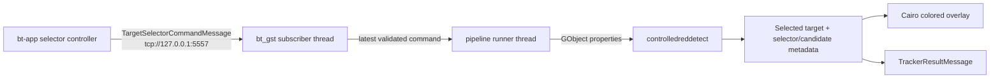
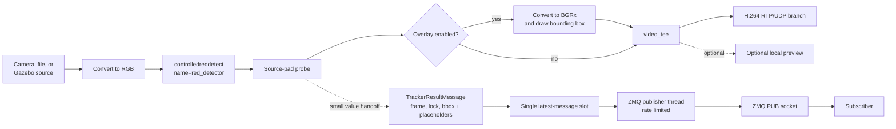
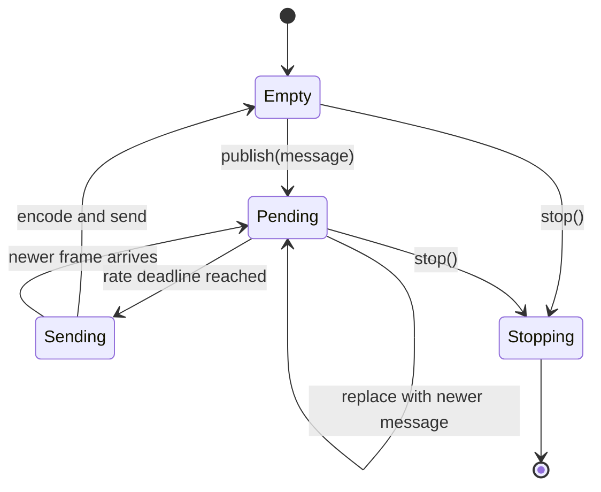
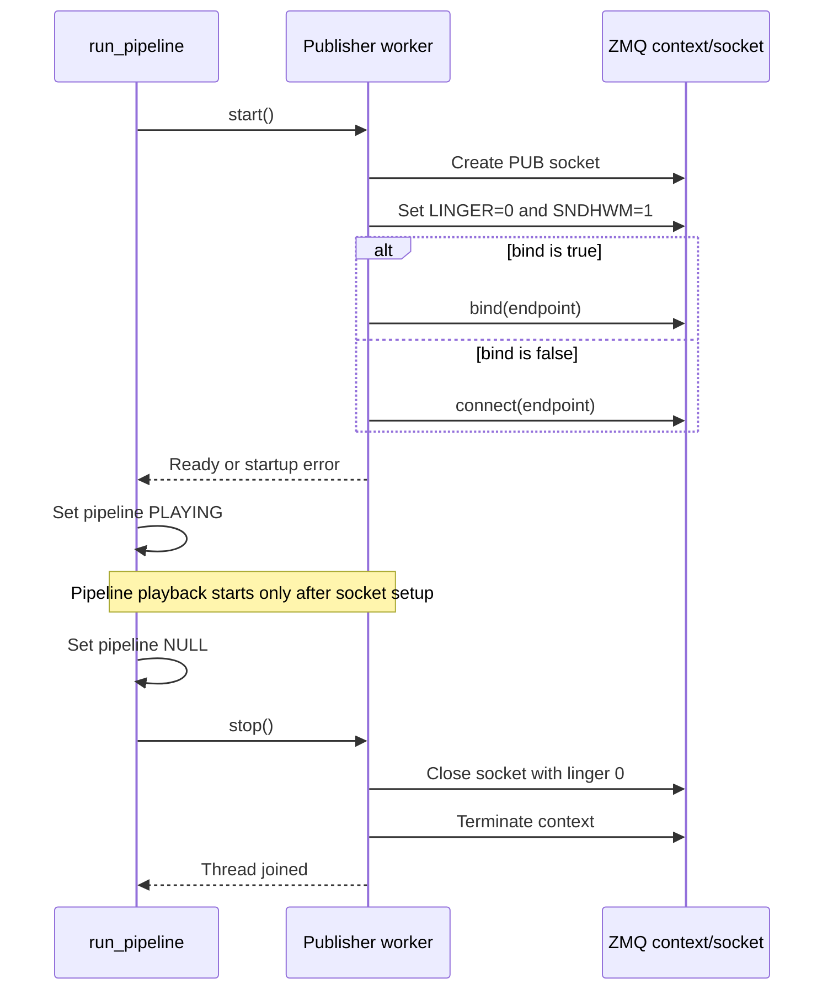
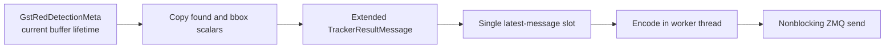

# Red Detection to ZMQ Publication Flow

## Target-selector command path

Detection results still flow from bt_gst to bt-app on the configured result
endpoint. Target selection adds an independent reverse PUB/SUB path:



Commands contain an absolute normalized center and `disabled`, `selecting`, or
`locked` state. Applying properties stays on the pipeline runner thread. Once
commands have been received, a 0.5-second receive timeout disables selection
and causes unlocked tracker results.

This document describes the current `bt_gst` implementation. The red detector
adds bounding-box metadata to every video buffer, and the ZMQ publisher copies
that detection into the generic tracker-result wire message.

The design keeps MessagePack encoding and all socket operations away from the
GStreamer streaming thread so a slow or disconnected subscriber cannot stall
the video pipeline.

## End-to-end flow



`controlledreddetect` processes the RGB pixels in place and attaches
`GstRedDetectionMeta` with these fields:

- `found`
- `x` and `y`
- `width` and `height`

The probe is installed on the detector's `src` pad, so both the custom metadata
and buffer PTS are still available before later conversion, overlay, encoding,
or streaming stages.

## Work performed by the pad probe

The pad probe runs synchronously on a GStreamer streaming thread. Its execution
time directly contributes to frame-processing latency.

```mermaid
sequenceDiagram
    participant GST as GStreamer streaming thread
    participant Probe as red_detector src-pad probe
    participant Slot as Latest-message slot
    participant Worker as ZMQ publisher thread
    participant SUB as ZMQ subscriber

    GST->>Probe: Buffer reaches detector src pad
    Probe->>Probe: Allocate next frame_id
    Probe->>Probe: Read GstRedDetectionMeta once
    alt Metadata present
        opt Overlay enabled
        Probe->>Probe: Update thread-safe overlay state
        end
        Probe->>Slot: Replace pending TrackerResultMessage
    else Metadata absent
        Probe->>Probe: Rate-limited warning; skip publication
    end
    Probe-->>GST: PadProbeReturn.OK

    Note over Probe,Slot: No pixel copy, MessagePack encoding, or socket call

    Worker->>Slot: Wait for and take latest message
    Worker->>Worker: Enforce maximum rate
    Worker->>Worker: message.encode()
    Worker->>SUB: Nonblocking ZMQ send
```

For every non-null buffer, the publication side of the probe performs only:

1. `next(frame_ids)`, where IDs start at 1 for each pipeline run.
2. One read of the buffer's scalar detector metadata and PTS.
3. Construction of an immutable slots `TrackerResultMessage`.
4. Replacement of `_pending_message` while holding a short-lived condition
   lock, followed by a worker notification.

The probe never passes a `Gst.Buffer` or `GstCustomMeta` to another thread. If
GStreamer provides no buffer, no frame ID is consumed and no message is
published. If a real buffer lacks detector metadata, its frame ID is consumed,
publication is skipped, and a warning is emitted at most once every five
seconds. Explicit metadata with `found=false` publishes a valid unlocked result.

## Latest-value and rate-limit behavior

The publisher uses one pending-message slot rather than a queue. A new detector
frame replaces an older pending message. The first message can be sent
immediately; later sends are separated by at least `1 / max_rate_hz` seconds
using `time.monotonic()`.



At the default 30 Hz limit, a source running faster than 30 FPS will have
intermediate messages coalesced. Frame IDs are assigned before coalescing, so
gaps in received IDs are expected and show that newer frames replaced older
pending frames.

## Message and wire format

`bt_msgs.TrackerResultMessage` owns the MessagePack representation:

```python
TrackerResultMessage(
    frame_id=42,
    timestamp_ns=123456789,
    tracker_id=0,
    locked=True,
    bbox_x=10,
    bbox_y=20,
    bbox_width=30,
    bbox_height=40,
    score=0.0,
    state=0,
    dx=0,
    dy=0,
)
```

Wire mapping:

```python
{
    "tracker_id": 0,
    "frame_id": 42,
    "timestamp_ns": 123456789,
    "locked": True,
    "bbox_x": 10,
    "bbox_y": 20,
    "bbox_width": 30,
    "bbox_height": 40,
    "score": 0.0,
    "state": 0,
    "dx": 0,
    "dy": 0,
}
```

`timestamp_ns` is the buffer's GStreamer PTS in nanoseconds, or `None` when the
buffer has no valid PTS. It is media time, not Unix wall-clock time, and may
restart when a pipeline restarts or a file is seeked.

The current red detector maps `found` to `locked` and copies its bounding box.
It uses zero placeholders for tracker ID, score, state, and deltas because it
does not yet compute those generic tracker values. State `0` means unknown.

The codec uses an explicit map rather than `dataclasses.asdict()` so internal
fields cannot accidentally enter the protocol. A local 12-field microbenchmark
measured about 1.19 microseconds and 105 bytes for the map versus 0.81
microseconds and 21 bytes for a positional array. At 30 Hz this difference is
negligible; named keys provide safer schema evolution.

## ZMQ ownership and lifecycle

`ZmqFramePublisher` creates and uses its ZMQ context and PUB socket only inside
its daemon worker thread. ZMQ sockets are not shared across threads.



Socket behavior:

- `SNDHWM=1` limits ZeroMQ's outbound queue.
- `LINGER=0` prevents queued packets from delaying shutdown.
- `NOBLOCK` prevents a send from waiting for socket capacity.
- `zmq.Again` drops that message and is logged at debug level.
- Other `zmq.ZMQError` send failures are logged and the worker continues.
- There is no replay, acknowledgement, or delivery guarantee. Messages sent
  before a subscriber finishes connecting, or while it is unavailable, are
  lost by normal PUB/SUB semantics.

During startup, socket creation and bind/connect failures are returned to
`run_pipeline()` as `PipelineRunError`; the pipeline does not enter `PLAYING`.
During shutdown, the pipeline enters `NULL` before the publisher is stopped,
preventing new probe submissions while the worker closes.

## Configuration

The publisher is disabled by the Python defaults and enabled by
`bt_bringup/launch/gst.yaml`:

```yaml
detector:
  enabled: true

zmq:
  enabled: true
  endpoint: tcp://127.0.0.1:5556
  bind: true
  max_rate_hz: 30
```

Validation requires:

- ZMQ publication can be enabled only when the detector is enabled.
- `endpoint` is a non-empty string.
- `bind` and `enabled` are booleans.
- `max_rate_hz` is a positive integer.

With the checked-in configuration, `bt_gst` binds the PUB socket and
subscribers connect to it.

## Observe the stream

Start `bt_gst`:

```bash
./bt_bringup/launch/run_gst.sh
```

Run the diagnostic subscriber from another terminal:

```bash
bt_gst/.venv/bin/python bt_gst/scripts/listen_zmq.py
```

Example output:

```text
tracker_id=0 frame_id=42 timestamp_ns=123456789 locked=True bbox=(10,20,30,40) score=0.0 state=0 delta=(0,0)
tracker_id=0 frame_id=43 timestamp_ns=156790122 locked=False bbox=(0,0,0,0) score=0.0 state=0 delta=(0,0)
```

## Known limitations from the code review

- The red detector does not yet produce a tracker ID, normalized score, tracker
  state, or center-relative deltas, so those fields contain documented zeros.
- Encoding failures are logged and drop only the affected result; the publisher
  worker continues. Unexpected exceptions outside the handled codec and ZMQ
  boundaries can still terminate the daemon publisher thread.
- `publish()` silently accepts and replaces messages even if the worker has
  already terminated unexpectedly; only normal startup and shutdown failures
  are surfaced to the pipeline runner.
- PUB/SUB intentionally favors freshness over reliability. There is no
  backpressure, retry, history, or subscriber-presence detection.

## Extending tracker fields later

When `TrackerResultMessage` is extended, preserve the current performance
boundary:

1. Read `GstRedDetectionMeta` while the current buffer is valid in the probe.
2. Copy only its scalar values into the shared `bt_msgs` value object.
3. Replace the single pending message; never pass a GStreamer object to the
   worker.
4. Encode and send the extended message only from the publisher thread.



This keeps the pipeline free of frame copies, an appsink branch, network I/O on
the streaming thread, and an accumulating message queue.
