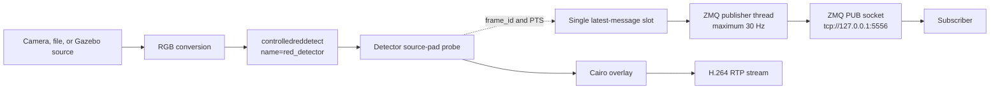
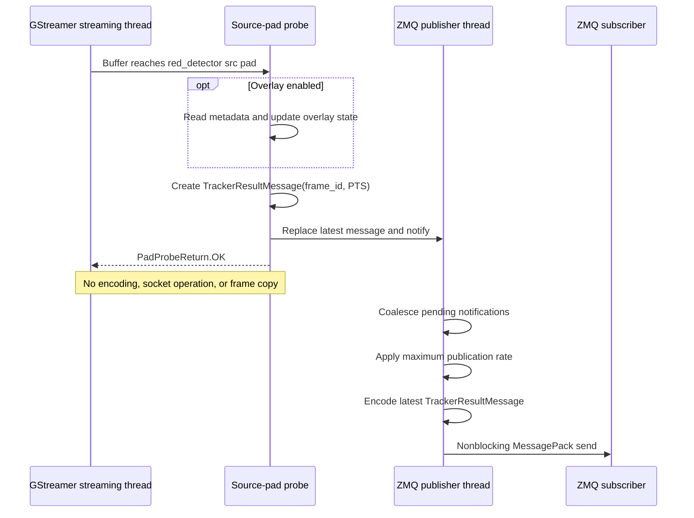
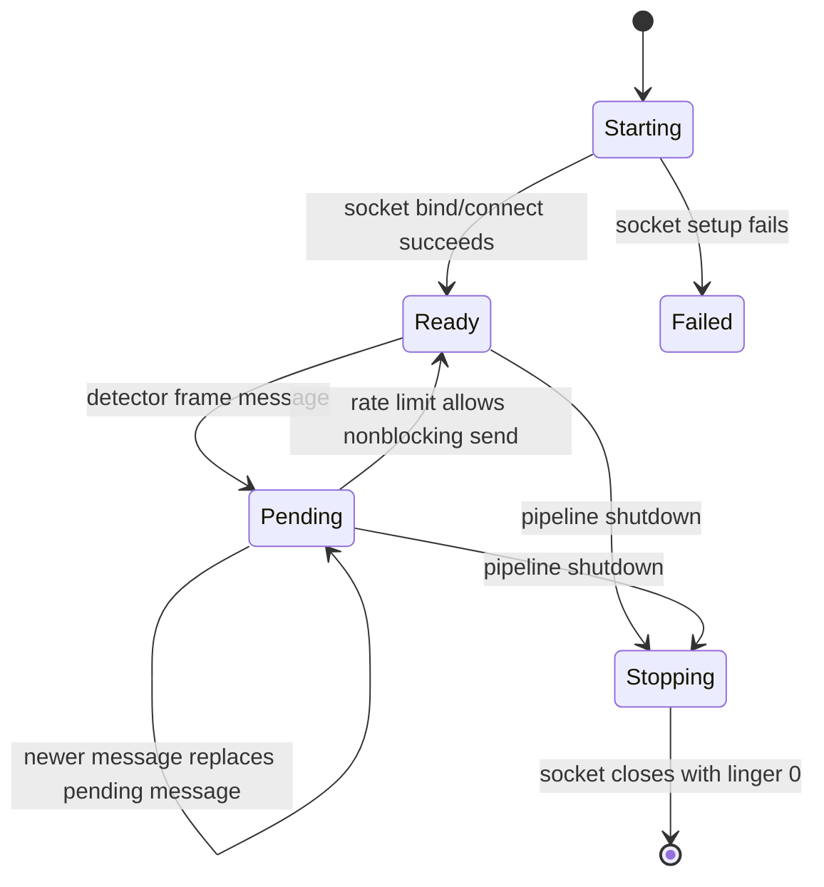
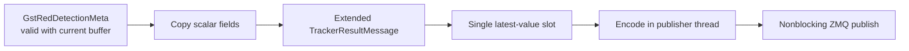

# Red Detection to ZMQ Publication Flow

`bt_gst` publishes a `bt_msgs.TrackerResultMessage` whenever frames pass through
the red detector. The design keeps all serialization and network work away from
the GStreamer streaming thread so a slow or disconnected subscriber cannot
stall video processing.

## Data flow



The detector attaches `GstRedDetectionMeta` to each buffer. The probe is placed
on the detector's source pad, where the metadata is available before later
video conversion, overlay, encoding, or streaming stages.

The probe reads the buffer PTS and assigns a sequential frame ID. It does not
copy frame pixels or serialize the message. If the overlay is enabled, the same
probe also reads the custom metadata for drawing the bounding box.

## Thread boundary

The pad probe runs synchronously on a GStreamer streaming thread. Anything slow
inside this callback would directly increase frame-processing latency.



Only a small immutable message crosses the thread boundary. Repeated frames
replace the single pending message instead of building an unbounded queue.
Consequently, the publisher sends the newest available result and does not
attempt to catch up by sending stale results.

## Publisher behavior

`ZmqFramePublisher` owns its ZMQ context and PUB socket entirely within its
worker thread. The socket is configured with:

- `SNDHWM=1` to keep at most one queued outbound message.
- `LINGER=0` so shutdown does not wait for queued packets.
- `NOBLOCK` for sends, dropping a packet when the socket cannot accept it.
- A configurable maximum rate, set to 30 Hz by the bringup configuration.

MessagePack encoding happens in the publisher thread after rate limiting.
Socket bind failures are returned during startup before the GStreamer pipeline
enters `PLAYING`.



## Configuration

The publisher is disabled by default in the Python configuration and enabled
by `bt_bringup/launch/gst.yaml`:

```yaml
zmq:
  enabled: true
  endpoint: tcp://127.0.0.1:5556
  bind: true
  max_rate_hz: 30
```

ZMQ publication requires `detector.enabled: true`. The endpoint must be a
non-empty string and `max_rate_hz` must be a positive integer.

## Current payload

`TrackerResultMessage` owns the MessagePack representation:

```python
{
    "frame_id": 42,
    "timestamp": 123456789,
}
```

`frame_id` starts at 1 and increments for every detector buffer. Publication
rate limiting may therefore create gaps between received IDs. `timestamp` is
the buffer's GStreamer PTS in nanoseconds, or `None` when no valid PTS exists.

The existing `bt_app` subscriber ignores this basic message because it has no
`type: "red-detection"` field.

## Future detector fields

When the detector message becomes available from `bt_msgs`, the integration
should preserve the same performance boundary:

1. Read `GstRedDetectionMeta` while the buffer is valid in the pad probe.
2. Copy only scalar values such as `found` and bounding-box coordinates into
   the `bt_msgs` value object.
3. Replace the pending value in a single-slot handoff; never pass a
   `Gst.Buffer` or metadata object to the worker.
4. Serialize the `bt_msgs` value and send it only from the publisher thread.



This future change adds result data without introducing frame copies, an
appsink branch, network I/O on the streaming thread, or an accumulating message
queue.
