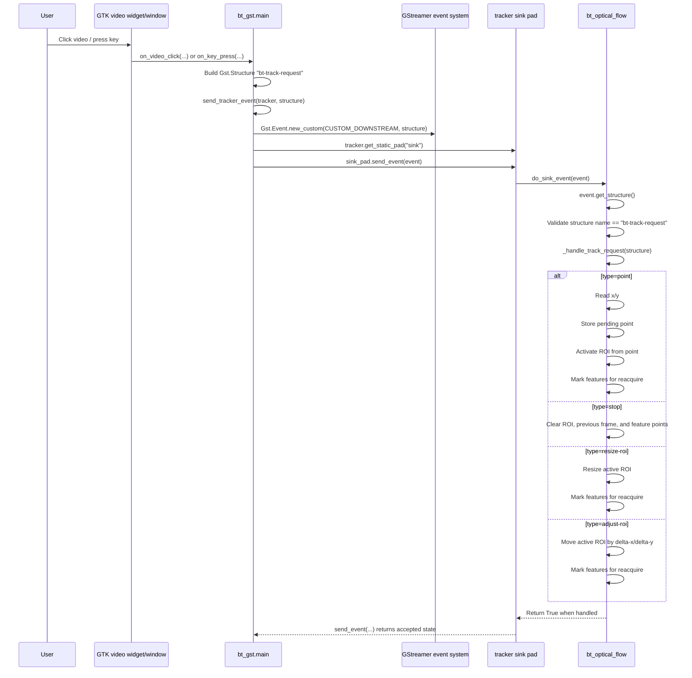

# Track Request Event Flow

## Summary
The application sends user tracking commands to `bt_optical_flow` as custom
downstream GStreamer events. The event payload is a `Gst.Structure` named
`bt-track-request`.

The app side creates the request structure in `bt_gst/main.py`, wraps it in a
`Gst.EventType.CUSTOM_DOWNSTREAM` event, and sends it directly to the tracker
element's `sink` pad. The plugin receives the event in `do_sink_event(...)` and
dispatches it to `_handle_track_request(...)`.

## Sequence Diagram


## App Side
`send_tracker_event(...)` is the common event sender:

```python
def send_tracker_event(tracker: object, structure: object) -> bool:
    from gi.repository import Gst

    event = Gst.Event.new_custom(Gst.EventType.CUSTOM_DOWNSTREAM, structure)
    sink_pad = tracker.get_static_pad("sink")
    if sink_pad is None:
        logger.warning("track request dropped reason=no-sink-pad")
        return False
    return bool(sink_pad.send_event(event))
```

Request helper functions build the `bt-track-request` structure before calling
`send_tracker_event(...)`:

- `send_user_point_request(...)`: sends `type=point`, `x`, and `y`.
- `send_user_stop_request(...)`: sends `type=stop`.
- `send_user_resize_roi_request(...)`: sends `type=resize-roi`, `width`, and
  `height`.
- `send_user_adjust_roi_request(...)`: sends `type=adjust-roi`, `delta-x`, and
  `delta-y`.

## Plugin Side
`bt_optical_flow` receives the custom downstream event in `do_sink_event(...)`:

```python
def do_sink_event(self, event: Gst.Event) -> bool:
    if event.type == Gst.EventType.CUSTOM_DOWNSTREAM:
        structure = event.get_structure()
        if structure is not None and structure.get_name() == TRACK_REQUEST_NAME:
            return self._handle_track_request(structure)
    return GstBase.BaseTransform.do_sink_event(self, event)
```

`_handle_track_request(...)` accepts only user requests, reads the request
`type`, and dispatches to the matching handler:

- `stop`: clears tracker state with `_reset_tracking(clear_roi=True)`.
- `resize-roi`: calls `_resize_active_roi(...)`.
- `adjust-roi`: calls `_adjust_active_roi(...)`.
- `point`: reads `x/y`, stores `_pending_point`, and activates a centered ROI.

The next buffer processed by `do_transform_ip(...)` uses the updated tracker
state to reacquire features, track motion, draw overlays, and write
`bt-tracker-meta`.
